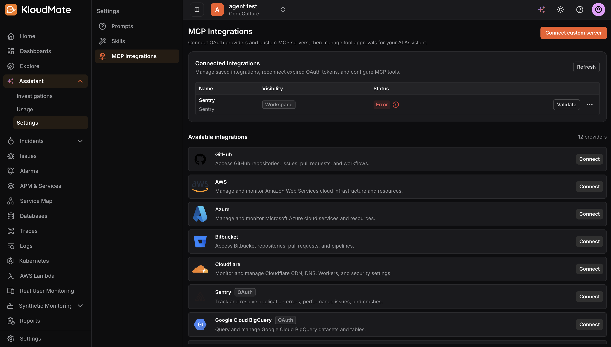
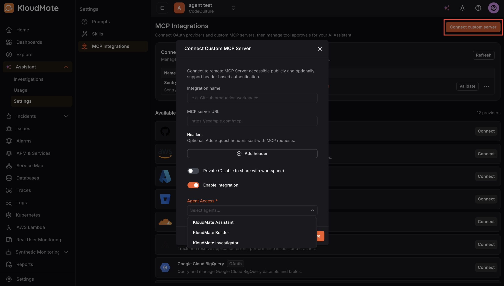

**MCP (Model Context Protocol) integrations**connect the Assistant to external systems such as OAuth providers or your own custom MCP servers. After connecting an integration, you configure which of its tools are enabled and whether the Assistant must request approval before running any of them.

### Connected Integrations

The Connected Integrations section lists all integrations you have already configured. For each integration, you can see its display name, whether it is scoped privately to your account or shared across the workspace, and its current connection status. 

<hint type="info">
  A status of **Error**indicates the integration requires attention. Use the**Validate** button to re-test the connection, or the menu to edit or remove the integration.

  If you see a **Reconnect Required status**, the integration’s authorization has expired and needs to be refreshed. Click the validate or reconnect option to re-authenticate.
</hint>

### Available Integrations

The Available Integrations section lists pre-built connectors you can activate.

Click **Connect** next to any provider to begin the connection flow.

### Connecting a Custom MCP Server

To connect an MCP server that is not listed among the available providers, click **Connect Custom Server** in the top-right corner. 

This opens the **Connect Custom MCP Server** dialog where you configure the following:

- **Integration Name:** A friendly label for the integration.
- **MCP Server URL:** The publicly accessible endpoint for your MCP server. This field is only required when connecting a custom server; for managed OAuth providers, it is pre-filled.
- **Headers (optional):**Additional HTTP headers to be sent with every MCP request. Use this for API key or token-based authentication, tenant or workspace routing, or any other custom metadata the server requires.
- **Private:**When enabled, only you can use the integration. When disabled, it is shared across the workspace. Keep integrations private for personal credentials, testing environments, or dev and staging connections, and share them when they are organization-managed and intended for the whole team.
- **Enable Integration:** The master on/off switch for the integration. Disable it during incidents, provider outages, security reviews, or when you want to deprecate the integration without permanently deleting it.
- **Agent Access:**Select which agents are permitted to use this integration. You must choose at least one. The available options are**KloudMate Assistant**,**KloudMate Builder**, and**KloudMate Investigator**. Narrow the scope for sensitive or high-impact integrations where only specific agents should have access.

After completing the form, click **Connect** to save the integration.

### Tool-Level Settings

After connecting an integration, you can configure each of its individual tools. For every tool exposed by the integration, you can control two things:

- **Enabled:**Determines whether the Assistant is allowed to call the tool at all. Disable individual tools you do not need to reduce the Assistant’s scope of action.
- **Approval Mode:**Determines whether the Assistant must ask for confirmation before running the tool. Setting it to **Default**uses the platform’s built-in behavior. Setting it to**Ask Before Run**requires the Assistant to confirm with you every time it wants to invoke the tool. Setting it to**Auto Approve** allows the tool to run without any confirmation prompt.

Tools may also carry labels that hint at their behavior. 

- A **Read** label indicates the tool is intended to be read-only and carries lower risk. 
- A **Write** label indicates the tool may perform destructive or state-changing actions and should be used with care. 

<hint type="info">
  When deciding on approval mode, it is advisable to apply stricter settings such as Ask Before Run for Write tools and for any tool with access to sensitive or production systems.
</hint>

