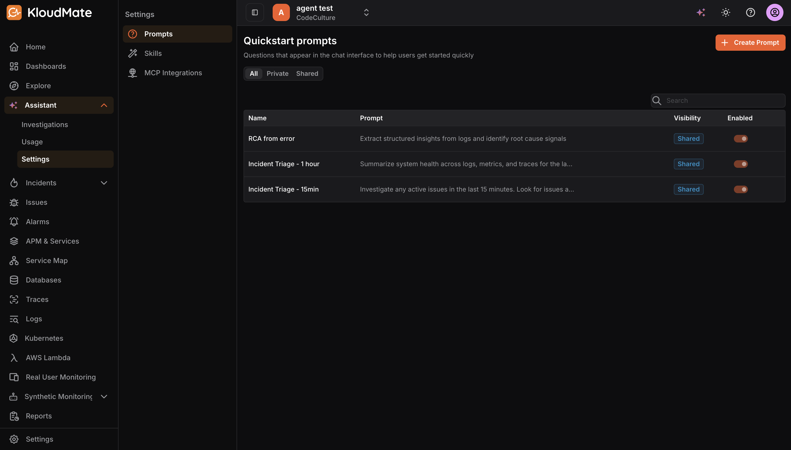
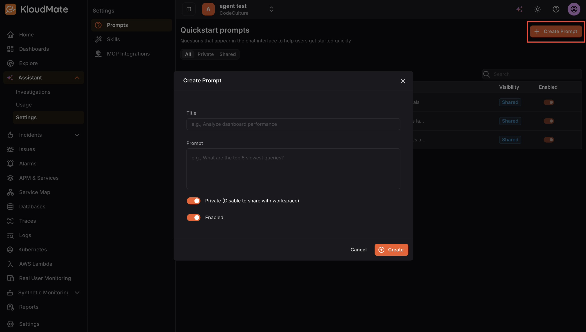

Quickstart prompts are suggested questions displayed in the chat interface to help users get immediate value. Clicking a prompt inserts its text directly into the chat input, saving users from having to type common queries from scratch.

The prompts list displays each prompt’s name, a preview of the prompt text, its visibility (Private or Shared), and whether it is currently enabled. The list can be filtered by All, Private, or Shared to quickly locate what you are looking for.

To create a new prompt, click the **Create Prompt** button in the top-right corner. 

A dialog will appear with the following fields:

- **Title: **A short, scannable label for the prompt 
- **Prompt: **The actual text that gets inserted into the chat input when the prompt is selected. This field is required.
- **Private: **When enabled, only you can see and use the prompt. Disable it to share the prompt with everyone in the workspace.
- **Enabled: **Controls whether the prompt is active and visible in the chat interface. You can disable a prompt when it is outdated or seasonal without deleting it.

Once you have filled in the required fields, click **Create** to save the prompt.​​​​​​​​​​​​​​​​
