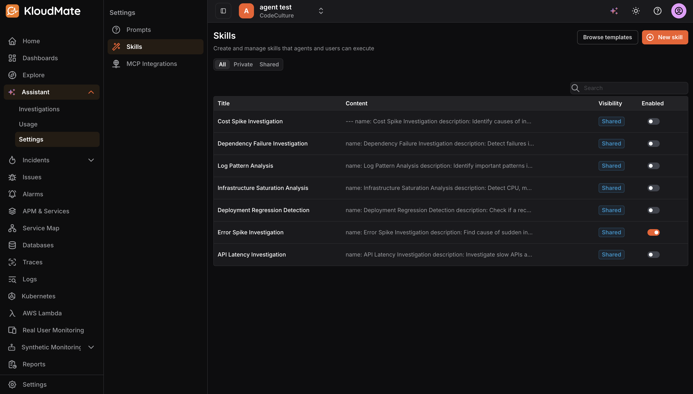
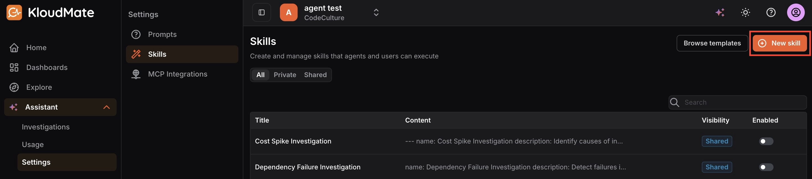
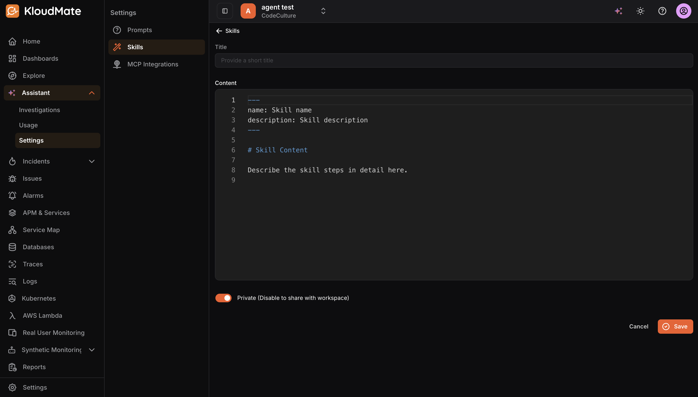
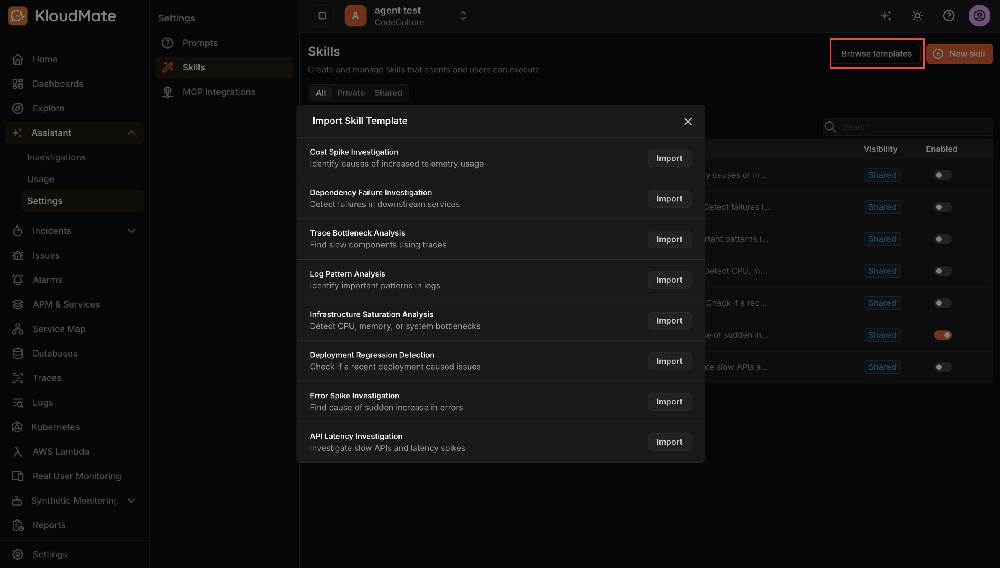

Skills are reusable instructions the Assistant can follow. They are useful for standardizing investigations, codifying runbooks, and enabling repeatable workflows across your team.

Each skill is defined by the following properties:

- **Title:** The name that users and agents will recognize when referencing or activating the skill.
- **Content:** The actual skill instructions. Skills are typically written in Markdown and include a short metadata header followed by the detailed steps the Assistant should follow.
- **Visibility:** When enabled, only you can use or manage the skill. When disabled, the skill is shared with the entire workspace.
- **Enabled: **Turns the skill on or off without deleting it, useful when you want to temporarily pause a skill.

The skills list can be filtered by All, Private, or Shared to help you quickly locate skills by their visibility scope.

### Creating a New Skill

To create a skill from scratch, click the **New Skill** button in the top-right corner. 

This opens the skill editor screen, which shows a **Title** field at the top and a **Content** editor below it. The content editor comes pre-populated with a structured template, it includes a metadata block at the top where you fill in the skill name and description, followed by a content section where you describe the steps the Assistant should follow in detail. 

Fill in the title, replace the template placeholders with your actual skill instructions, configure the **Private** toggle as needed, then click **Save** to create the skill.

### Importing a Skill from a Template

To get started quickly from a pre-built starting point, click **Browse Templates** in the top-right corner. 

This opens the Import Skill Template dialog, which lists a set of curated templates ready to import. Click **Import** next to any template to add it to your skills list. Once imported, you can open and customize the skill to suit your specific environment and workflows.
