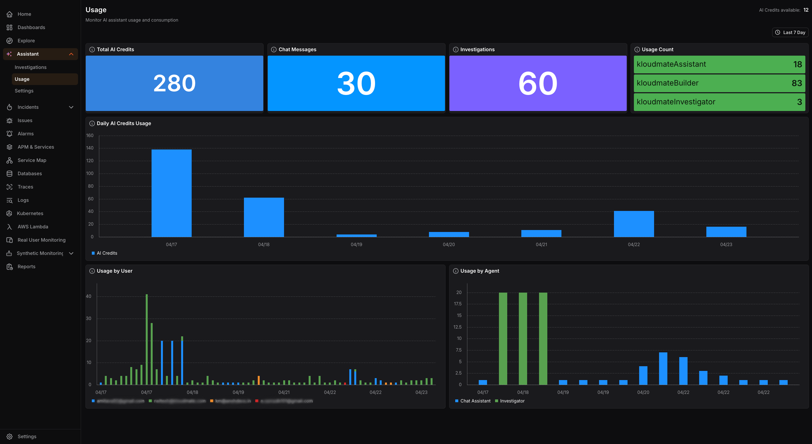

Usage provides visibility into AI consumption across your workspace and helps you track how the Assistant is being used by your team, manage costs, and stay within quota limits.

### Summary Metrics

At the top of the page, four tiles give you a high-level snapshot of activity in the selected period:

- **Total AI Credits:**The total number of AI credits consumed across all Assistant interactions.
- **Chat Messages:** The total number of conversational messages sent to the Assistant.
- **Investigations:** The total number of investigations triggered during the period.
- **Usage Count by Agent:** A breakdown showing how many interactions were handled by each agent type.

### Daily AI Credits Usage

A bar chart displays daily AI credit consumption over the selected period. This makes it easy to spot spikes in usage.

### Usage by User

A stacked bar chart breaks down daily credit consumption by individual user, identified by their email address. This view helps team leads or administrators understand which users are driving the most AI activity across the workspace.

### Usage by Agent

A separate chart shows daily credit consumption broken down by agent type, Chat Assistant versus Investigator. This is useful for understanding whether your team relies more on conversational queries or on deep investigation workflows, and can inform decisions around capacity planning and feature adoption.
