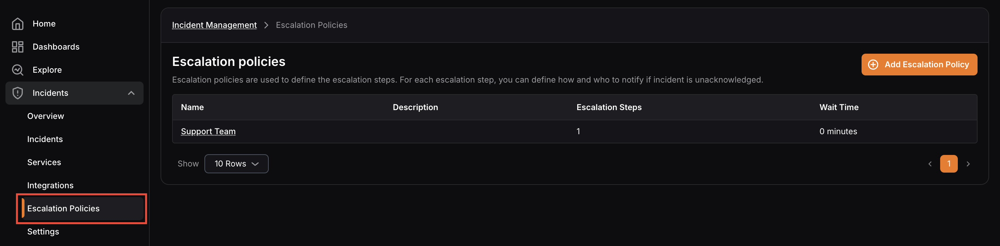
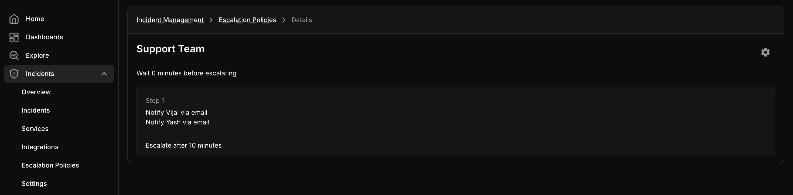

Escalation policies define how and who will be notified when an incident is triggered. They enable you to automate the incident assignment process within your incident management workflow.

Escalation policies within KloudMate are designed to notify different targets at different steps, in the event that the initial assignee or the assignee at a previous step could not acknowledge the incident.

To navigate to the Escalation Policies screen, click **Incidents** in the left navigation, then select **Escalation Policies**.

This screen displays a list of all existing escalation policies along with their name, description, number of escalation steps, and wait time.

<hint type="info">
  - Escalation steps decide who needs to be notified and how the notification will be sent.
  - Multiple notification channels can be added to a single escalation step.&#x9;
  - The wait time defines how long an incident should remain unacknowledged before escalating to the next step.
</hint>

## Escalation Policy Details

Click on any **escalation policy** to open its detail view. 

This screen displays all the details of the selected policy and its escalation steps, including:

- The wait time before escalation begins
- The configured notification channel for each escalation step
- The notification assignee for each escalation step
- The escalation timeout for each step

You can use the **Settings** icon to edit or archive the selected escalation policy.

