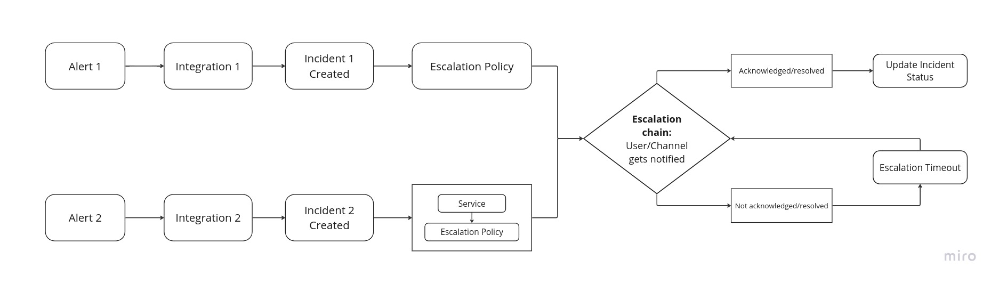

The lifecycle of an incident begins when the incident is triggered and ends when it has been resolved. All the components of the '***Incident Management***' module such as alerts, integrations, and more, come together to create a working flow with which an incident moves throughout its lifecycle.

Following is how the incident lifecycle looks with each of the components working together:

### Alerts: 
An alert is a notification that is triggered when certain predefined conditions or thresholds of an event are met or exceeded within the monitored application or system. 

### Integrations: 
Integrations help bring in alerts from various sources to KloudMate's Incident Management module. 

Alerts reach the KloudMate incident management platform through integration endpoints. All Integrations are attached to a Service. 

A Service can have multiple integrations from different sources related to that Service

- Integration can only have one escalation policy
- Integrations can have their own escalation policies which can be selected while creating an integration
- If the Integration has no escalation policy of its own, then the default escalation policy of the assigned service will be assigned to the integration.

### Incidents: 
An incident is an unplanned event that disrupts or negatively impacts operations, services, functions, or an application workflow.
 

An incident is created as soon as an integrated alert within an application monitoring platform gets triggered.

### Services: 
A Service is a collection of incidents grouped together, based on the microservices, or application functionality that the incidents belong to. Services are used to collectively manage a group of incidents. 

- Services will have a default escalation policy attached to it. 
- Integrations attached to the service can have their own escalation policy.

### Escalation Policy
An escalation policy will define how and who will be notified for the incidents of the service that the escalation policy is attached to.

An escalation policy can have multiple escalation steps that specify different team members who should be notified at each escalation step. This ensures that there is a response plan for incidents in the event where the initial assignee of the incident, or the assignee at the previous step couldn't acknowledge the incident.

### Escalation Chain
Escalation chain are the steps added to the escalation policy.

Once the Incident reaches the first set of User(s)/channel based on the escalation policy of the Incident or the Service, they will have a time window within the escalation timeout to acknowledge or resolve the incident. 

- If the incident is acknowledged or resolved before escalation timeout, the incident status will be updated from triggered to acknowledged or resolved respectively.
- If the incident goes unacknowledged or unresolved till the escalation timeout, the next target specified in the next escalation step will be notified.

***

## **Related Resources**

[What Is Incident Management?](https://docs.kloudmate.com/what-is-incident-management)

