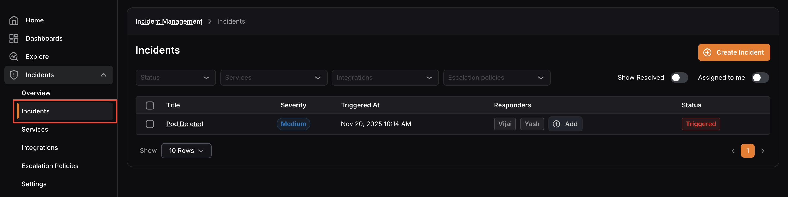
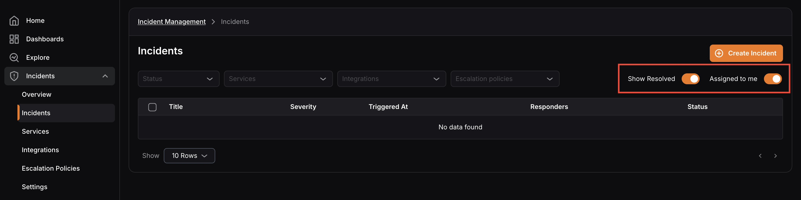
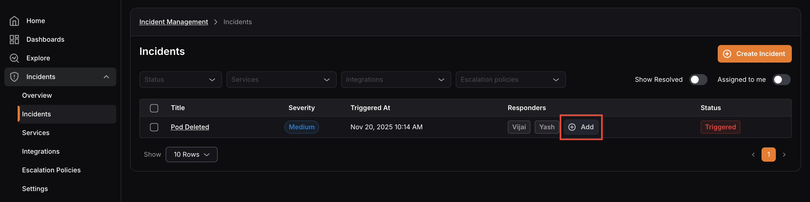
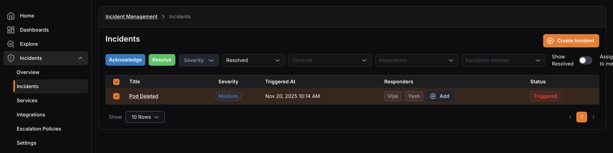
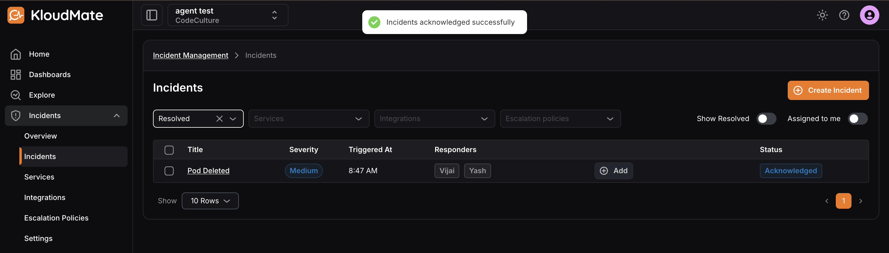

An **incident** is any unplanned event that causes or has the potential to cause disruption to your services, operations, or end users.

To navigate to the Incidents screen, click **Incidents** in the left navigation menu, then select **Incidents**.

The screen displays a list of all existing incidents along with key details, title, severity, triggered time, responders, and status.

## Filtering Incidents

You can filter the incidents list using the dropdown menus at the top of the screen:

- **Status —** Filter incidents by their current status: **Triggered**, **Acknowledged**, or **Resolved**.
- **Services —** Filter incidents based on the service they belong to.
- **Integrations —** Filter incidents based on the integration they came through.
- **Escalation Policies —** Filter incidents based on the escalation policy applied.

Use the **Show Resolved** toggle to include resolved incidents in the list, and the **Assigned to me** toggle to view only incidents assigned to you.

## Adding Responders

You can assign one or more responders to an incident to make them responsible for actively investigating and resolving it. 

To add a responder, locate the incident in the list and click **Add** under the Responders column.

## Updating Incident Status

An incident starts with the **Triggered** status as soon as it is created. Once the relevant responders have reviewed or resolved it, the status needs to be updated accordingly.

To update the status, select the incident from the list using the checkbox. Once selected, **Acknowledge** and Resolve action buttons appear at the top of the list. 

Click the relevant action to update the status, a confirmation message will appear once the status has been updated successfully, and the change will be reflected immediately in the Status column.

***

## **Related Resources**

[Incident Details](https://docs.kloudmate.com/incident-details)

[Creating an Incident](https://docs.kloudmate.com/creating-an-incident)

