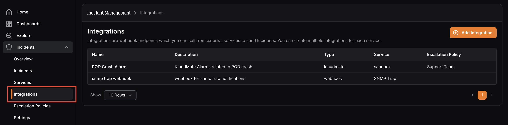

Integrations are webhook endpoints that can be called from external services to send notifications about incidents to on-call teams and developers. 

Each integration has a service and an escalation policy assigned to it, and will notify the relevant team based on the rules defined in that escalation policy.

## Integrations Overview

Navigate to **Incident Management** > **Integrations** to view a list of all existing integrations. The screen displays each integration’s name, description, type, service, and assigned escalation policy.

<hint type="info">
  Each integration can only have one escalation policy attached to it.
</hint>

## Integration Details

Click on any integration to open its Details screen. From here you can:

- **Enable** or **disable** the integration using the toggle next to the integration name.
- Copy the **integration URL**, which is required to connect with an external alerting source.
- **Edit** or **archive** the integration using the **settings** icon.

