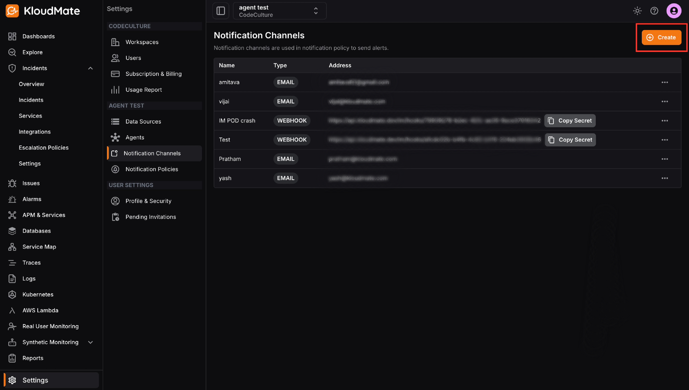
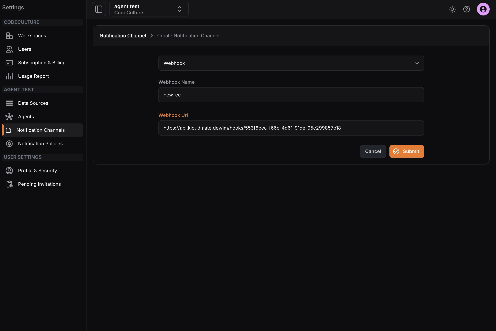
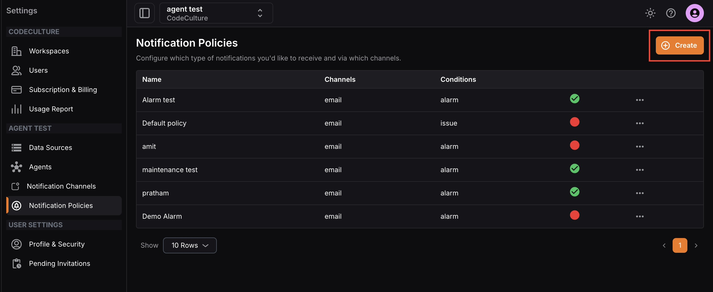
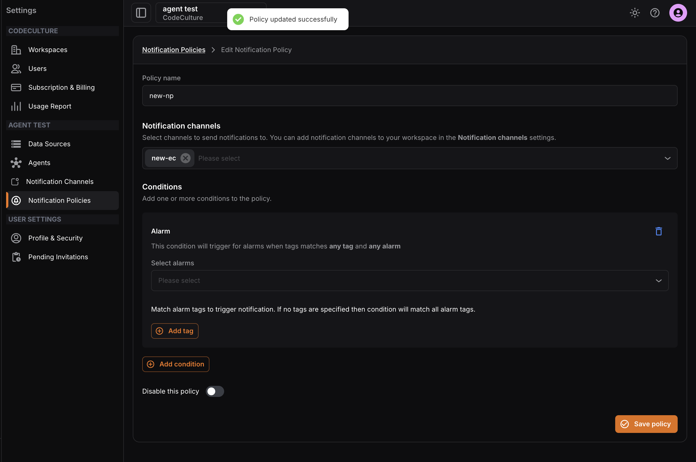

To receive alarm-triggered alerts in your Incident Management workflow, you need to configure a webhook notification channel linked to your integration, and then set up a notification policy for it.

A **notification channel**defines where the notification is sent, while a**notification policy** defines which alarms or issues trigger that notification.

### Step 1: Copy the Integration URL

Navigate to **Incidents**>**Integrations**and click on the integration of type**KloudMate** **Alarm**. From the Integration Details screen, click**Copy Integration URL** to copy the webhook URL.

Refer to the [Adding Integrations](<./Adding Integrations.mdx>) documentation to learn how to create an integration.

### Step 2: Create a Notification Channel

Navigate to **Settings**>**Notification Channels**and click**Create**.

- Select **Webhook** as the notification channel type from the dropdown.
- Enter a name for the webhook and paste the integration URL copied in the previous step.

- Click **Submit**. The webhook notification channel will appear in the Notification Channels list.

### Step 3: Create a Notification Policy

Navigate to **Settings**>**Notification Policies**and click**Create**.

- Enter a name for the policy and select the notification channel created in the previous step.

- Click **Add Condition**and select**Alarm**or**Issue** depending on what you want to be notified for.

- Select the specific alarm(s) from the dropdown. You can also **add alarm tags**to match specific alarms. If no tags are specified, the condition will match all alarm tags. You can**add multiple conditions** to a single notification policy.
- Click **Save Policy**. A confirmation message will appear once saved.

<hint type="info">
  Once saved, alerts from this notification policy will be sent to the respective Incident Management integration and will notify the members defined in the corresponding escalation policy.
</hint>

