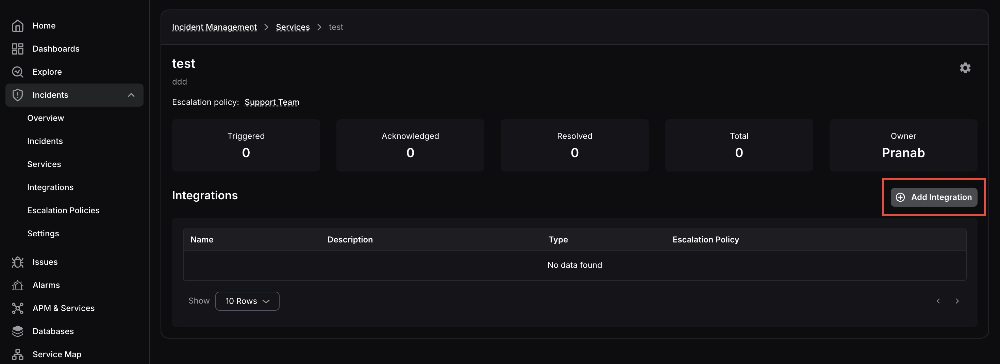
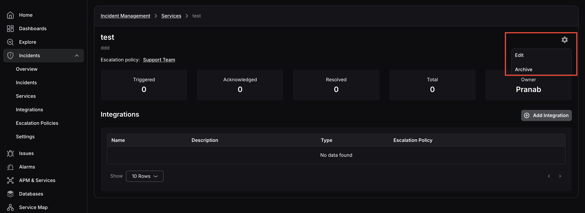

**Services** enable you to group your incidents based on the service, microservice, or application functionality they belong to. By organising incidents under services, you can configure response plans and manage related incidents collectively.

To navigate to the Services screen, click **Incidents** in the left navigation, then select **Services**.

The screen displays a list of all existing services with their name, description, owner, escalation policy, and health status. 

<hint type="info">
  A service can have multiple escalation policies. A service marked as Unhealthy indicates there are active issues, while Healthy indicates no current issues. The escalation policy shown is the default policy assigned when the service was created.
</hint>

## **Service Details**

Click on any service to open its detail view. This screen shows a summary of all incidents under that service, how many are Triggered, Acknowledged, Resolved, and the total count, along with the service owner and its associated integrations.

You can add integrations to the service directly from this screen using the **Add Integration** button. 

When adding an integration, you can assign a specific escalation policy to it. If no escalation policy is selected, the default escalation policy of the service will be applied.

To **edit** or **archive** the service, click the **settings** icon at the top right corner of the screen.

