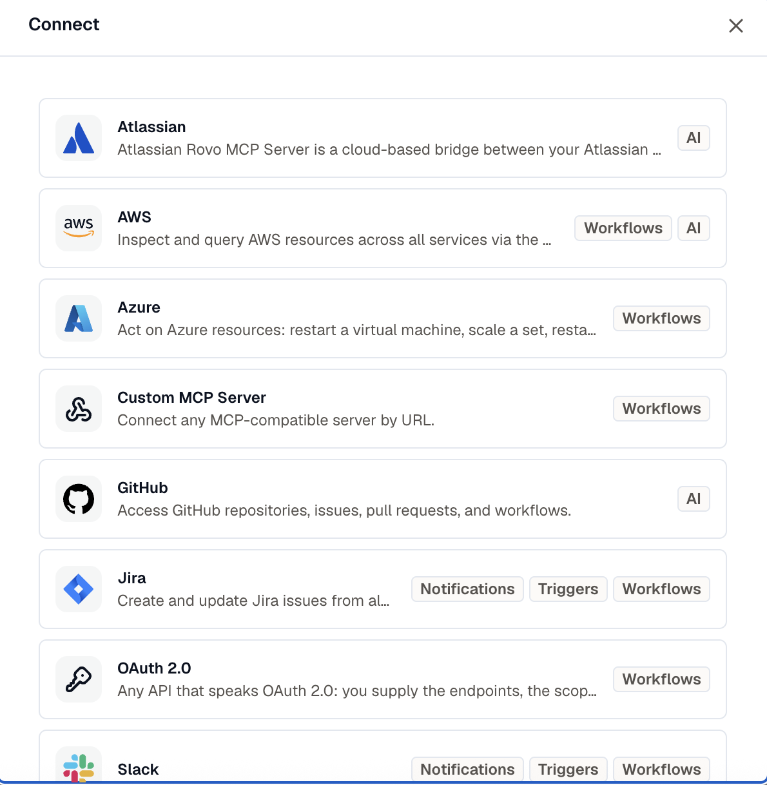

Open **Settings → Connections** and click **Connect**. You need the **Developer** role to connect an account.

The picker lists only the providers your organization can connect, so anything shown will work. If a provider you expect is missing, see [Providers](../providers/#what-your-plan-includes).

Pick a provider, name the connection, then finish it one of two ways.

## An OAuth install

Slack, Jira Cloud, Sentry, and the Google Cloud providers hand you off to the provider itself. Click **Connect**, approve the access there, and the connection is added.

The consent asks only for the permissions the capabilities you're connecting for actually need, so connecting Slack for notifications asks for less than connecting it to receive events.

The account you authorized is recorded on the connection, so two Slack installs or two Google accounts stay distinguishable.

## A credential form

AWS, Azure, GitHub, Atlassian, a custom MCP server, and a generic OAuth 2.0 API take their credentials directly. Fill in the provider's fields and click **Connect**.

Where a provider supports more than one method, an **Authentication** control picks between them. AWS offers **Assume Role** (recommended) or **Access keys**; a custom MCP server offers no auth, a bearer token, or an API key in a named header.

Saving checks the credential straight away. If the check fails, the connection is still saved so you don't lose what you typed, and it's marked **Degraded** with the provider's own reason. Edit it and fix the values.

:::note
The generic **OAuth 2.0** provider covers any API that speaks OAuth 2.0 without a module of its own: you supply the authorize and token URLs, the scopes, and your own client id and secret. With the client-credentials grant it works the moment you save. With the authorization-code grant it's saved as **Pending** first, then the connect flow sends you to approve it.
:::

## Connect from where you need it

You don't have to start in Settings. Every connection picker offers **New connection**, which opens the same form and grants the capability that picker needs.

That matters most for app-event triggers. A Slack account connected for notifications holds no permission to receive events, so it won't appear in a trigger's account picker. Connecting from there asks Slack for the event permissions, so the new connection can be picked straight away.

## Visibility

Every connection is **Workspace** or **Private**.

**Workspace** is the default and almost always the right choice. The connection belongs to the workspace, so anyone with the **Developer** role can use and manage it, and it keeps working when whoever connected it leaves.

**Private** restricts a connection to its creator. Only an **AI**-capable connection can be private, so use it for a personal GitHub or Google account you want the assistant to reach on your behalf and nobody else's.

A private connection is invisible to everyone else: it's absent from their list, and they can't reach it even if they know its id.

Visibility is editable afterward. Share a private connection with the workspace from its row menu, or change it back from the edit dialog, as long as its capabilities still allow private.

## Related

- [Providers](../providers/) for what each one covers and what a plan includes.
- [Manage a connection](../manage-connections/) for editing, reconnecting, and deleting.
- [Workflows](/workflows/) for binding a connection to a step or a trigger.
