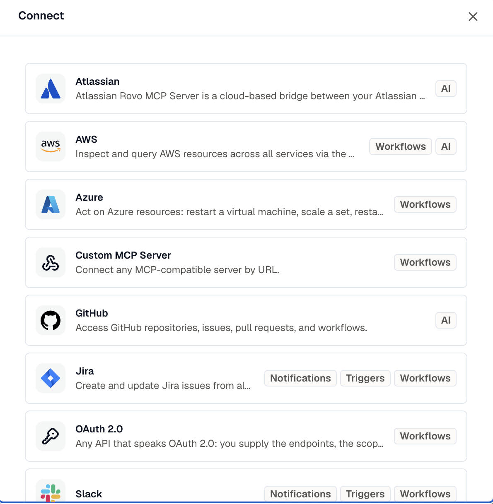

You need the **Developer** role to connect an account. Open **Settings → Connections** and click **Connect**.

The picker lists only the providers your organization can connect. If a provider you expect is missing, see [Providers](../providers/#providers-in-your-plan).

Pick a provider and fill in the **Connection name**. How you finish depends on the provider.

A connection made here starts with the provider's usual capability: **Notifications** for Slack and Jira Cloud; **Workflows** for AWS, Azure, a custom MCP server, and OAuth 2.0; and **AI** for the assistant tools. Change what it's used for, and who can use it, afterward under [Edit](../manage-connections/#edit).

## Connect through OAuth

Slack, Jira Cloud, Sentry, and the Google Cloud providers send you to the provider's own site. Click **Connect** and approve the access there. KloudMate adds the connection when you're done.

The connection records the account you authorized, so you can tell two Slack installs or two Google accounts apart.

## Connect with a credential form

AWS, Azure, GitHub, Atlassian, a custom MCP server, and a generic OAuth 2.0 API take their credentials in a form. Fill in the provider's fields and click **Connect**.

Where a provider supports more than one method, choose one under **Authentication**. AWS offers **Assume Role** (recommended) or **Access keys**; a custom MCP server offers no auth, a bearer token, or an API key in a named header.

KloudMate checks the credential as soon as you save. If the check fails, it still saves the connection, so you don't lose what you typed, and marks it **Degraded**. Click **Edit** beside it and fix the values.

:::note
The generic **OAuth 2.0** provider works with any API that uses OAuth 2.0 and has no provider of its own in KloudMate: you supply the authorize and token URLs, the scopes, and your own client id and secret. With the client-credentials grant it works the moment you save. With the authorization-code grant, KloudMate saves it as **Pending** first, then sends you to approve it. If the approval doesn't finish, the row stays **Pending** with an **Authorize** button beside it. For a worked example with Google, see [Trigger a workflow when a new email is received in Gmail](/guides/workflows/trigger-on-new-gmail/).
:::

## Connect from a workflow step or trigger

You don't have to start in Settings. A workflow step's connection picker and an app-event trigger's **Account** picker both offer **New connection**, or **Connect** followed by the app's name when the app has no connection yet. They open the same form, and the new connection can be used for **Workflows** straight away.

That matters most for app-event triggers. A Slack account connected from Settings for notifications still appears in a trigger's **Account** picker, but it's flagged **Not enabled for workflows** until you add **Workflows** to it under [Edit](../manage-connections/#edit).

## Visibility

Every connection is **Workspace** or **Private**.

**Workspace** is how every connection starts, and it's almost always the right choice. The connection belongs to the workspace, so anyone with the **Developer** role can use and manage it, and it keeps working when whoever connected it leaves.

**Private** restricts a connection to its creator. Only a connection whose one capability is **AI** can be private, so use it for a personal GitHub or Google account that you want the assistant to use on your behalf and nobody else's.

A private connection is invisible to everyone else: it's absent from their list, and they can't use it even if they know its id.

To make a connection private, set **Visibility** under **Edit**. To share a private connection with the workspace, use **Share with workspace** on its row menu.

## Related

- [Providers](../providers/) for what each one covers and what a plan includes.
- [Manage a connection](../manage-connections/) for editing, reconnecting, and deleting.
- [Workflows](/workflows/) for binding a connection to a step or a trigger.
