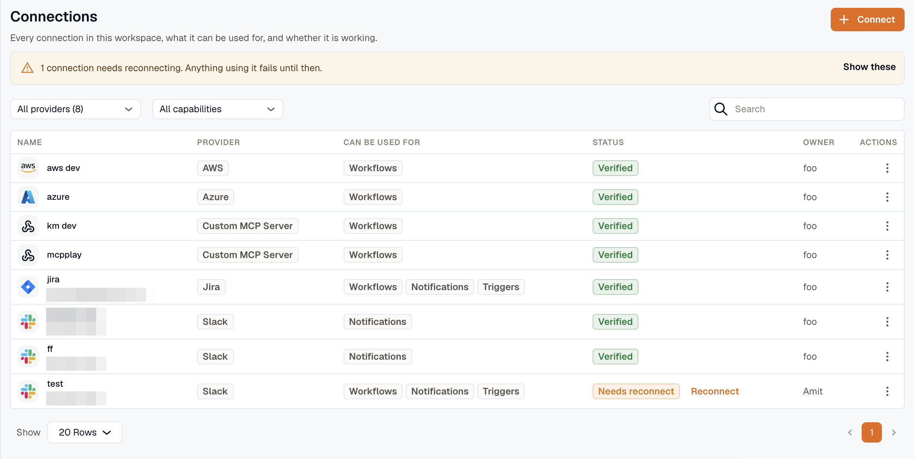

A connection is one credential for one account: an AWS role, a Slack bot install, an Atlassian grant, an MCP server token. Connect the account once, and every workflow step, notification channel, and dashboard query that needs it points at the same connection.

That gives you one row to rotate when a credential changes, one place that lists what would break if you deleted it, and one switch that takes it out of service everywhere at once.

Open **Settings → Connections** for the full list. The **Connections** tab inside [Workflows](/workflows/) shows the same rows narrowed to the ones a workflow can bind.

:::note
AWS accounts connected for inventory and metrics live under [Settings → Data Sources](../data-sources/), and notification destinations live under [Settings → Notification Channels](../notification-channels/). Neither appears in this list.
:::

## Capabilities: what a connection is connected for

A credential is granted for particular uses, and those grants are checked every time something reaches for it. The **Can be used for** column shows them:

| Capability | What it grants |
|---|---|
| **Workflows** | Workflow steps can use this connection. |
| **Notifications** | Notification channels can send through it. |
| **Triggers** | Events from this account can start a workflow. |
| **Data source** | Dashboards and alert rules can query through it. |
| **AI** | AI assistants can call it as a tool. |

Capabilities decide:

- **What permissions are asked for.** A Slack connection for notifications asks only for permission to post; one for triggers asks for permission to receive events. Add a capability later and the connection may need reconnecting before the app grants it.
- **Where the connection appears.** A workflow step's picker only offers connections carrying **Workflows**; an app-event trigger's picker only offers **Triggers**.
- **Whether it can be private.** Only an **AI** connection can be. See [Connect an account](./connect-an-account/#visibility).
- **Whether a run can use it.** The grant is checked at the moment of use, not only when you set it up. Withdraw **Workflows** from a connection and every step binding it starts failing.

A capability is permission, not observed usage, so a badge can be present for something nothing has used yet.

## Reading the list

Filter the list by provider or by capability, or search it by name, provider, or account.

| Status | Meaning |
|---|---|
| **Verified** | The last check reached the provider successfully. |
| **Pending** | Saved, not yet checked. An OAuth connection waiting for someone to approve it sits here. |
| **Degraded** | The last check failed. The connection still works everywhere except app-event triggers, so this is a warning rather than an outage. Re-check it. |
| **Needs reconnect** | The grant is dead or too narrow. Anything using it fails until you reconnect. |
| **Disabled** | Someone switched it off. Nothing reaches the provider through it. |

Connections that need reconnecting are called out at the top of the page.

## In this section

- [Connect an account](./connect-an-account/)
- [Providers](./providers/)
- [Manage a connection](./manage-connections/)

## Related

- [Workflows](/workflows/) for the steps and triggers that bind a connection.
- [Notification channels](../notification-channels/) for the delivery destinations.
- [KloudMate Assistant](/kloudmate-assistant/) for the AI tools a connection can serve.
