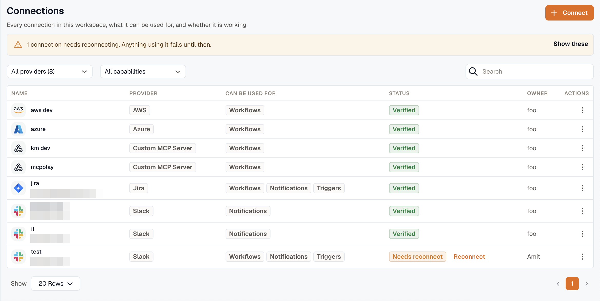

A connection is one credential for one account: an AWS role, a Slack bot install, an Atlassian grant, an MCP server token. Connect the account once, and every workflow step, notification channel, and dashboard query that needs it uses the same connection.

When a credential changes, you rotate it once. Before you delete a connection, KloudMate lists everything that still uses it, and one switch takes it out of service everywhere.

Open **Settings → Connections** for the full list. The **Connections** tab inside [Workflows](/workflows/) shows only the connections that can be used for **Workflows**.

:::note
AWS accounts connected for inventory and metrics live under [Settings → Data Sources](../data-sources/), and don't appear in this list. Notification channels live under [Settings → Notification Channels](../notification-channels/). A channel isn't listed here, but the Slack or Jira account it sends through is, as a connection used for **Notifications**.
:::

## Capabilities

Each connection is granted for particular uses, and KloudMate checks the grant every time something uses the connection. The **Can be used for** column lists those uses:

| Capability | What it grants |
|---|---|
| **Workflows** | Workflow steps can use this connection, and events from its account can start a workflow. |
| **Notifications** | Notification channels can send through it. |
| **Data source** | Dashboards and alert rules can query through it. |
| **AI** | AI assistants can call it as a tool. |

Capabilities decide:

- **Whether a workflow can use it.** A workflow step's connection picker and an app-event trigger's **Account** picker list every connection for the app, and flag one without **Workflows** as **Not enabled for workflows**. Publishing refuses a workflow that uses one.
- **Whether it needs reconnecting.** Adding a capability that needs permissions the connection wasn't granted marks it **Needs reconnect** until you approve them.
- **Whether it can be private.** Only a connection whose one capability is **AI** can be. See [Connect an account](./connect-an-account/#visibility).
- **Whether a run can use it.** KloudMate checks the grant at the moment of use, not only when you set it up. If you withdraw **Workflows** from a connection, every step that uses it starts failing and its app-event triggers stop.

A capability grants permission. It doesn't mean anything has used the connection that way yet.

## Read the connections list

Filter the list by provider or by capability, or search it by name, provider, or account.

| Status | Meaning |
|---|---|
| **Verified** | The last check reached the provider, or the last approval succeeded. |
| **Pending** | Its approval never finished, for example an OAuth 2.0 connection that's still waiting for someone to approve it. |
| **Degraded** | The last check failed. Workflow steps and dashboard queries still run through it, but its app-event triggers pause until it verifies again. |
| **Needs reconnect** | The grant is dead, or too narrow for what the connection is now used for. Reconnect it. |
| **Revoked** | The provider refused the credential when a workflow step or trigger used it. Workflows and dashboards can't use it until you reconnect or edit it. |
| **Disabled** | Someone switched it off. Nothing can use it to reach the provider. |

When a connection isn't working, a banner at the top of the page says how many, and **Show these** narrows the list to them. The banner counts connections that are **Degraded**, **Needs reconnect**, or **Revoked**, and an OAuth 2.0 connection still waiting for approval.

A row that needs attention has its fix beside its status: **Authorize** for an approval that never finished, **Reconnect** for a provider you approve at its own site, or **Edit** for one whose credential you type in.

## In this section

- [Connect an account](./connect-an-account/)
- [Providers](./providers/)
- [Manage a connection](./manage-connections/)

## Related

- [Workflows](/workflows/) for the steps and triggers that bind a connection.
- [Notification channels](../notification-channels/) for the delivery destinations.
- [KloudMate Assistant](/kloudmate-assistant/) for the AI tools a connection can serve.
