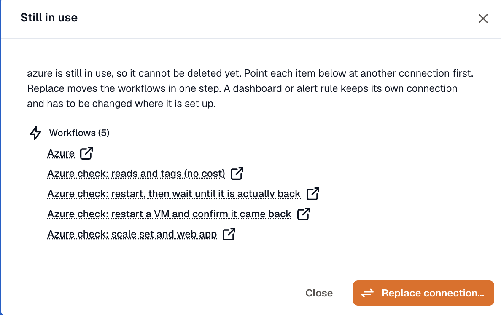

Every action here is on the row menu in **Settings → Connections**, and all of them need the **Developer** role.

## Edit

**Edit** changes the connection's name, capabilities, visibility, enabled state, and the provider's own settings.

Rotate a credential the same way: type the new value and save. Leave a secret field blank to keep the stored value. Saving a changed credential or setting re-checks the connection against the provider.

The provider and the authentication method are fixed once a connection exists, so an AWS connection made with access keys can't be switched to a role. Connect a new one instead.

:::caution
Changing **Can be used for** can break things that are already working. Removing a capability stops every use that depends on it at the next call. Adding one can need a reconnect first, and is refused outright when the provider's existing grant doesn't cover it.
:::

## Re-check

**Re-check** asks the provider whether the credential still works and updates the status. Use it after you've fixed something at the provider's end.

A connection that fails the check is marked **Degraded**. That's a warning, not an outage: workflow steps and dashboard queries still run through it. App-event triggers are the exception, and back off until it verifies again.

## Reconnect

**Reconnect** re-runs the OAuth approval and rotates the credential in place. The connection keeps its id, so every workflow, channel, and dashboard bound to it keeps working. Only providers that connect through OAuth have this; a credential-form provider is fixed with **Edit**.

**Needs reconnect** means one of two things:

| Reason | What happened |
|---|---|
| The provider now needs permissions this connection doesn't have. | You granted a new capability, or the permissions a capability requires changed. Re-consenting grants them. |
| The provider revoked this access. | Someone removed the app at the provider's end, or the grant expired and couldn't renew itself. |

A re-consent can widen what's granted but never narrows it, so reconnecting to add event permissions doesn't cost you the ones you had.

A reconnect has to land on the same account. An approval that resolves to a different one is refused.

## Switch it off

The **Enabled** switch in the edit dialog stops a connection being used without deleting it or touching the credential. Everything binding it fails until you switch it back on, and publishing a workflow that binds it is refused.

Use it to take a compromised credential out of service immediately while you work out what was using it.

## Replace

**Replace** moves what workflows bind from one connection to another of the same provider. It's the way to retire a credential that's still in use.

The target has to be shared and carry the workflow capabilities the source has. Only valid targets are offered.

**It rewrites drafts, not live versions.** A published version keeps the old connection until you republish it, so the result lists the workflows to republish. Retiring a connection is: replace, republish each one, then delete.

Dashboards and alert rules keep their own connection and aren't touched. Change those in their own editors.

## Delete

**Delete** is refused while anything still binds the connection. **Still in use** lists every workflow, dashboard, and alert rule holding it, each linked to its own editor.

When workflows are among them, **Replace connection** is offered right there.

Once nothing is bound, deleting asks for confirmation and can't be undone.

## Who can do what

A **workspace** connection belongs to the workspace, so anyone with the **Developer** role can edit, rotate, or delete it, and it outlives whoever connected it.

A **private** connection can only be edited or rotated by its creator. An organization owner can still delete one, so a workspace isn't stuck when someone leaves.

When someone leaves the organization or the workspace, their workspace connections keep working and lose their owner. Their private connections are deleted.

## Related

- [Connect an account](../connect-an-account/)
- [Providers](../providers/)
- [Workflows](/workflows/) for what binds a connection.
