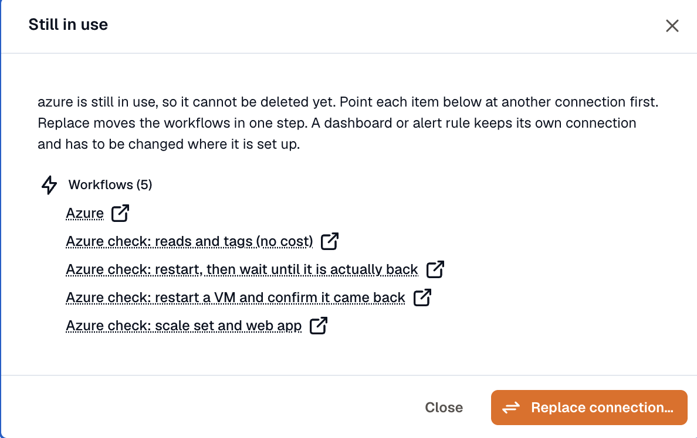

Every action here is on the row menu in **Settings → Connections**, and all of them need the **Developer** role. A row that needs attention also has its fix beside its status: **Authorize**, **Reconnect**, or **Edit**.

## Edit

**Edit** changes the connection's name, capabilities, visibility, enabled state, and the provider's own settings.

Rotate a credential the same way: type the new value and save. To keep a stored secret, leave its field blank. When you save a changed credential or setting, KloudMate checks the connection against the provider again.

You can't change the provider or the authentication method after you create a connection, so an AWS connection made with access keys can't switch to a role. Connect a new one instead.

:::caution
Changing **Can be used for** can break things that are already working. Removing a capability stops every use that depends on it at the next call. Adding one can mark the connection **Needs reconnect** until you approve the extra permissions, and you can't add a capability the provider is no longer offered for.
:::

## Re-check

**Re-check** asks the provider whether the credential still works and updates the status. Use it after you've fixed something at the provider's end. It can clear **Revoked** when the credential works again, but not **Needs reconnect**, which only a reconnect clears.

A connection that fails the check becomes **Degraded**. That's a warning, not an outage: workflow steps and dashboard queries still run through it. App-event triggers are the exception, and pause until it verifies again.

## Reconnect

**Reconnect** re-runs the OAuth approval and rotates the credential in place. The connection keeps its id, so every workflow, channel, and dashboard that uses it keeps working. Slack, Jira Cloud, Sentry, the Google Cloud providers, and an OAuth 2.0 connection that uses the authorization-code grant have it. For the other providers, use **Edit** instead. While a connection's first approval is unfinished, the action is called **Authorize**.

**Needs reconnect** shows one of these reasons when you hover over it:

| Reason | What happened |
|---|---|
| The provider now needs permissions this connection does not have. | You added a capability, or the permissions a capability requires changed. Re-consenting grants them. |
| The provider revoked this access. | Someone removed the app at the provider's end. |
| The access expired and cannot renew itself. | The grant expired and has no way to refresh itself. |
| The provider rejected the last call made with this connection. | The provider refused a call made through the connection. |

Approving again can add permissions but never removes any, so reconnecting to add permissions doesn't cost you the ones you had.

A reconnect must use the same account. KloudMate refuses an approval that resolves to a different one.

## Switch a connection off

The **Enabled** switch in the edit dialog stops anything from using a connection, without deleting it or touching the credential. Everything that uses it fails until you switch it back on, and publishing refuses a workflow that uses it.

Use it to take a compromised credential out of service immediately while you work out what was using it.

## Replace

**Replace** moves every workflow that uses one connection to another connection of the same provider. It's the way to retire a credential that's still in use.

The target must be shared with the workspace and be usable for **Workflows**. The picker offers only valid targets.

**It rewrites drafts, not live versions.** A published version keeps the old connection until you republish it, so the result lists the workflows to republish. To retire a connection, replace it, republish each workflow on that list, then delete the connection.

Replace doesn't touch dashboards or alert rules. Change their connection in their own editors.

## Delete

KloudMate refuses to **Delete** a connection while anything still uses it. The **Still in use** dialog lists every workflow, dashboard, and alert rule that uses it, each linked to its own editor.

When workflows are among them, the dialog also offers **Replace connection**.

When nothing uses the connection, deleting asks for confirmation, and you can't undo it.

## Who can manage a connection

A **workspace** connection belongs to the workspace, so anyone with the **Developer** role can edit, rotate, or delete it, and it keeps working after the person who connected it leaves.

Only the creator can edit or rotate a **private** connection. An organization **Owner** can still delete one, so a workspace isn't stuck when someone leaves.

When someone leaves the organization or the workspace, their workspace connections keep working and lose their owner. KloudMate deletes their private connections.

## Related

- [Connect an account](../connect-an-account/)
- [Providers](../providers/)
- [Workflows](/workflows/) for what binds a connection.
