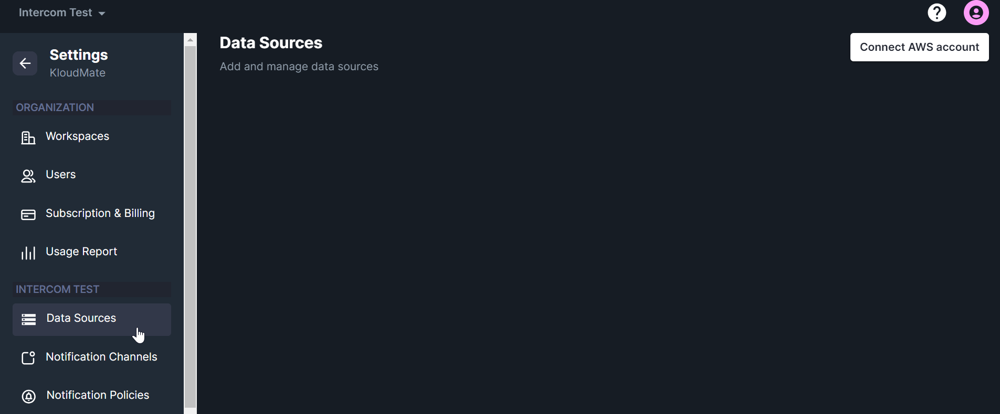
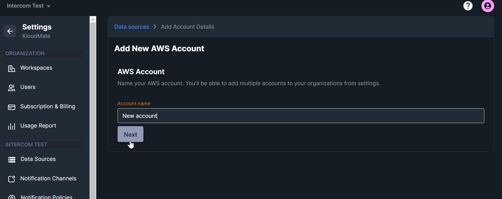
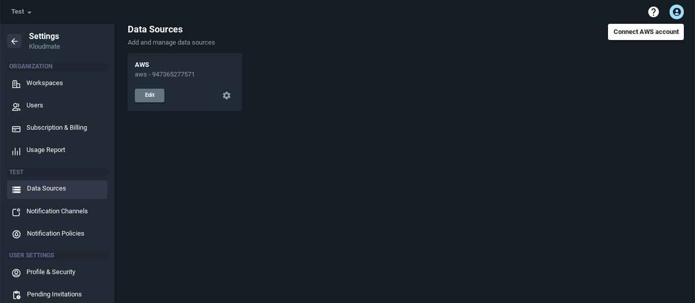
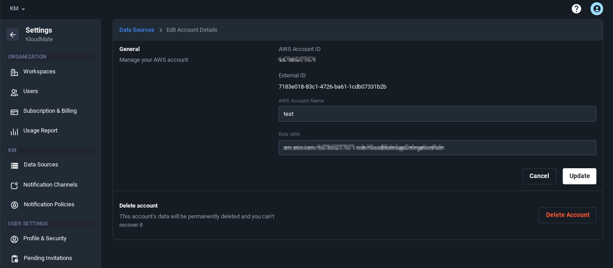
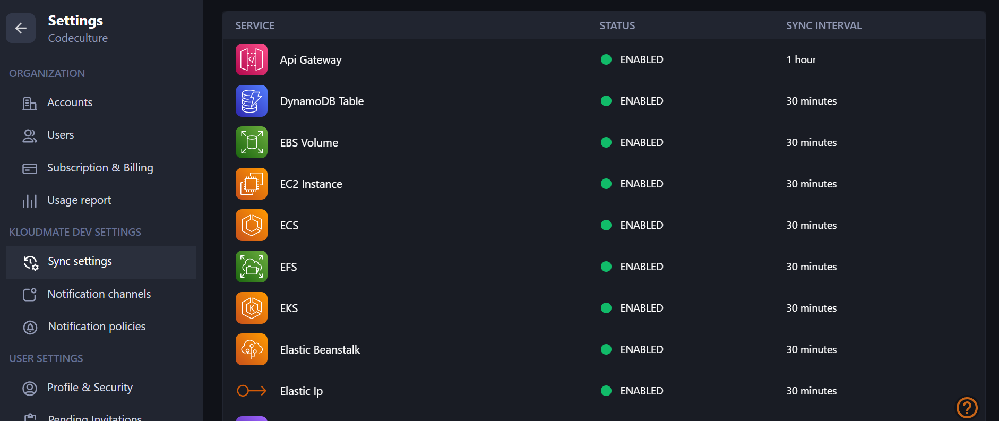
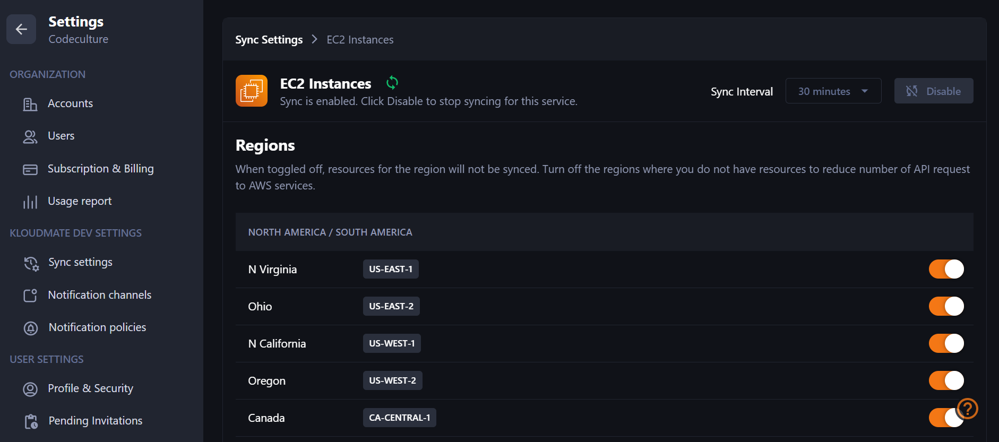
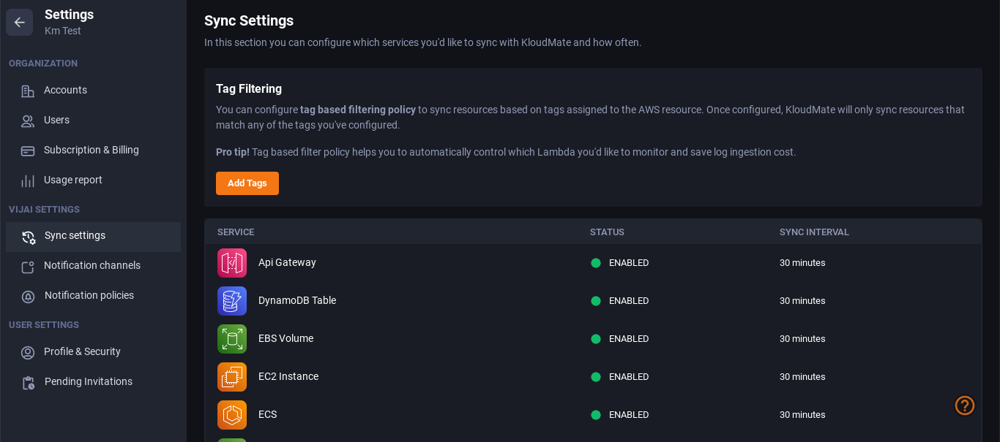
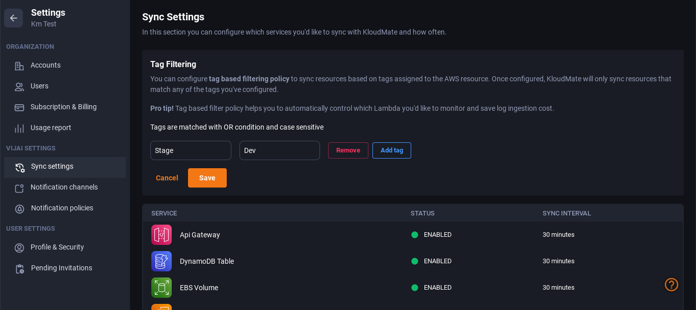
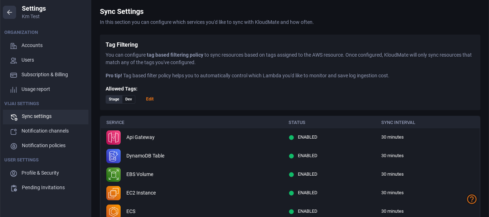

Users can connect multiple AWS accounts with KloudMate. It takes **less than 5 minutes to connect the AWS account(s) and set up KloudMate**. Once the setup is complete, KloudMate automatically starts monitoring your synced services, pulls in the logs, traces, and metrics either through OpenTelemetry or CloudWatch, and weaves a comprehensible data fabric for the developers that is presented using visualizations.

 [Click here ](https://docs.kloudmate.com/setting-up-kloudmate)to link your AWS account with KloudMate.

### Managing AWS Account(s) 
KloudMate lets you view, add, [delete](https://docs.kloudmate.com/deleting-your-aws-account-from-kloudmate), and edit **all the linked AWS account(s) under one window.**

<hint type="info">
  At present, this page displays all of your AWS Data Sources. In the coming days, you will also be able to access your OTel configurations and sources in this same section.
</hint>

- To add multiple AWS accounts, go to **Settings > Data sources **
- Click on the **Connect AWS Account **button located at the top right corner

- Enter the account name, click on next, and follow the on-screen instructions

### **Managing Sync Settings for Each AWS Account**

- Navigate to the data sources screen by clicking on **Settings > Data sources**
- You will see a list of all the connected AWS Accounts

- To view further details about any AWS account click on the **Edit **button of the respective AWS account

- Click on the **Settings** icon of the respective AWS account for which you want to modify the sync settings or view the CloudWatch logs.
- The Sync settings screen will display the list of all the AWS services that are synced with KloudMate.

- Click on any service to enable or disable its sync setting with KloudMate. Toggle off the regions where there are no resources.

## Tag Filtering

KloudMate also lets users choose the resources they want to sync with KloudMate based on the tags assigned to their AWS resources. By setting up tag-based filtering policy users can define certain tags and KloudMate will only sync resources that match any of those tags.

- Navigate to the **Sync Settings Screen **by clicking on **Settings > Sync settings.**
- Click on the **Add Tags **button under Tag Filtering

- Provide the tags of your choice and click on the **Save **button

- If you have configured tags, you will see the **Edit **button under Tag Filtering, which can be used to remove or add more tags.

