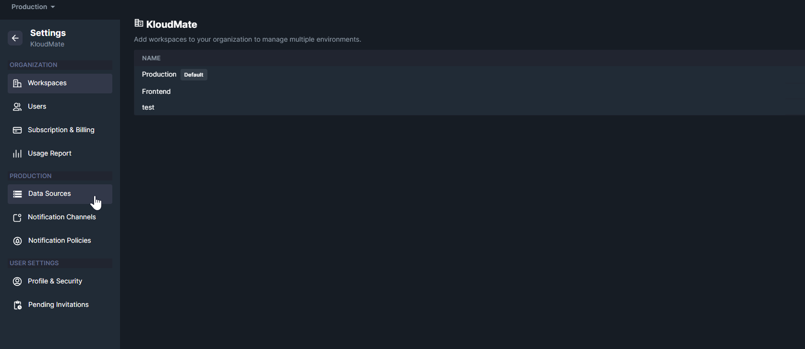
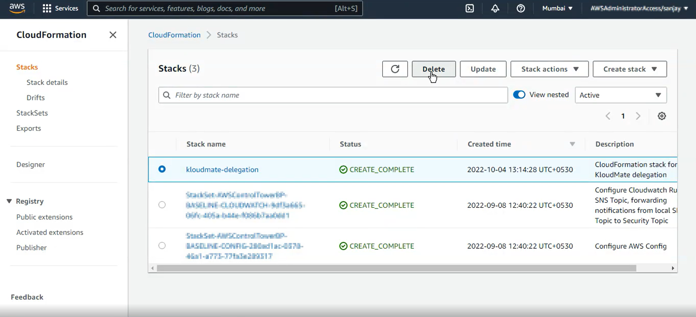

import { Aside } from '@astrojs/starlight/components';

Use this workflow when you want to disconnect an AWS account from KloudMate and clean up the integration resources in AWS.

Only users with **Owner** permissions can remove connected AWS accounts.

## Remove the AWS Account from KloudMate

1. Open **Settings -> Data Sources**.

2. Select the connected AWS account you want to remove.
3. Open the account details screen.
4. Click **Delete Account**.

<Aside type="note">
  Remove the AWS account from KloudMate before deleting the corresponding CloudFormation stack in AWS.
</Aside>

## Remove the CloudFormation Stack in AWS

1. Sign in to the [AWS Console](https://console.aws.amazon.com/).
2. Open the same region where the KloudMate stack was created.
3. Go to **CloudFormation -> Stacks**.
4. Select the stack named `kloudmate-delegation`.
5. Click **Delete**.

