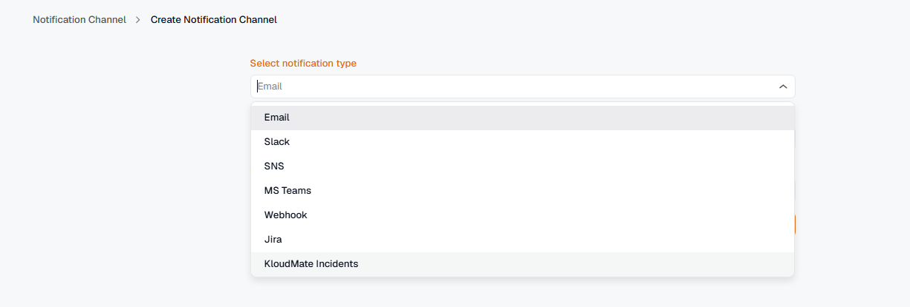
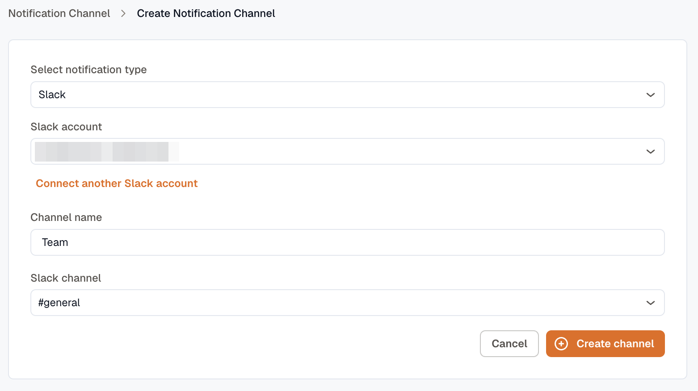
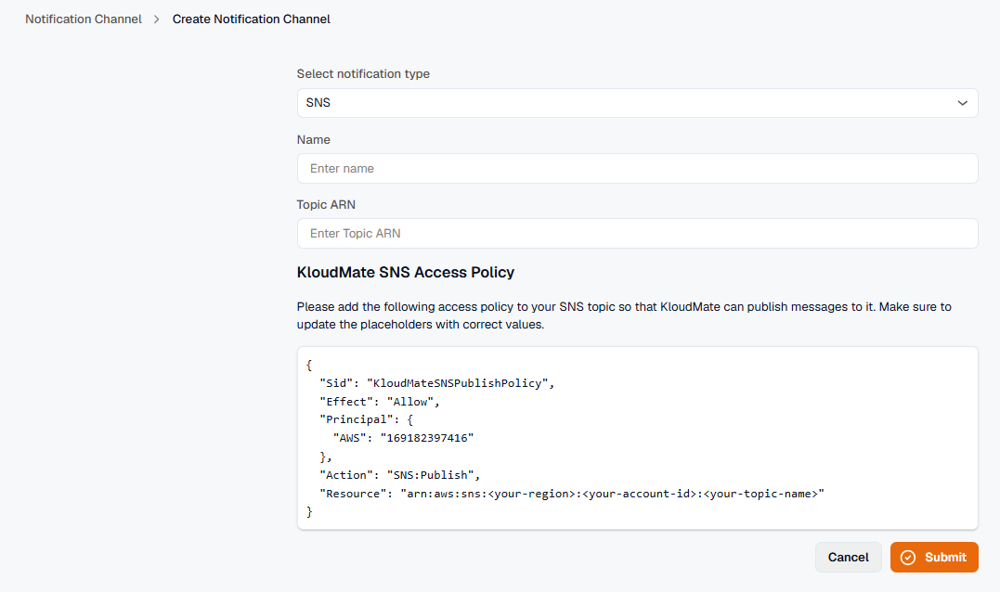
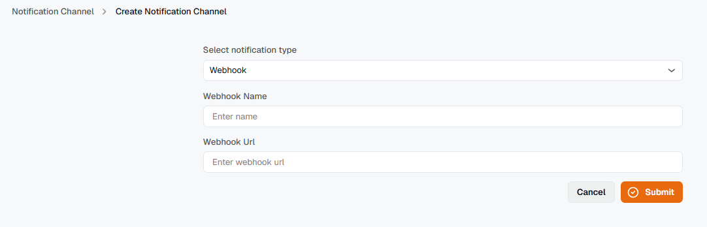
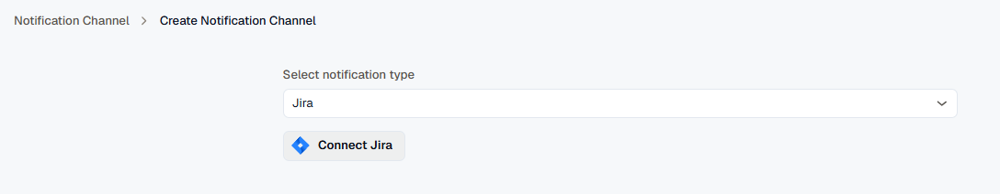
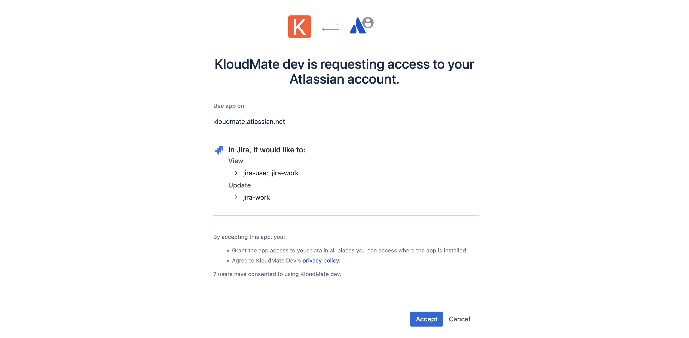
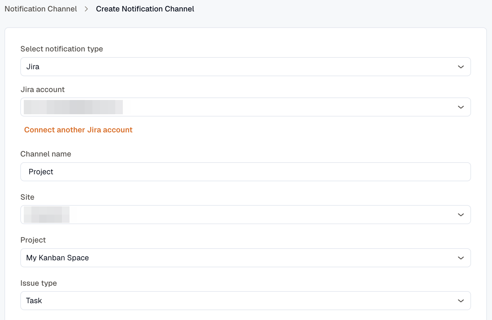
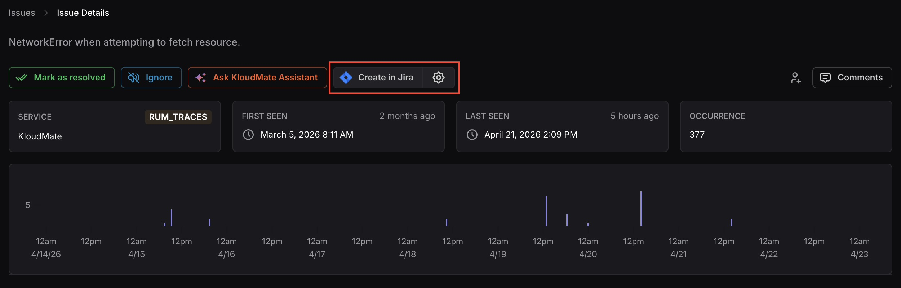
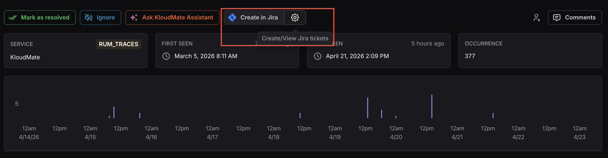

import { Tabs, TabItem } from '@astrojs/starlight/components';

To receive notifications from KloudMate, you need to set up notification channels — the communication platforms where alerts and incident updates are sent.

KloudMate supports the following notification channels:
- Email
- Slack
- SNS
- MS Teams
- Webhook
- Jira
- KloudMate Incidents — bridges alerts and synthetic checks into [Incident Management](../../../incident-management/)

:::info
In the case of multiple workspaces and AWS accounts, you must set up notifications for each account in their respective **Settings**.
:::

Navigate to **Settings** > **Notification Channels**. The screen displays all existing channels with their name, type, and address.


1. Click the **Create** button at the top-right corner.
2. Select the desired channel type from the dropdown.



Once created, the channel appears in the list. You can **Edit** or **Delete** any channel using the more options (⋯) icon. 


Below are the configuration steps for each specific channel type:

### Email

1. Select **Email** from the dropdown menu.
2. Enter a **Name** for the channel (e.g., demo) and your email address in the Address field.
3. Click **Submit**.


### Slack

KloudMate uses a single unified Slack app for both notifications and IM ChatOps. Installing it once gives you threaded notifications, message attribution, and the ability to acknowledge or resolve incidents directly from Slack.

1. Select **Slack** from the dropdown menu, then click the **Add to Slack** button.
2. You will be redirected to Slack's OAuth flow. Pick the channel KloudMate should post into and approve the bot scopes.
3. On approval, KloudMate creates the channel row and the Slack integration is also visible under **Incidents → Settings → ChatOps**.



### MS Teams

1. Select **MS Teams** from the dropdown menu.
2. Create an incoming webhook URL from Microsoft Teams by going to **Channel** > **Connectors** > **Incoming Webhooks** in the Microsoft Teams Apps.
3. Enter the **Team Channel Name** and the **Webhook Address** in their respective fields.
4. Click **Submit**.


:::info
Optionally, you can download the KloudMate logo from the link provided on the screen to update the webhook’s image in MS Teams.
:::

### SNS

1. Select **SNS** from the dropdown menu.
2. Copy the KloudMate SNS Access Policy displayed on the screen. Navigate to your AWS Console and paste the policy into your SNS topic. Update the placeholders in the policy with the correct values.
3. Return to KloudMate, enter a **Name** and your **Topic ARN** in their respective fields.
4. Click **Submit**.



### Webhooks

1. Select **Webhook** from the dropdown menu.
2. Enter a **Webhook Name** and the **Webhook URL** in their respective fields.
3. Under **Secret**, provide a secure key. This secret is used to generate an HMAC-SHA256 signature for each webhook payload, allowing you to verify that the request came from KloudMate.
4. Click **Submit**.



#### Webhook Signature Validation

When KloudMate sends a webhook to your configured URL, it includes an `X-KM-Signature` HTTP header. This signature is an HMAC-SHA256 hash generated using the payload body and the **Secret** you provided during configuration.

To ensure the webhook is genuinely from KloudMate, you should compute the hash on your server and compare it with the `X-KM-Signature` header.

Here are examples of how to perform this validation in common programming languages:

<Tabs>
  <TabItem label="Node.js (Express)" icon="node">
    ```javascript
    const crypto = require('crypto');

    // Ensure you have access to the raw request body.
    // For Express, you might use express.raw({ type: 'application/json' }) 
    function verifySignature(req) {
      const signatureHeader = req.headers['x-km-signature'];
      const secret = 'YOUR_WEBHOOK_SECRET';
      
      // Create HMAC-SHA256 hash of the raw JSON body
      const expectedSignature = crypto
        .createHmac('sha256', secret)
        .update(req.rawBody) // Pass the raw JSON string here
        .digest('hex');

      return signatureHeader === expectedSignature;
    }
    ```
  </TabItem>
  <TabItem label="Python" icon="seti:python">
    ```python
    import hmac
    import hashlib

    def verify_signature(payload_body: bytes, secret: str, signature_header: str) -> bool:
      # payload_body must be the raw bytes of the request body
      expected_signature = hmac.new(
        secret.encode('utf-8'),
        payload_body,
        hashlib.sha256
      ).hexdigest()
      
      return hmac.compare_digest(expected_signature, signature_header)
    ```
  </TabItem>
  <TabItem label="Go" icon="seti:go">
    ```go
    import (
      "crypto/hmac"
      "crypto/sha256"
      "encoding/hex"
    )

    func verifySignature(payloadBody []byte, secret string, signatureHeader string) bool {
      mac := hmac.New(sha256.New, []byte(secret))
      mac.Write(payloadBody)
      expectedMAC := hex.EncodeToString(mac.Sum(nil))
      
      return hmac.Equal([]byte(expectedMAC), []byte(signatureHeader))
    }
    ```
  </TabItem>
</Tabs>

#### Notification Payloads

Every webhook is delivered as a single `POST` with a JSON body and `Content-Type: application/json`. The body you receive is exactly the bytes that were HMAC-signed (see above), so verify the signature against the raw body before parsing.

The payload shape depends on which KloudMate feature triggered the notification:

- **Alert group** notifications carry a top-level `event` field (`opened`, `appended`, `resolved`, or `rca_completed`) that identifies the lifecycle stage.
- The other payloads have no `event` field — identify them by their distinctive top-level keys: `slo_name` (SLO burn rate), `monitor_id` (synthetic monitor), `serviceName` (new issue), and `investigationId` (AI investigation).

The tabs below show one representative example of each payload, with notes on how the variants differ.

<Tabs>
  <TabItem label="Alert group">
    Sent when an [alert group](../../../alerts/) opens, gains new alerts, resolves, or completes a root-cause analysis. The payload is **summary-first**: each rule reports aggregate `counts` plus up to five `sample_instances`, and `instances_omitted` tells you how many more are visible at `group.url`.

    ```json
    {
      "event": "opened",
      "emitted_at": "2026-05-23T10:00:05.123Z",
      "group": {
        "id": "550e8400-e29b-41d4-a716-446655440000",
        "title": "High CPU on payments-api",
        "state": "Open",
        "severity": "sev1",
        "severity_escalated": false,
        "opened_at": "2026-05-23T10:00:00.000Z",
        "resolved_at": null,
        "labels": { "service": "payments-api", "env": "production" },
        "annotations": { "runbook": "https://wiki.example.com/runbooks/cpu" },
        "commonAnnotations": { "runbook": "https://wiki.example.com/runbooks/cpu" },
        "routing_rule": { "id": "rr-1", "name": "Production critical" },
        "workspace_id": "ws-1",
        "signal_count": 3,
        "url": "https://app.kloudmate.com/ws-1/alerts/groups/550e8400-e29b-41d4-a716-446655440000"
      },
      "totals": { "newly_firing": 3, "still_firing": 0, "newly_resolved": 0 },
      "rules": [
        {
          "alarm_id": "alarm-cpu-1",
          "alarm_name": "CPU > 90%",
          "counts": { "newly_firing": 3, "still_firing": 0, "newly_resolved": 0 },
          "severity_breakdown": { "sev1": 3 },
          "sample_instances": [
            {
              "transition": "newly_firing",
              "source_event_id": "3f2504e0-4f89-41d3-9a0c-0305e82c3301",
              "severity": "sev1",
              "labels": {
                "alarm_id": "alarm-cpu-1",
                "alarm_name": "CPU > 90%",
                "host": "ip-10-0-1-23"
              },
              "annotations": { "runbook": "https://wiki.example.com/runbooks/cpu" },
              "received_at": "2026-05-23T10:00:00.000Z"
            }
          ],
          "instances_omitted": 0
        }
      ],
      "rca": null
    }
    ```

    **Variants by `event`:**
    - `appended` — new alerts joined an already-open group; `totals`/`counts` reflect the newly firing instances.
    - `resolved` — `group.state` becomes `"Resolved"`, `group.resolved_at` is set, and affected instances appear under `newly_resolved`.
    - `rca_completed` — the `rca` object is populated instead of `null`:

    ```json
    "rca": {
      "investigation_id": "inv-9",
      "summary": "Deployment v1.42 introduced a regression in the payments service.",
      "url": "https://app.kloudmate.com/ws-1/assistant/investigations/inv-9"
    }
    ```
  </TabItem>
  <TabItem label="New issue">
    Sent when a new [issue](../../../issues/) is created for a service.

    ```json
    {
      "subject": "[FATAL] New Issue - api (workspace-name / org-name)",
      "serviceName": "api",
      "severity": "FATAL",
      "errorMessage": "TypeError: Cannot read property 'x' of undefined",
      "occurrence": 7,
      "lastOccurrenceAt": "2026-05-23T09:55:00.000Z",
      "actionUrl": "https://app.kloudmate.com/ws-1/issues/iss-1",
      "actionLabel": "View in KloudMate"
    }
    ```
  </TabItem>
  <TabItem label="SLO burn rate">
    Sent when an [SLO burn-rate alert](../../../reliability/burn-rate-alerts/) starts firing or resolves. `threshold` and the observed burn rates are formatted with a trailing `×` (an infinite rate renders as `∞`); windows render as `5m`, `1h`, etc.

    ```json
    {
      "subject": "🔥 SLO burn-rate firing: Checkout availability",
      "slo_name": "Checkout availability",
      "alert_name": "Fast burn",
      "severity_tier": "critical",
      "threshold": "14.4×",
      "short_window": "5m",
      "long_window": "1h",
      "observed_short_burn": "21.3×",
      "observed_long_burn": "16.8×",
      "status_line": "Firing since 2026-05-23 10:00:00 UTC",
      "actionUrl": "https://app.kloudmate.com/ws-1/slos/slo-1",
      "actionLabel": "View SLO"
    }
    ```

    On resolve, `subject` becomes `"✅ SLO burn-rate resolved: Checkout availability"` and `status_line` becomes a duration, e.g. `"Fired for 17 minutes"`. `severity_tier` is one of `critical`, `high`, `medium`, or `low`.
  </TabItem>
  <TabItem label="Synthetic monitor">
    Sent when a [synthetic monitor](../../../synthetic/) goes down or recovers.

    ```json
    {
      "subject": "🔴 Monitor is DOWN: API health",
      "monitor_id": "mon-1",
      "name": "API health",
      "target": "https://api.example.com/healthz",
      "cause": "HTTP 503",
      "start_time": "2026-05-23 10:00:00 UTC",
      "duration": "",
      "actionUrl": "https://app.kloudmate.com/ws-1/synthetics/mon-1",
      "actionLabel": "View Details"
    }
    ```

    On recovery, `subject` becomes `"🟢 Monitor is UP: API health"`, `duration` is populated (e.g. `"15 minutes"`), and an `end_time` field is added.
  </TabItem>
  <TabItem label="AI investigation">
    Sent when an [AI investigation](../../../kloudmate-assistant/investigations/) completes. `rootCauseAnalysisText` is plain text, truncated to 8000 characters.

    ```json
    {
      "investigationId": "inv-1",
      "workspaceId": "ws-1",
      "title": "API outage investigation",
      "subject": "[AI Investigation Completed] API outage (workspace-name / org-name)",
      "workspaceName": "workspace-name",
      "orgName": "org-name",
      "completedAt": "2026-05-23 10:00:00 UTC",
      "rootCauseAnalysisText": "Deployment v1.42 introduced a regression in the payments service.",
      "actionUrl": "https://app.kloudmate.com/ws-1/assistant/investigations/inv-1",
      "actionLabel": "View Investigation"
    }
    ```
  </TabItem>
</Tabs>

### KloudMate Incidents

KloudMate Incidents is the channel type that bridges into [Incident Management](../../../incident-management/). When an alert routes through a KloudMate Incidents channel, KloudMate opens an incident on the linked IM service automatically — no separate webhook plumbing required.

:::note[Placeholder image]
Screenshot pending — the Create Channel form with KloudMate Incidents selected and a Linked IM service dropdown.
:::


1. Select **KloudMate Incidents** from the dropdown menu.
2. Pick the IM service you want to bridge into from the **Linked IM service** dropdown. If you don't have any services yet, KloudMate prompts you to create one first.
3. Click **Submit**.

KloudMate automatically creates two rows:

- A KloudMate Alert integration under the linked service.
- A notification channel pointing at the integration's signed loop URL.

KloudMate Incidents channels are **HMAC-signed by default** — the signing secret is generated and stored automatically; you don't need to copy or paste it. The signing secret and linked service are fixed at creation; to change either, delete the channel and create a new one.

To wire it into the alert flow, add the channel as a destination on a [Routing Rule](../../../alerts/routing-rules/).

### Jira

1. Select **Jira** from the dropdown menu and click the **Connect Jira** button.



2. You will be redirected to the Jira authorization page. Click **Accept** to authorize the integration between KloudMate and your Atlassian account.



3. You will be redirected back to the Jira Notification Channel configuration page in KloudMate. 



Enter a **Channel Name** and select the following:
- **Site**: your Jira site
- **Project**: the Jira project to link
- **Issue Type:** the type of issue to create (e.g., Task)
- **Status for Open state:** the Jira status that corresponds to an open ticket (e.g., To Do, In Progress)
- **Status for Closed state:** the Jira status that corresponds to a closed ticket (e.g., Done)

4. Click **Submit** to complete the integration.

:::info
The Jira integration is one-way. Status changes in KloudMate are reflected in Jira, but changes made in Jira are not reflected in KloudMate.
:::

#### Alert and Issue Details in Jira

**Alert details in Jira**

| KloudMate | Jira |
| --- | --- |
| Alert name | Ticket title |
| KloudMate account name | Ticket title |
| Alert description | Ticket description |
| Alert value | Ticket description |
| Regression alerts | Ticket comment |

**Issues details in Jira**

| KloudMate | Jira |
| --- | --- |
| Issue's service name | Ticket title |
| KloudMate account name | Ticket title |
| Regression Issues | Ticket title |
| Issue name | Ticket description |
| Issue comments | Ticket comments |

#### Creating a Manual Jira Ticket

You can create a Jira ticket directly from an issue or alert details page to raise individual tickets that are not bound to a routing rule.

**Prerequisite:** A Jira notification channel must already be configured.

1. Navigate to the **Issue** or **Alert** details page.
2. Click the **Create in Jira** button. A dialog opens showing all Jira channels integrated with your KloudMate account, along with any previously linked Jira tickets for that issue.




3. Under Jira Channels, select the checkbox(es) for the channel(s) you want to raise a ticket in.
4. Click **Create Ticket**.

#### Unlinking a Jira Ticket

1. On the issue or alert details page, click the **settings** icon next to the Create in Jira button to open the Jira Tickets panel.
2. The panel displays all Jira tickets currently linked to the issue, showing the Ticket ID, Site, Project, and Issue Type.
3. Click the **unlink** icon next to the ticket you want to remove to unlink it from KloudMate.


