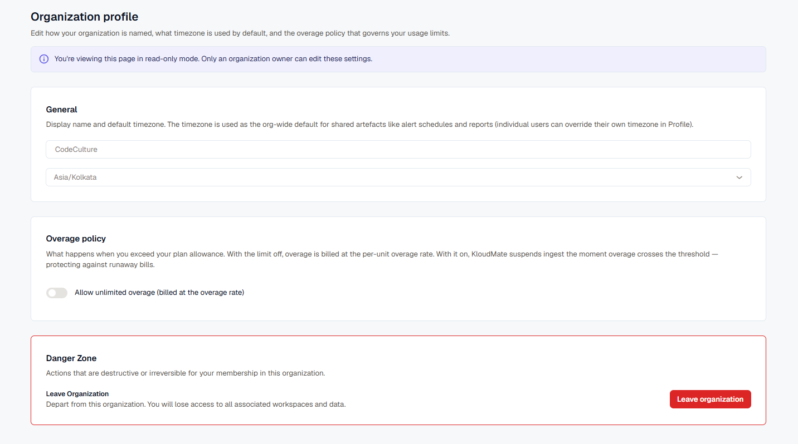

Organization settings apply org-wide: the display name, default timezone, and overage policy.

Open **Settings → Organization** to view or edit these settings.

:::note
Only an organization owner can edit these settings. Other members see the page in read-only mode.
:::

## General

Set the organization's display name and default timezone. The timezone is the org-wide default for shared artifacts like alert schedules and reports; individual users can override it for themselves in their own [Profile & Security](../profile-security/) settings.

## Overage Policy

Controls what happens when usage exceeds your plan's allowance:

- **Off (default):** overage is billed at the per-unit overage rate.
- **On:** KloudMate suspends ingest the moment usage crosses the threshold, protecting against runaway bills.

Toggle **Allow unlimited overage** to switch between the two.

## Leave an Organization

Instead of asking an owner to remove you, you can leave an organization yourself — useful cleanup if you've accumulated memberships in organizations or workspaces you no longer use.

- **Non-owners** can leave at any time.
- **Owners** must transfer ownership to another member first. An organization always needs at least one owner, so the leave action stays unavailable until ownership is transferred.

Use **Leave organization** in the **Danger Zone**. Leaving removes your access to the organization and every workspace and data set associated with it.

## Related

- [Workspaces](../workspaces/)
- [Users & Permissions](../users-permissions/)
- [Profile & Security](../profile-security/)
