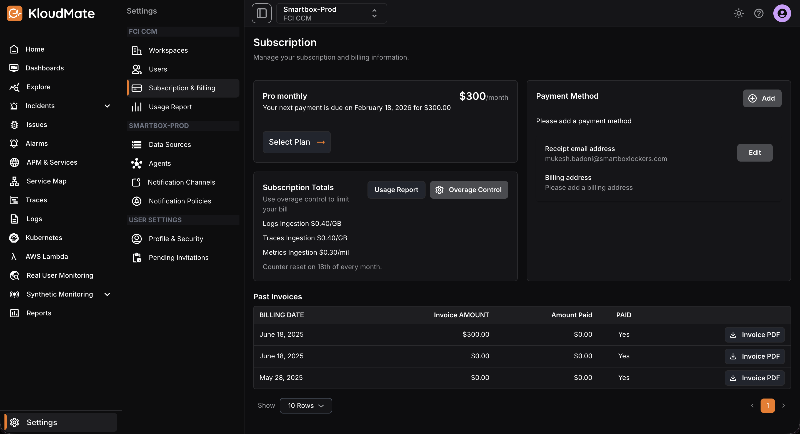
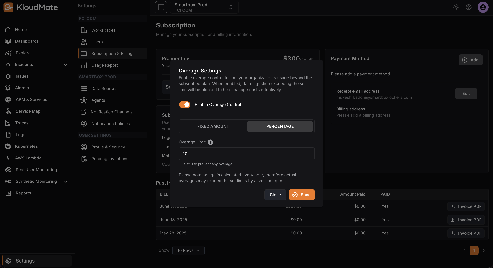

The '**Subscription & Billing**' section within KloudMate is where users can find and manage their KloudMate subscription.

This section gives an overview of the subscription and billing details such as:

-
  The current plan and its respective charges 
- The payment method and billing-related information
- The subscription totals of the associated account in terms of Lambda invocations and logs ingestion
- Past invoices with respective billing dates

Users can also download past invoices as PDF files.

The users with '**Owner**' level permission can:

- Change the subscription by clicking on the **Select Plan **button
- Add or remove multiple payment methods using the **Add **button, note that only the one that's set as default will be charged
- Modify payment method details such as the email address and billing address using the **Edit **button 

## Controlling Overage Costs

Data ingestion beyond your plan limit can lead to unexpected charges. Use overage controls to cap billing and stay within your organization’s budget.

You can configure overage controls in two ways:

- **Fixed Amount:** Set a specific dollar amount beyond which no additional overage charges apply. For example, enter `$50` to block charges above that threshold.
- **Percentage:** Define a percentage of your organization’s plan limit. Charges stop once overage exceeds this percentage (e.g., `10%` of your plan limit).

To prevent any overage charges entirely, enable overage control and set the value to `0`.
