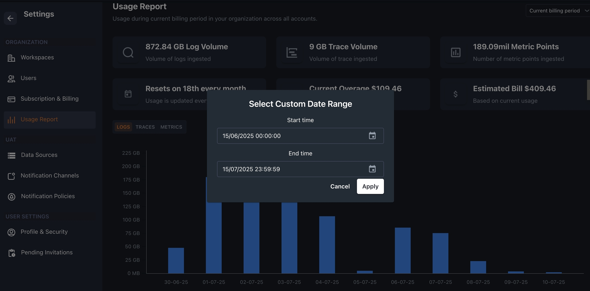

The '**Usage Report**' section within KloudMate is where users can find a comprehensive set of usage data, including:

- The total volume of logs ingested during the current billing period in GB
- The total volume of Traces ingested during the current billing period in MB
- The total number of metric points ingested during the current billing period 
-
  The reset date of the usage report
- Overage accrued in the current billing cycle

It shows the consolidated usage summary for the logs, traces, and metrics for the current billing period. The usage data is updated on an hourly basis.

You can view the usage report for the current billing cycle or the previous cycles using the dropdown located at the top right corner of the screen.

## Custom Date Range Reports

Users can generate usage reports for a specific time interval by selecting a custom date range from the billing period dropdown.

