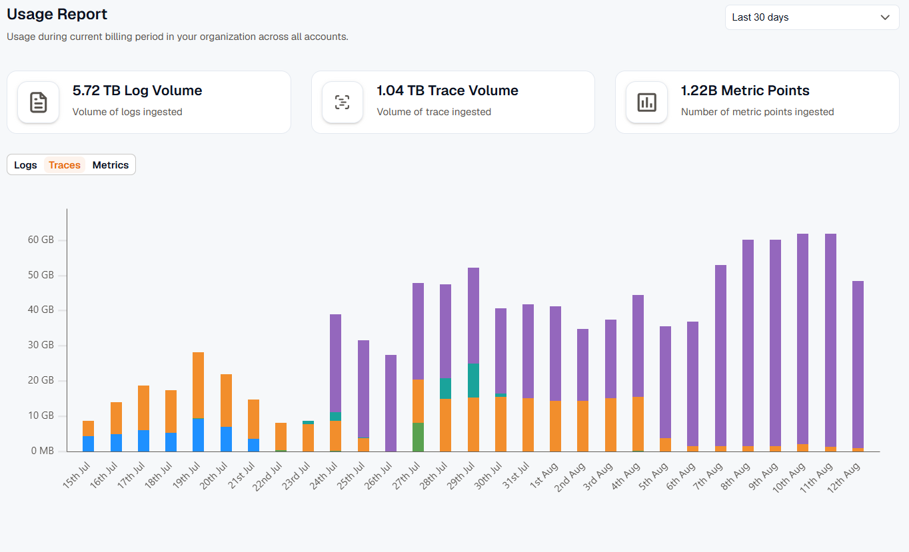
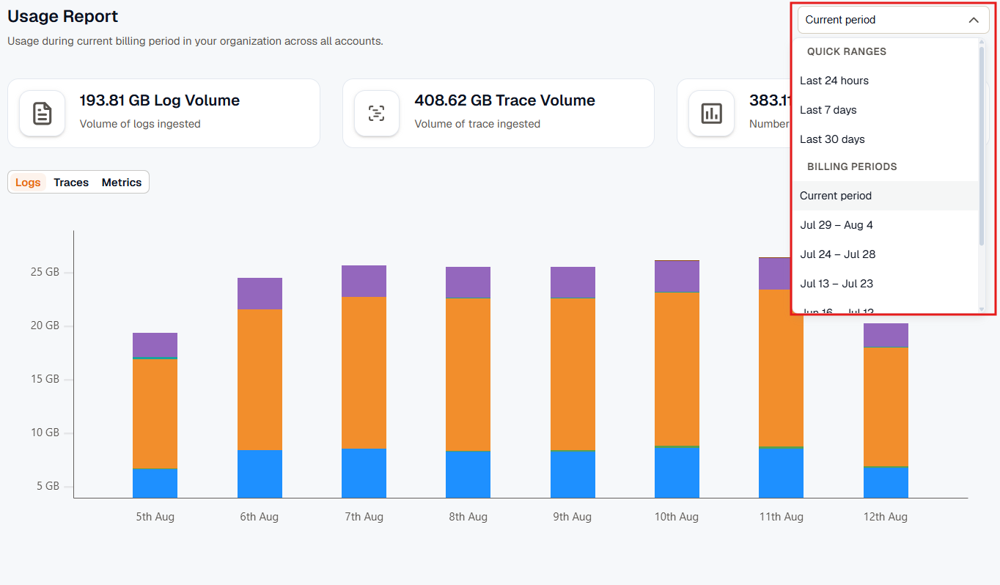
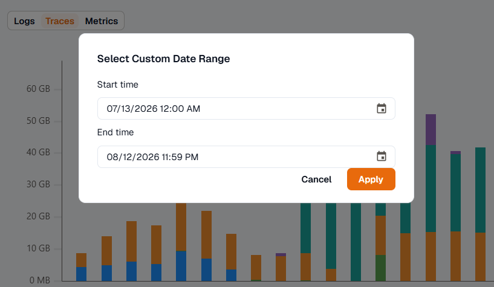

The usage report provides a consolidated view of platform consumption for the current billing period or past billing cycles.

It includes:

- Total logs ingested during the billing period
- Total traces ingested during the billing period
- Total metric points ingested during the billing period
- The billing reset date
- Any accrued overage

Use the billing period selector to switch between the current cycle and previous cycles.

## Custom Date Range Reports

You can also generate usage reports for a custom date range by selecting a custom window from the billing period selector.

