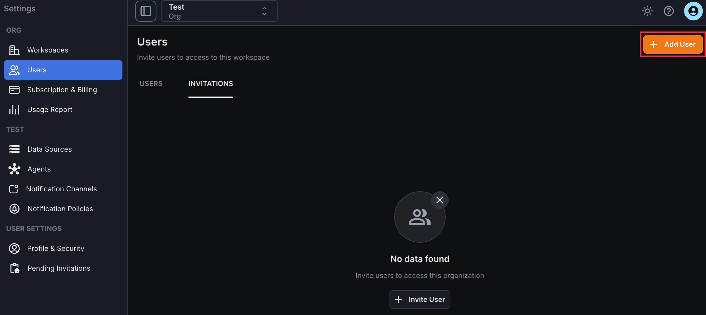
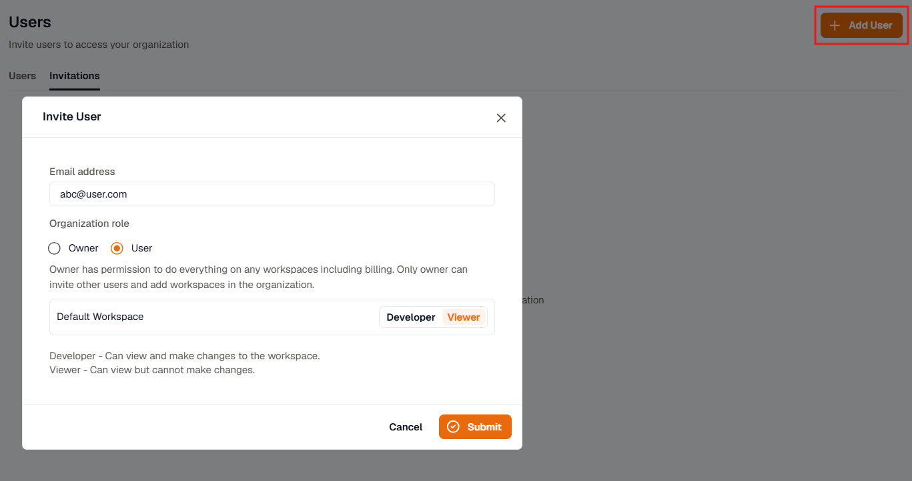
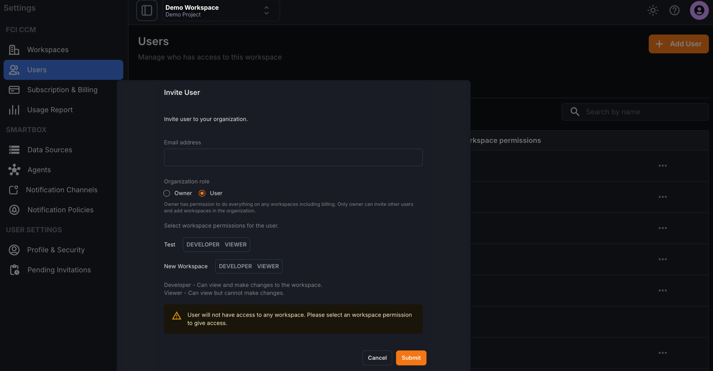

Users and associated permissions can only be managed by the **organization owner**. To access the user management section, click on**Settings > Users.**

In this section, the organization owner can do the following:

- Add new users
- Modify user permissions for existing users
- Remove users

This section also displays a list of all the users and their roles.

## Invite Users

New users can be added to an organization or workspace from the invitations section or by using the Add User button in the top‑right corner.

To invite a user, click Invite/Add User to open the form, then enter the user’s email address and select the permissions that should be assigned to that user. 

Different permissions can be configured per workspace; if no permission is assigned for a workspace, the user will not have access to that workspace.

