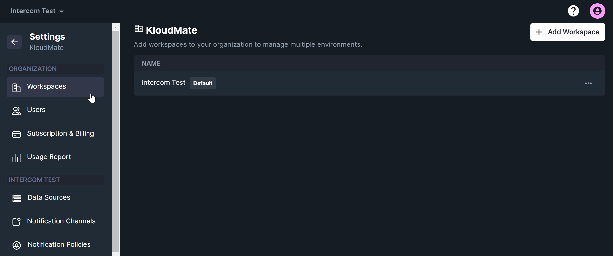
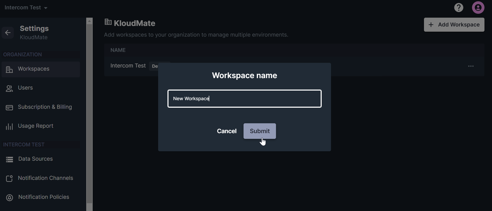
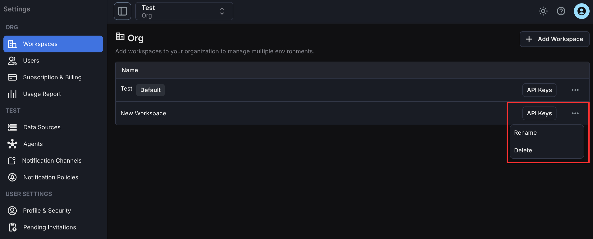
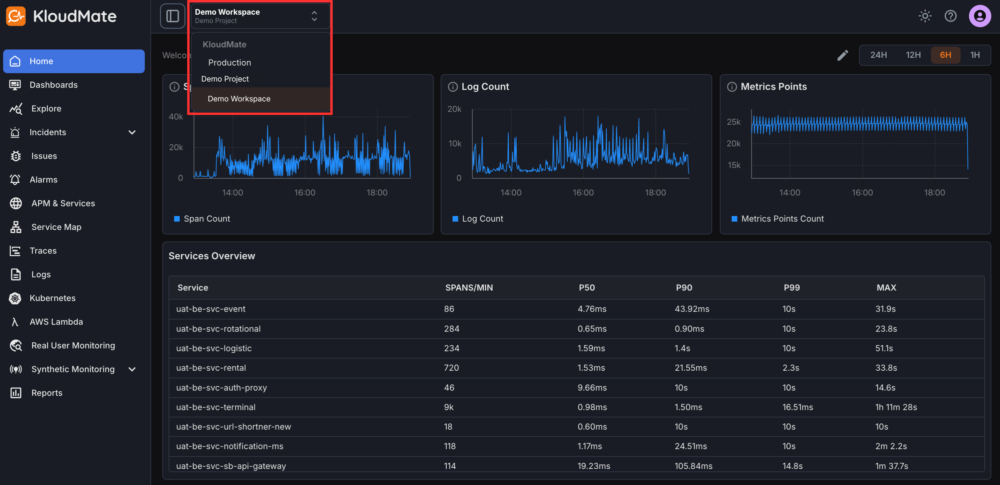

Workspaces let you organize data sources, services, and users by environment, team, or ownership boundary.

## Manage Workspaces

You create your first workspace during [initial setup](../../../getting-started/setting-up-kloudmate/). After that, you can create and manage additional workspaces from **Settings -> Workspaces**.

From this page, you can:

- View existing workspaces
- Create a new workspace
- Rename a workspace
- Delete a workspace

## Create a Workspace

1. Click **Add Workspace**.
2. Enter the workspace name.
3. Submit the form to create the workspace.

## Edit or Delete a Workspace

Use the edit action to rename a workspace. Use the delete action to permanently remove the workspace.

## Switch Between Workspaces

If you belong to multiple workspaces, use the workspace selector in the top-right corner of the interface to switch context.

