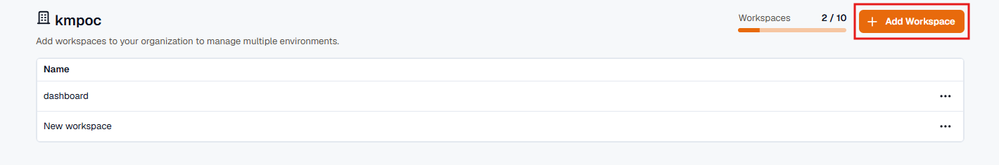
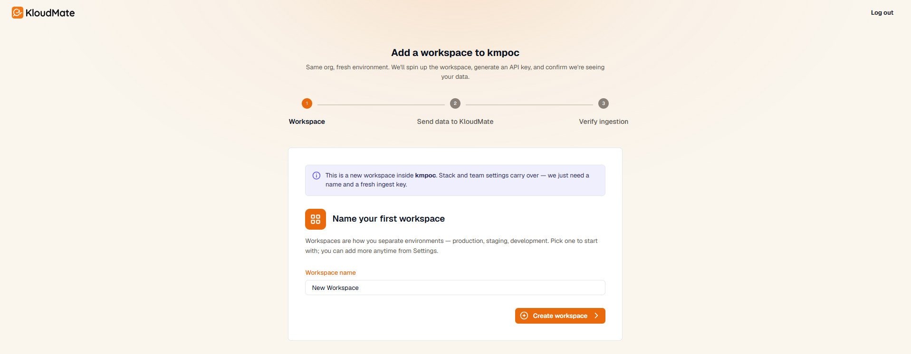
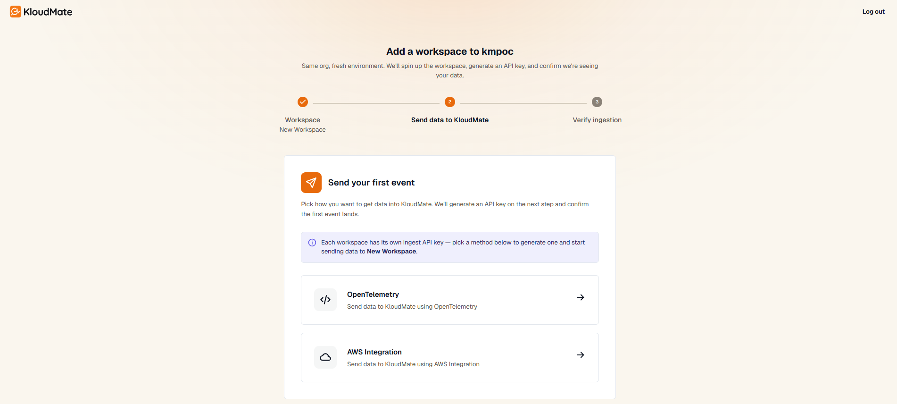
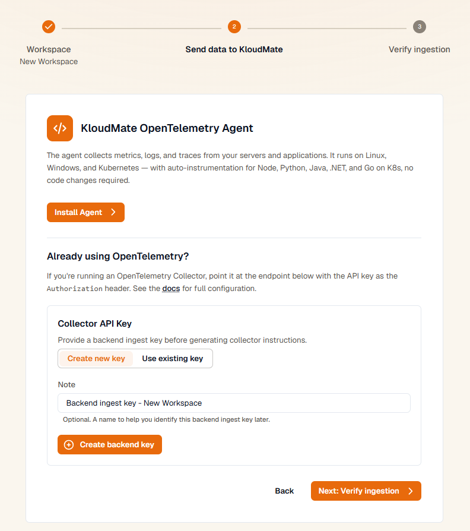
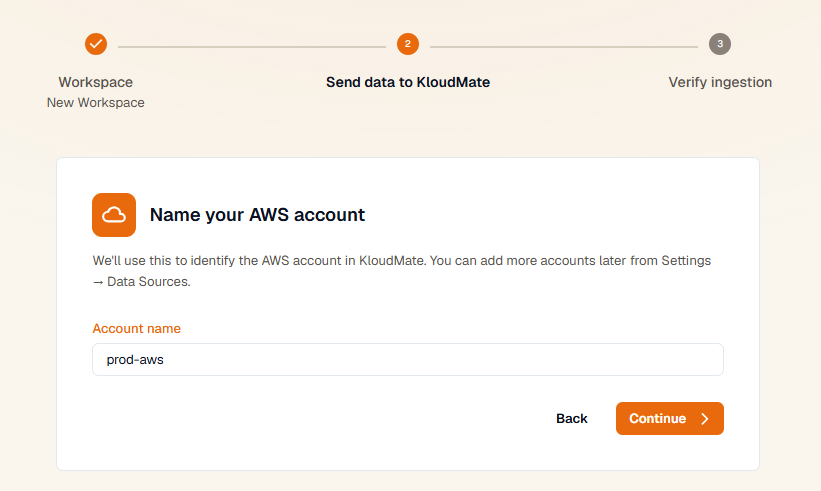
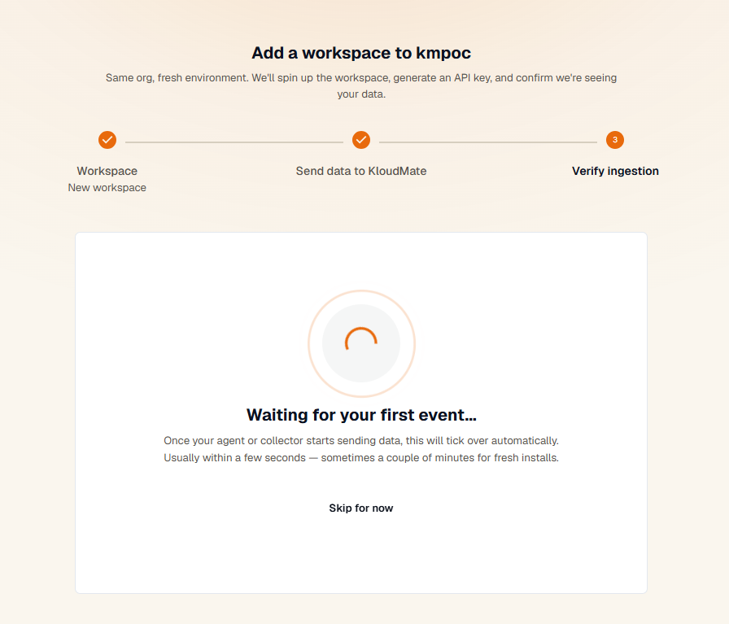
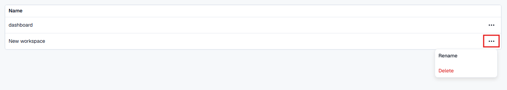
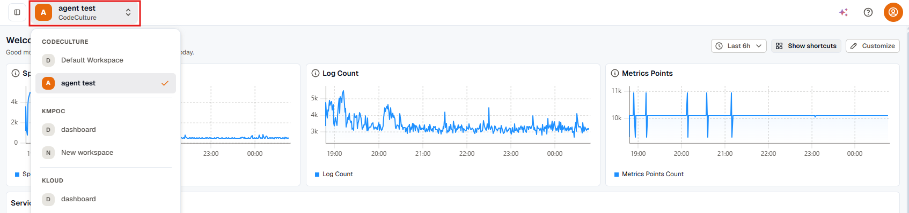

Workspaces let you organize data sources, services, and users by environment, team, or ownership boundary.

## Manage Workspaces

You create your first workspace during [initial setup](../../../getting-started/setting-up-kloudmate/). After that, manage additional workspaces from **Settings → Workspaces**.

From this page, you can:

- View existing workspaces
- Add a new workspace
- Rename a workspace
- Delete a workspace

## Create a Workspace

Click **Add Workspace** to start a three-step wizard that creates the workspace and confirms data is flowing into it, rather than just naming an empty workspace.

1. **Workspace.** Name the new workspace. Stack and team settings carry over from the organization, so this step only needs a name.

   

2. **Send data to KloudMate.** Choose how to send data to the new workspace, either the KloudMate OpenTelemetry Agent or AWS Integration. Each workspace gets its own ingest API key.

   

   - **OpenTelemetry Agent:** install the agent, or, if you already run an OpenTelemetry Collector, point it at the given endpoint using the generated API key as the `Authorization` header.

     

   - **AWS Integration:** name the AWS account KloudMate will connect to. You can add more accounts later from **Settings → Data Sources**.

     

3. **Verify ingestion.** The wizard waits for the first event to confirm data is reaching the workspace. This usually takes a few seconds, longer for a fresh install. Select **Skip for now** to finish setup without waiting.

   

## Rename or Delete a Workspace

Open the **⋯** menu on a workspace's row and choose **Rename** or **Delete**. Deleting a workspace is permanent.

## Switch Between Workspaces

Click the workspace selector in the top-left corner of the interface to switch context. If you belong to multiple organizations, the switcher groups workspaces by organization so you can jump between them without signing out.

