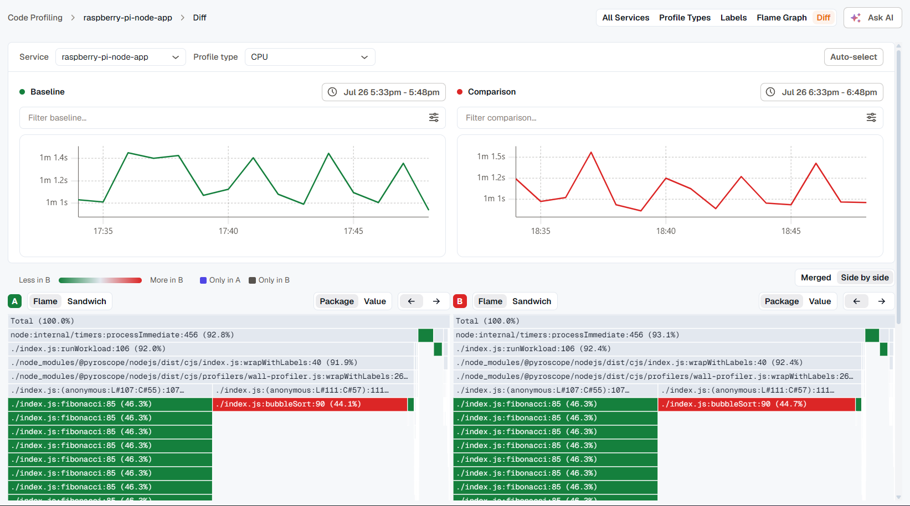

**Difference View** compares two time windows of the same service and profile type — the view to reach for right after a deploy, a config change, or a traffic shift, when the question is "did that make things better or worse?" instead of "what does this look like right now?"

## Set up the comparison

A **Service** and **Profile type** selector sits at the top, shared by both windows. Below it, two independent panels:

- **Baseline** (green) — the "before" window.
- **Comparison** (red) — the "after" window.

Each panel has its own time-range picker, its own label filters, and its own mini chart, so baseline and comparison can come from genuinely different moments — different days, different deploys, whatever you're comparing. Click **Auto-select** for a reasonable default: the last 15 minutes as the comparison window, and a 15-minute window from about an hour ago as the baseline.

## Merged vs. side by side

A toggle switches the bottom panel between two ways of looking at the same comparison.

### Merged

One flame graph, built from a single merged tree, colored by change: green frames got cheaper, red frames got more expensive, gray frames didn't move. The function table next to it adds **Baseline %**, **Comparison %**, and **Δ** columns — percentage-point deltas, so a function's cost is comparable even if the two windows aren't the same length.

This is the fastest way to get a single answer: scan for the widest red frame.

### Side by side

Two independent flame graphs, A (baseline) and B (comparison), each showing its own full 100% breakdown rather than one merged tree. Hover a frame in either one and the *same function* highlights in the other, with a tooltip showing self time and percentage on both sides plus the delta between them.

Reach for this when the merged view's single tree hides something — a function that moved depth in the call stack, for instance, or one that only exists in one of the two windows. The legend calls those out directly: teal/red for less-or-more in the same function, and separate swatches for "only in A" and "only in B."

## Related

- [Flame Graph](../flame-graph/) — the single-window view Difference View builds on.
- [Labels](../labels/) — the same filter mechanism, applied independently to each window here.
