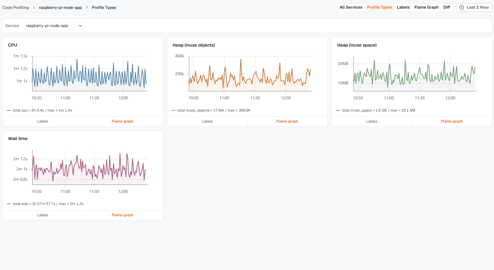

**Profile Types** flips the axis from [All Services](../all-services/): instead of one type across every service, you pick one service and see every type it reports — CPU, allocated objects, allocated space, in-use objects, goroutines, and anything else its SDK collects.

## Pick a service

A **Service** dropdown sits at the top of the page. Switching it reloads the grid with that service's own profile types — a service that only enables CPU profiling shows one card; a Go service with the full profiler config enabled might show five or six.

If nothing's selected yet, the page shows an empty state prompting you to pick a service from All Services first.

## Reading a card

Each card is one profile type, showing its label and a mini time-series chart over the selected time range. Two links sit in the card's footer:

- **Labels** — opens the [Labels](../labels/) view for this type, so you can break it down by resource attribute.
- **Flame graph** — opens the [Flame Graph](../flame-graph/) view for this type, ready to dig into.

If a service hasn't reported any profile types in the selected time range, the grid shows an empty state instead — widen the time range before assuming the SDK isn't sending data.

## Related

- [All Services](../all-services/) — the reverse view: one type across every service.
- [Labels](../labels/) — break one profile type down by resource attribute.
- [Flame Graph](../flame-graph/) — the detail view a card's "Flame graph" link opens.
