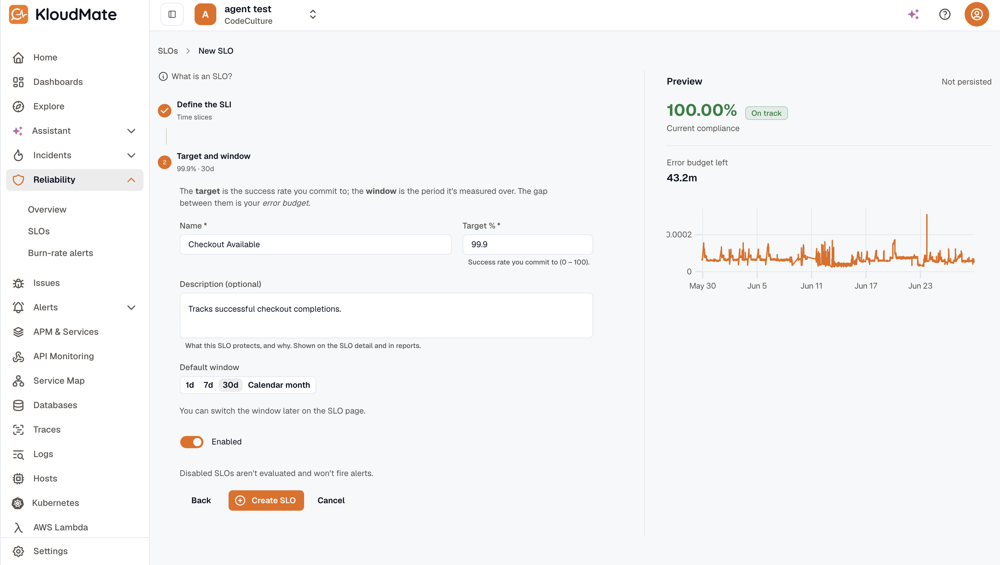

import { Steps } from '@astrojs/starlight/components';

Creating an SLO is a **two-step wizard**: pick the signal you want to measure (the SLI) and configure it, then set the target and window. A live preview on the right shows the projected compliance and error budget before you save.

Workspace **admin** is required. Non-admins don't see the Create SLO button.

## Where to start the wizard

Four entry points lead to the same wizard at `/<workspaceId>/slos/create`:

- **Reliability Overview → Create SLO** (top-right).
- **Reliability Overview → Quick start → Create an SLO** card.
- **Service detail → Reliability tab → Create SLO** — deep-links with `?service_id=…`, which pre-selects the **Incident availability** kind and prefills that service in the SLI (since the service lives inside the SLI, not on the SLO).
- **Alert detail → Define an SLO** action — opens the wizard with no prefill.

A **What is an SLO?** info tooltip sits above the steps for first-time users (create mode only), defining the core terms inline.

## The two steps

### Step 1 — Define the SLI

Pick the **family** first (a card), then the specific kind:

- **By Count** — a ratio of good ÷ total events: APM error rate, APM latency, APM request rate, Custom metric.
- **By Monitor Uptime** — uptime from incidents or a synthetic monitor: Incident availability, Synthetic uptime.
- **By Time Slices** — a custom uptime definition over time: Time slices.

After you pick a kind, a short "When to use this" description appears and the kind-specific form renders below. For details on each kind and its fields, see [SLI kinds](../sli-kinds/).

Only **Incident availability** asks for a service — every other kind is workspace-level. The metric and service-name pickers are free-solo, so you can also type a value that doesn't have telemetry yet.

When you click **Next**, KloudMate validates the SLI's configuration before advancing, so you can't carry an incomplete selector into the next step.

### Step 2 — Target and window

<Steps>
1. **Name** the SLO (required).

2. Set the **target %** — `0–100`, supports decimals (e.g. `99.99`). Defaults to `99.9`.

3. Add a **description** (optional) — shown on the SLO detail page and in reports.

4. Pick a **default window** — a segmented toggle, defaults to `30d`. Options: `1d`, `7d`, `30d`, `Calendar month`.

5. **Enabled** toggle defaults on. Leave it off to save the SLO without starting evaluations.

6. Watch the **preview** rail (see below) for the projected compliance %, error budget, and a *"Would breach"* chip if applicable.

7. Click **Create SLO**. KloudMate creates the SLO and redirects you to its detail page.
</Steps>

## The live preview

The right-hand rail shows a **Preview** card labelled *"Not persisted."* Whenever the SLI, target, or window settle (about 800 ms after your last change), KloudMate runs a one-off evaluation and shows:

- The projected **compliance %**, large and color-coded, with an **On track** or **Would breach** chip.
- The would-be **error budget left**, in the SLI's unit (a duration for time-based kinds, a count for ratio kinds).
- A **trend chart** when the SLI produces a per-bucket series (today that's Time slices and Synthetic uptime); other kinds show a placeholder until the SLI is evaluated.

If a metric or service has no data over the window, the preview surfaces a non-fatal warning so you can fix the name or filters. The preview never persists anything — it doesn't create snapshots or emit metrics.

## Editing an SLO

The Edit form uses the same layout as Create, with both steps open at once. Differences:

- The **SLI kind is locked** — changing the kind would mean a different SLI, so an info banner suggests creating a new SLO instead. The rest of the SLI (including the service on an incident-based SLO) is still editable.
- The **preview still runs**, showing the effect of your *unsaved* edits before you save.
- **Save only writes the fields you changed.**

You can reach Edit from the SLO detail page header or via the row menu on the [SLOs list](../slo-detail/).

## Deleting an SLO

The Delete confirmation **soft-deletes** the SLO — it disappears from the list, but its data is preserved and it stops being evaluated on the next tick. Any burn-rate alerts on the SLO are automatically disabled (their configuration is kept), so restoring the SLO later brings them back intact.

## Related

- [SLI kinds](../sli-kinds/) — the six SLI kinds and their fields.
- [SLO detail](../slo-detail/) — what you land on after saving.
- [Burn-rate alerts](../burn-rate-alerts/) — the next thing to set up.
