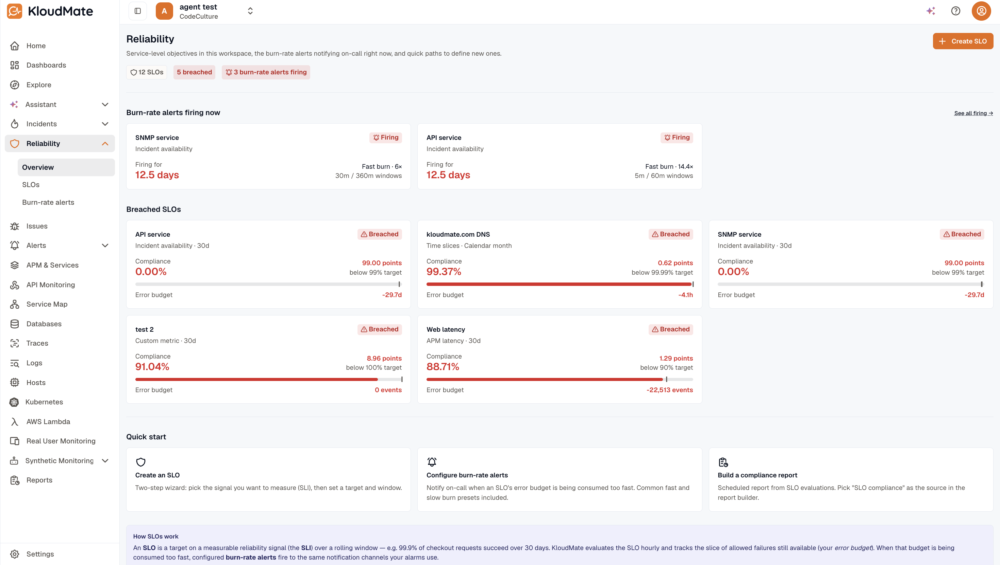

import { LinkCard, CardGrid } from '@astrojs/starlight/components';

The **Reliability** area is where you set, monitor, and respond to reliability promises about your services. Define a service-level objective (SLO), track compliance over time, and get paged before the error budget runs out.

This page is the workspace's reliability home — the hub you land on when you click **Reliability** in the left nav.

## What's on this page

The Reliability Overview hub is composed of, top to bottom:

1. **Status strip** — three clickable chips showing total SLOs, breached SLOs, and currently firing burn-rate alerts. Each chip deep-links into the matching filtered view.
2. **Burn-rate alerts firing now** — cards for every currently-firing burn-rate alert, deduplicated by parent SLO. Empty state reads e.g. *"All alerts quiet"*. Each card opens the parent [SLO detail](./slo-detail/).
3. **Breached SLOs** — top 5 breached SLOs, compact cards with compliance / target / window. A *"See all N →"* link appears when there are more than 5 breached SLOs.
4. **Quick start** — three action cards:
   - **Create an SLO** → opens the two-step wizard ([Create an SLO](./create-an-slo/)).
   - **Configure burn-rate alerts** → opens the workspace-wide [Burn-rate alerts](./burn-rate-alerts/) list.
   - **Build a compliance report** → opens the [SLO Compliance report](./slo-compliance-report/) flow.
5. **How SLOs work** — a single concept paragraph for first-timers.

## How SLOs work

An **SLO** is a reliability promise written as "this service should achieve X% over a Y-day window." You pick the signal you care about (the SLI), the target percentage, and the time window. KloudMate evaluates compliance on a schedule and alerts you when the error budget runs low.

## Next steps

<CardGrid>
  <LinkCard title="What is an SLO?" description="Plain-English definitions of SLO, SLI, error budget, and burn rate." href="./what-is-an-slo/" />
  <LinkCard title="Create an SLO" description="Walk through the two-step wizard with a live compliance preview." href="./create-an-slo/" />
  <LinkCard title="SLI kinds" description="The six SLI kinds and when to use each." href="./sli-kinds/" />
  <LinkCard title="Burn-rate alerts" description="Page on burn-rate spikes before the error budget runs out." href="./burn-rate-alerts/" />
</CardGrid>

## Related

<CardGrid>
  <LinkCard title="Alerts" description="Per-event alerting and routing." href="../alerts/" />
  <LinkCard title="Incident Management" description="Linked SLOs panel on incident detail." href="../incident-management/" />
  <LinkCard title="Reports" description="Add an SLO Compliance report as a recurring deliverable." href="../reports/" />
</CardGrid>
