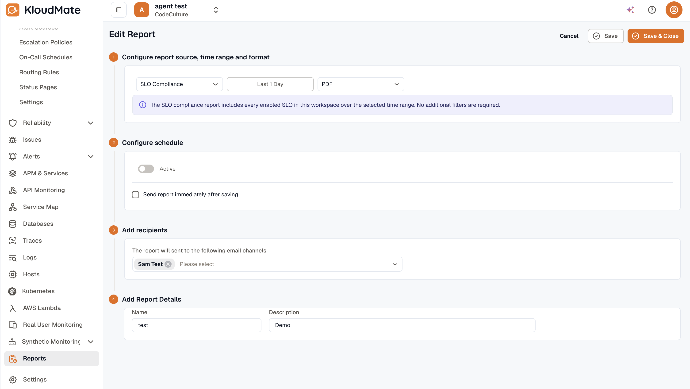

The **SLO Compliance** report is a source on the Reports module. It produces one row per enabled SLO with its latest compliance snapshot, error budget, and burn-rate-alert state.

The source has **no additional configuration** — it's a workspace-wide rollup of every enabled SLO. No filters, no per-SLO toggles. For a narrower view, filter the export afterward.

## Create an SLO Compliance report

1. Open **Settings → Reports → Create Report**.
2. In the **Report Type** picker, select **SLO Compliance**.
3. An info banner explains: e.g. *"Workspace-wide rollup: includes every enabled SLO over the selected time range. No additional filters are required."*
4. Pick a **Time Range**, **Report Format** (PDF or XLSX), **Schedule** (Fixed or Recurring), and **Recipients** — same as other report sources. See [Create Report](../reports/create-report/) for the full walk-through.
5. Click **Save**.

## Discovery entry point

You can also reach this flow from the [Reliability Overview hub](../reliability/) — the **Quick-start → Build a compliance report** card deep-links into the report builder with SLO Compliance pre-selected. This means users don't need to navigate to Reports separately to set this up.

## What the report contains

For every enabled SLO in the workspace, the export has one row with:

- **Service** — only for **Incident availability** SLOs (resolved from the SLI); blank for the workspace-level kinds.
- **SLO** name.
- **SLI kind**.
- **Window** — the SLO's default window.
- **Target %**.
- **Compliance %** — from the SLO's latest cached snapshot for its default window.
- **Error budget** — remaining at that snapshot, in the SLI's unit (a duration or an event count). A negative value means breached.
- **Burn-rate alert** — the worst current burn-rate-alert state on the SLO (e.g. *Firing for 2.0h*, *configured*, or *—*).
- **Status** — `OK`, `BREACHED`, or `no snapshot yet` for a newly-created SLO before its first evaluation.

## Related

- [Reports — Create Report](../reports/create-report/) — the surrounding report flow.
- [SLO detail](./slo-detail/) — for ad-hoc, single-SLO views.
- [Reliability Overview](../reliability/) — the deep-link entry point.
