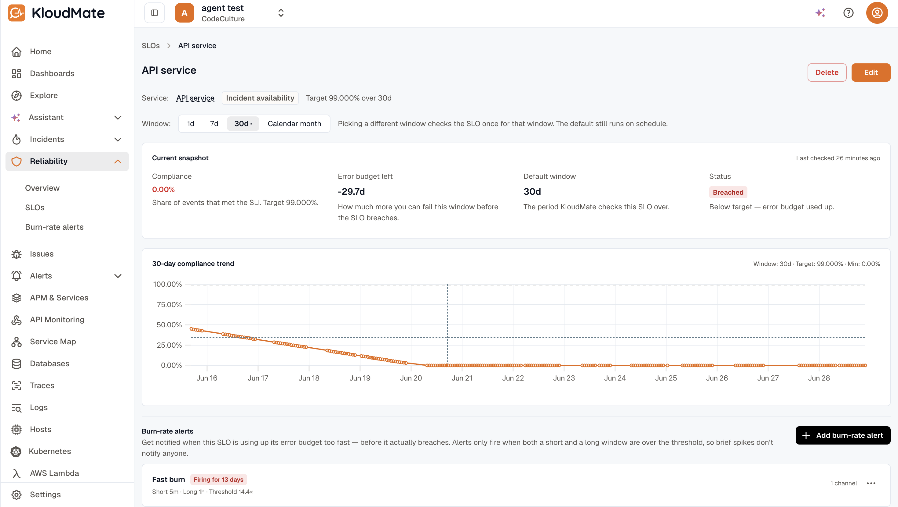

The SLO detail page is where you read compliance and manage burn-rate alerts for a single SLO. It lives at `/<workspaceId>/slos/<id>` and is reached from the [SLOs list](../reliability/), the breached cards on the [Overview hub](../reliability/), the service detail [Reliability tab](./service-reliability-tab/), or the **Linked SLOs** panel on incident detail.

## Page layout

The page is composed of, top to bottom:

### Header

Name, SLI kind chip, target / window summary, and a `Disabled` chip if applicable. For an **Incident availability** SLO the header also shows a **Service** link (a soft-deleted service still renders, suffixed *"(deleted)"*); every other kind is workspace-level and shows no service. Admins see **Edit** and **Delete** buttons.

### Window picker

A segmented toggle: `1d` / `7d` / `30d` / `Calendar month`. The SLO's **default window** is bold and tooltipped as *"Default window — refreshed hourly."*

Picking a different window kicks off a **one-off re-evaluation** — the SLO's scheduled evaluations keep using the default. A caption next to the picker reminds you:

e.g. > *Picking a different window checks the SLO once for that window. The default still runs on schedule.*

### Current snapshot card

A header strip shows *"Current snapshot"* on the left and *"Last checked X ago"* (or *"Not checked yet"*) on the right. Below it, four metric stats in a responsive grid:

- **Compliance** — large, color-coded percentage. Helper text: *"Share of events that met the SLI. Target X%."*
- **Error budget left** — how much more you can fail this window before the SLO breaches, in the SLI's unit: a duration for the time-based kinds (incident availability, time slices, synthetic uptime), a count of events for the ratio kinds (the APM kinds and custom metric). A negative (exhausted) budget renders as e.g. `-1.4h` / `-3.3d` rather than raw seconds.
- **Default window** — e.g. `30d`.
- **Status** — `Healthy` / `Breached` / `Not evaluated` chip with a one-line helper (e.g. *"On track — within target."* or *"Below target — error budget used up."*).

### 30-day compliance trend chart

A line chart over the last 30 days for the currently-selected window.

- **Dotted points** at each evaluation, so sparse data reads as a real series.
- **Dashed horizontal target line** for instant visual reference.
- **Hover tooltip** showing exact compliance % + timestamp at the cursor.
- **Smart x-axis ticks** — single-day data shows times (`14:30`); multi-day shows dates (`May 25`).
- **Y-axis anchored from below the target to 100%**, floored at 90%. Tiny drops don't appear catastrophic, and the typical "well-above-target" case still has room.

### Burn-rate alerts section

A list of every burn-rate alert configured for this SLO with its firing state. Admins see an **Add burn-rate alert** button and a per-alert Edit / Delete menu.

For the full preset set and form fields, see [Burn-rate alerts](./burn-rate-alerts/).

## Related

- [Burn-rate alerts](./burn-rate-alerts/) — the alerting layer over an SLO.
- [Create an SLO](./create-an-slo/) — the wizard that produced this SLO.
- [SLI kinds](./sli-kinds/) — what the SLI on this SLO is measuring.
