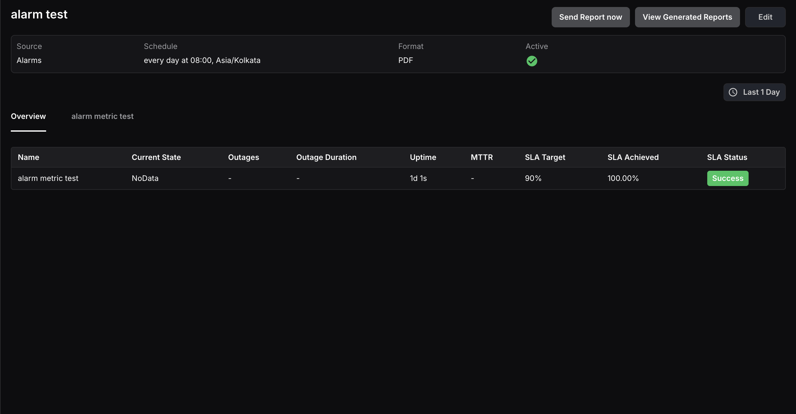

An Alarm Report provides detailed statistics about a single alarm or a group of alarms, helping you track their performance and state changes over a selected time range.

The report displays the following details for each alarm:

- **Name:** The name of the alarm.
- **Current State:** The state of the alarm at the time of report generation.
- **Outages:** The total number of times the alarm was triggered during the selected time range.
- **Outage Duration:** The cumulative duration the alarm remained in an alerting state within the selected time range.
- **Uptime:** The total time the alarm remained in a normal state within the selected time range.
- **MTTR (Mean Time to Resolution):** The average time taken to resolve the alarm from an alerting state back to normal.
- **SLA Target:** The SLA percentage target set by the user.
- **SLA Achieved:** The percentage of time the alarm was in a normal state during the selected time range.
- **SLA Status:** Shows Success if SLA achieved meets or exceeds the target, or Failed if it falls below.

<hint type="info">
  SLA targets for alarms can be configured on the **Alarm Configuration** page.
</hint>

