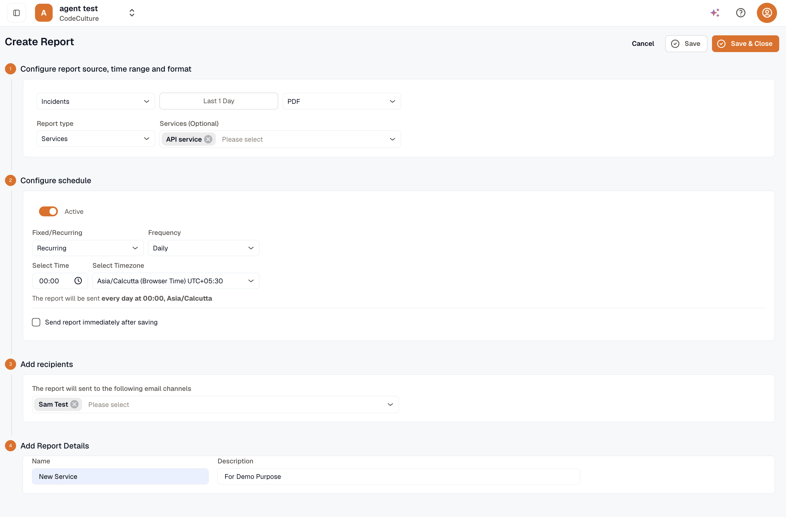
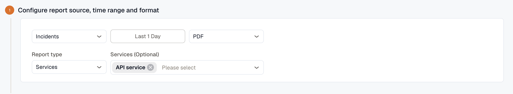
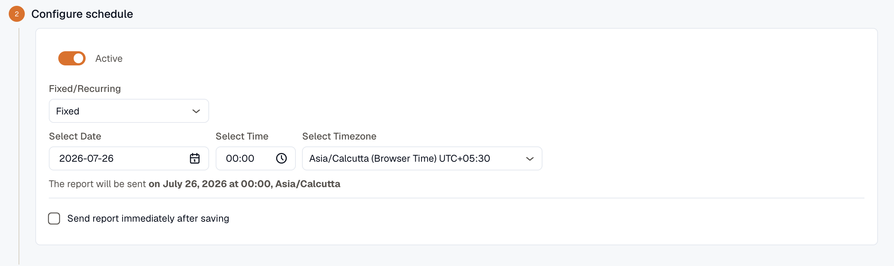
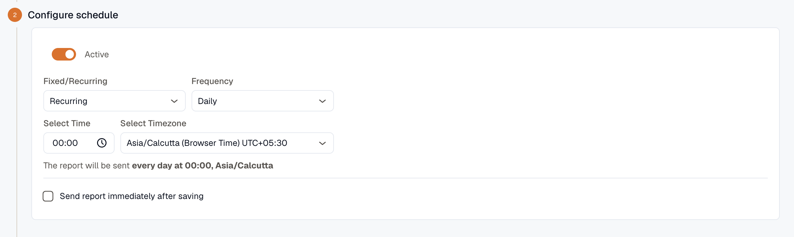
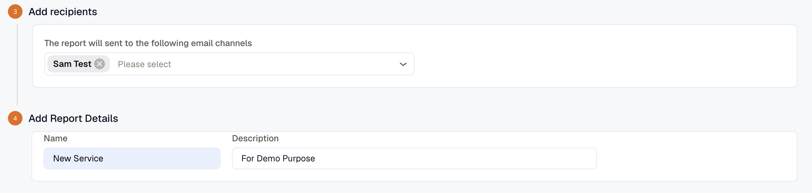

Reports are created from the Reports Overview page. The Create Report page is divided into four sections.

### 1. Configure Report Source, Time Range and Format

- **Source:** Select what the report pulls data from — [Availability](../availability-report/), [Incident Report](../incident-report/), [Dashboard Report](../dashboard-report/), or [SLO Compliance](../../reliability/slo-compliance-report/). When generating an Availability report, you can also filter alerts by labels or select specific alerts using the dropdown.
- **Time Range:** Select the duration for which the report should be generated.
- **Report Format:** Choose the output format — PDF or XLSX.
- **Report type:** For an Incidents report, choose **Services**, **Responders**, or **Services & Responders** to set what the report covers.
- **Services (Optional):** When **Report type** includes Services, optionally filter to specific services using the dropdown. Leave it empty to include all services.

### 2. Configure Schedule

Scheduling is optional. Disable the **Active** toggle to skip it.
Users can choose between two scheduling options:

**A. Fixed**
Send the report once at a specific date and time.

- **Select Date:** Choose the exact date for the report.
- **Select Time:** Specify the time the report should be sent.
- **Select Timezone:** Set the timezone for the selected time.

**B. Recurring**
Automatically generate and send reports at a defined interval.

- **Frequency:** Choose how often the report should be sent — Daily, Weekly, or Monthly.
- **Daily:** Select the time of day.
- **Weekly:** Select the day of the week and time.
- **Monthly:** Select the date of the month and time.
- **Select Timezone:** Set the timezone for the selected time.

:::info
Check **Send report immediately** after saving to dispatch the report instantly upon saving.
:::

### 3. Add Recipients

Select one or more recipients from the dropdown. The recipient list includes all email channels configured in KloudMate’s notification channels.

### 4. Add Report Details

- **Name:** The title of the report, displayed on the Reports Overview page.
- **Description:** A brief summary describing the report’s purpose.

Once all sections are filled in, click **Save** to schedule the report or **Save & Close** to save and exit.
