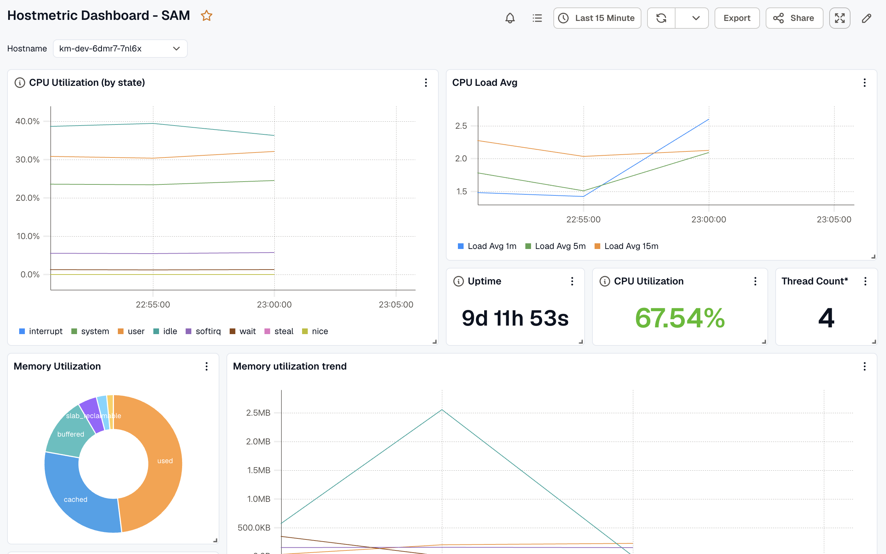
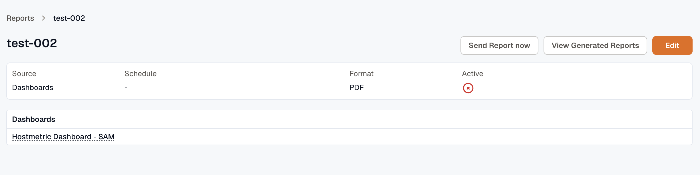
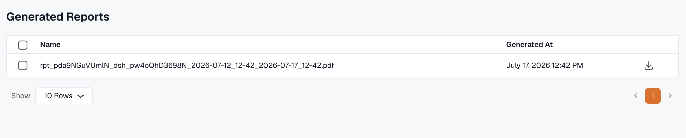

The **Dashboard Report** generates a PDF version of a selected dashboard. 

The report details page displays the **source**, **schedule**, **format**, and **active** status of the report, plus the specific dashboard (or dashboards) the report includes.

You can click **Send Report now** to trigger the report immediately, or click **View Generated Reports** to access and download previously generated report files.

