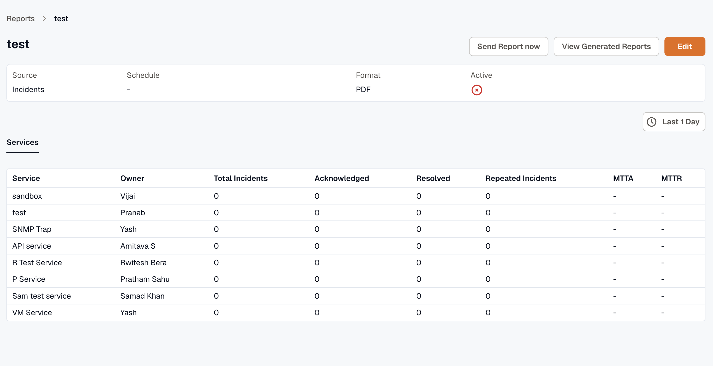

An Incident Report provides detailed statistics about incidents associated with services and responders in the Incident Management module, offering insights into performance and resolution efficiency over a selected time range.

Each report shows its **Source**, **Schedule**, **Format**, and whether it is **Active**, plus buttons to **Send Report now**, **View Generated Reports**, or **Edit** the report. Use the time range control (for example, **Last 1 Day**) to change the window the statistics below cover.

The report is split into two tabs; Services and Responders.

### Services

The **Services** tab focuses on incidents related to specific services. 

It displays the following details:

- **Service:** The name of the service.
- **Owner:** The owner responsible for the service.
- **Total Incidents:** The total number of incidents triggered during the selected time range.
- **Acknowledged:** The number of incidents acknowledged during the selected time range.
- **Resolved:** The number of incidents resolved during the selected time range.
- **Repeated Incidents:** The number of recurring incidents for the service within the time range.
- **MTTA (Mean Time to Acknowledge):** The average time taken to acknowledge incidents after they are triggered.
- **MTTR (Mean Time to Resolve):** The average time taken to resolve incidents after they are triggered.

:::tip
Reliability tracking has moved to SLOs. The SLA Target, SLA Achieved, and SLA Status columns are no longer part of the Incident Report — see [Reliability](../../reliability/) to set up service-level objectives, or the [SLO Compliance report](../../reliability/slo-compliance-report/) for a scheduled rollup.
:::

### Responders

The **Responders** tab evaluates the performance of responders assigned to incidents. It displays the following details:

- **Name:** The name of the responder.
- **Assigned Incidents:** The number of incidents assigned to the responder during the selected time range.
- **Acknowledged:** The number of incidents acknowledged by the responder.
- **Resolved:** The number of incidents resolved by the responder.
- **MTTA (Mean Time to Acknowledge):** The average time taken by the responder to acknowledge assigned incidents.
- **MTTR (Mean Time to Resolve):** The average time taken by the responder to resolve assigned incidents.

