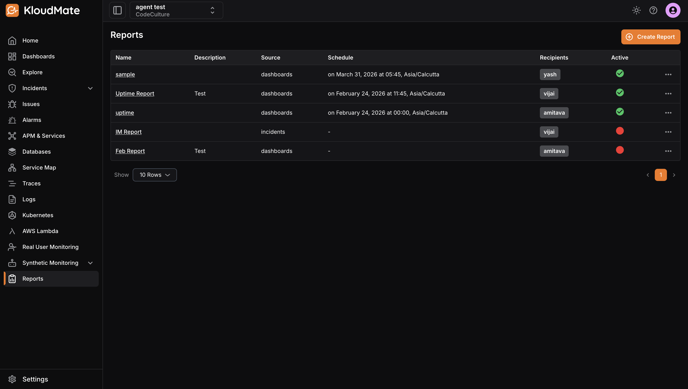

The **Overview** page provides a centralised view of all your generated and scheduled reports. From here, you can view report details, edit or delete existing reports, and create new ones.

Each report displays the following details:

- **Name:** The name assigned to the report.
- **Description:** A brief summary of the report’s purpose or contents.
- **Source:** The data source used to generate the report, such as dashboards, alarms, or incidents.
- **Schedule:** The configured schedule for sending the report. This field will be empty if no schedule has been set.
- **Recipients:** The email address(es) the report is sent to when scheduled.
- **Active:** Indicates whether the report is currently active (green) or inactive (red).

***

## Learn how to: [Create a Report](./create-report.mdx)

 

