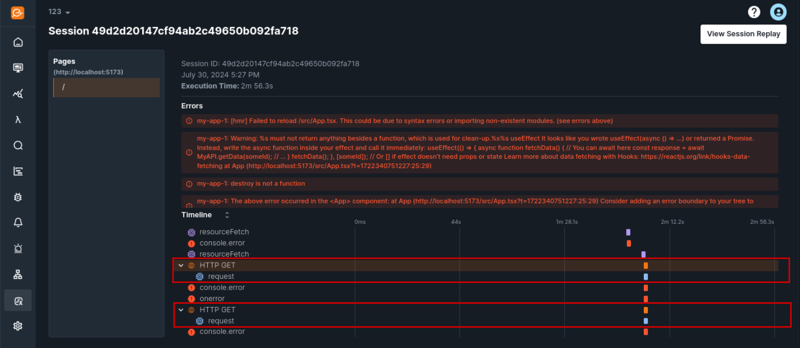
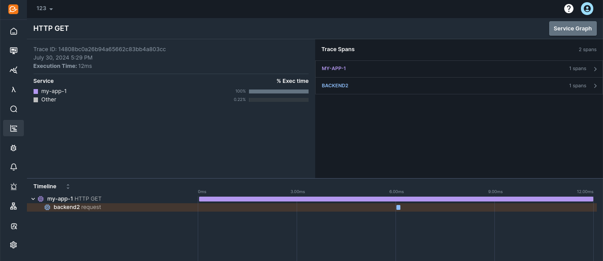

KloudMate's RUM lets you connect requests from your web apps to their related backend traces. This integration provides a unified view of both your frontend and backend data and helps to Identify issues throughout your stack and gain insight into your users' experiences.

:::note
  The RUM SDK by default adds [context propagation headers (W3C)](https://opentelemetry.io/docs/concepts/context-propagation/#propagation) to fetch and XHR requests made to the same origin. 
:::

If you want to propagate these headers to a different origin, it can be configured at initialization. 

For example, if you want to propagate trace context headers to `https://api.example.com`, the RUM SDK would be initialized as shown below: 

```javascript
KloudMateRum.init({
  endpoint: 'https://otel.kloudmate.dev:4318',
  rumAccessToken: '<YOUR_PUBLIC_API_KEY>',
  applicationName: 'my-app',
  version: '1',
  deploymentEnvironment: 'prod',
  sessionRecorder: {
      enabled: true,
  }
  instrumentations: {
    fetch: {
      propagateTraceHeaderCorsUrls: [new RegExp('https://api.example.com.*')]
    },
    xhr: {
      propagateTraceHeaderCorsUrls: [new RegExp('https://api.example.com.*')]
    }
  }
});

```

This will add context propagation headers to backend requests. The backend can then generate its spans using this context. 

:::note
  You can find examples of context extraction on the backend here: [https://opentelemetry.io/docs/languages/js/propagation/#generic-example](https://opentelemetry.io/docs/languages/js/propagation/#generic-example) 
:::

**Sample Integration:**

1. Once the RUM and backend are integrated you can view the corresponding backend trace of a frontend request



2\. You can identify the same in APM traces



***

### Related Resources

- [What Is Real User Monitoring (RUM)?](../)
- [KloudMate RUM Interface](../rum-interface/)

