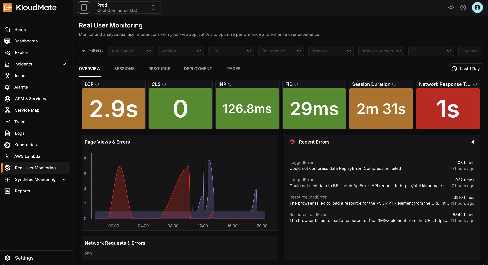
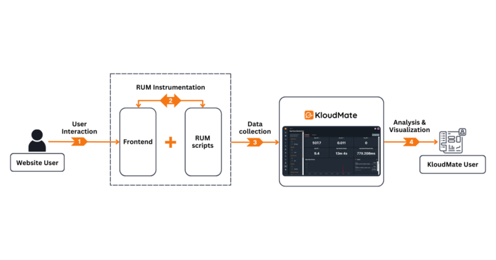

Real user monitoring (RUM) is a performance monitoring practice that is used to observe and measure the performance of a website or an application from the users' perspective. RUM captures data on how real users interact with the system in real-time, which includes metrics like page load times, transaction speeds, error rates, and user behavior patterns. 

This data provides insights into how users directly experience the system. Using this data, developers can identify and address performance bottlenecks, understand user behavior, and improve overall user satisfaction of their websites or applications.

## Real User Monitoring With KloudMate

RUM must be integrated with an APM backend such as KloudMate for the RUM data to be used effectively. This integration is essential as the APM backend, KloudMate in this case, provides the necessary infrastructure and tools to aggregate, process, and analyze the RUM data. 

### How Does RUM Work?


Rum works by embedding small JavaScript snippets into web pages while they are in use. These snippets record and send performance metrics back to a monitoring platform where the data can be queried and visualized. The collected data is then analyzed using the monitoring platform's monitoring capabilities to understand various performance aspects. 

The following diagram illustrates the step-by-step process of how Real User Monitoring (RUM) works: 

**1. User Interaction:** A website user interacts with the RUM-instrumented website or application, initiating various actions like accessing the website, navigating pages, clicking buttons, or submitting forms.

**2. RUM Instrumentation:** The front end of the web page that is being accessed is instrumented with RUM scripts, which include embedded JavaScript snippets. As the user continues interacting with the page, the RUM SDK will collect data on various performance metrics, such as page load times, resource loading times, and user interactions. 

**3. Data Collection:** The collected data is sent back to KloudMate. KloudMate then aggregates the data and allows for real-time monitoring and analysis.

**4. Analysis & Visualization:** KloudMate creates a default dashboard dedicated to visualizing the collected RUM data. This dashboard is pre-populated with all the critical information such as Avg. LCP, CLS, INP, etc., and can be accessed within KloudMate's RUM interface. 

### Key Concepts in RUM

| **Term** | **Description** |
| --------------------- | ---------------------------------------------------------------------------------------------------------------------------------------------------------------------------------------------------------------------------------------------------------------------------------------------------------------------------------------------------------------------------------------------------------------------------------------------------------------------------------------------------------------------------------------------------------------------------------------------------------------------------------------------------------------------------------------------------------------------------------------------------------------------------------------------------------------------------------------------------------------------------- |
| Trace                 | A trace is a detailed sequential record of operations that occur within an application and its services during the execution of a particular user request or transaction.                                                                                                                                                                                                                                                                                                                                                                                                                                                                                                                                                                                                                                                                                                    |
| Span                  | A span represents a single operation within a trace. Each span includes metadata such as the start and end time, operation name, and other relevant details.                                                                                                                                                                                                                                                                                                                                                                                                                                                                                                                                                                                                                                                                                                                 |
| Session               | A session is a period during which a user interacts with an application or a website. It starts when the user first accesses the web or application page and ends after a predetermined period of inactivity or when the user closes the application.                                                                                                                                                                                                                                                                                                                                                                                                                                                                                                                                                                                                                        |
| User Journey          | The paths that users take through a website, including the sequence of pages and interactions.                                                                                                                                                                                                                                                                                                                                                                                                                                                                                                                                                                                                                                                                                                                                                                               |
| Session ID            | A session ID is a unique identifier assigned to each user session.  The session ID helps in correlating various user activities and interactions in a session, such as page views, clicks, form submissions, and other events, into a single coherent session.                                                                                                                                                                                                                                                                                                                                                                                                                                                                                                                                                                                                               |
| Session Replay        | A feature within KloudMate that allows capturing and replaying user interactions with a website for analysis.                                                                                                                                                                                                                                                                                                                                                                                                                                                                                                                                                                                                                                                                                                                                                                |
| Network Response Time | The time it takes for a network request made by the user's browser to receive a response from the server.                                                                                                                                                                                                                                                                                                                                                                                                                                                                                                                                                                                                                                                                                                                                                                    |
| Web Vitals            | A set of metrics to quantify essential aspects of web page performance, including **Largest Contentful Paint (LCP)**, which measures how long it takes the largest visible content element to render; **Cumulative Layout Shift (CLS)**, which measures unexpected layout shifts over the page lifetime; **Interaction to Next Paint (INP)**, which captures the time between user interaction and the next paint event; and **First Input Delay (FID)**, which measures the delay between the first user interaction and when the browser starts processing it. |

***

### Related Resources

- [Instrumentation Guide](./instrumentation-guide/)
- [RUM Interface](./rum-interface/)
