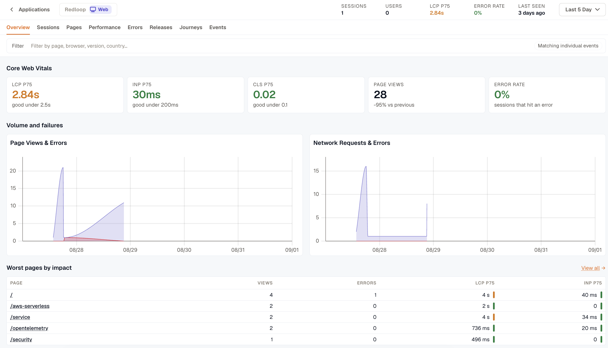

Real user monitoring (RUM) measures how your site or app performs for the people actually using it. A synthetic test measures a page on a machine you control. RUM reports what happened in a real browser, on a real device, over a real network: how long pages took to load, which requests failed, what visitors clicked, and where they gave up.

Those two numbers often differ sharply. A page that loads in 400 ms on your laptop can take six seconds on a mid-range phone in another country, and only your visitors ever see the second one.

## Real user monitoring with KloudMate

RUM data is worth little until something collects, stores, and queries it. An SDK in your application sends its measurements to KloudMate, and the [RUM interface](./rum-interface/) turns them into pages you can read, filter, and share. Because that data sits alongside your logs, metrics, and backend traces, you can go from a slow request in a browser session to the backend service that made it slow.

### How does RUM work?

You add a small SDK to your website or mobile app. From then on it watches page loads, route changes, network calls, clicks, and errors as they happen, and sends what it records to KloudMate. Your application code doesn't change beyond the one call that initializes the SDK.

**1. User Interaction:** Someone loads a page, moves between routes, clicks a button, or submits a form.

**2. RUM Instrumentation:** The SDK measures what each of those actions cost: page load and resource timing, web vitals, request duration, and any error thrown along the way.

**3. Data Collection:** The SDK sends those measurements to KloudMate, where they're stored and indexed as they arrive.

**4. Analysis & Visualization:** The [RUM interface](./rum-interface/) opens on **Overview**, which reports LCP, INP, and CLS at p75 with page views and error rate, and links through to the sessions behind each number.

### Key concepts in RUM

| **Term** | **Description** |
| --- | --- |
| Trace | The record of one request as it moves through your application and the services behind it. |
| Span | A single operation inside a trace, with its own start time, duration, name, and attributes. |
| Session | One visit. It starts when someone first loads a page and ends after a stretch of inactivity or when they close the app. |
| User Journey | The path someone took through the app: which pages they saw, in what order, and what they did on each. |
| Session ID | The identifier that ties everything in one visit together, so page views, clicks, form submissions, and errors read as a single session rather than as unrelated events. |
| Session Replay | A recording of what the page looked like during a session, played back frame by frame. Recording is off until it is turned on, and only a sampled share of sessions carry one. See [Record sessions for replay](./instrumentation-guide/web/#record-sessions-for-replay). |
| Frustration signal | A click the browser SDK judged unproductive at the moment it happened: a **rage click** (repeated clicks on the same element), a **dead click** (a click nothing responded to), or an **error click** (a click followed by a JavaScript error). See [Frustration signals](./session-detail/#frustration-signals). |
| Network Response Time | How long a request from the visitor's browser took to come back from the server. |
| Web Vitals | Metrics that quantify how a page felt to load and respond: **Largest Contentful Paint (LCP)**, how long the largest visible element took to render; **Cumulative Layout Shift (CLS)**, how much the layout moved unexpectedly; **Interaction to Next Paint (INP)**, the delay between an interaction and the next paint; plus **Time to First Byte (TTFB)** and **First Contentful Paint (FCP)** on an individual session. INP replaced First Input Delay as a Core Web Vital in March 2024, and the RUM views report it instead. |

***

### Related Resources

- [Instrumentation Guide](./instrumentation-guide/)
- [RUM Interface](./rum-interface/)
- [Session Detail](./session-detail/)
- [Correlate RUM traces with OpenTelemetry backends](./correlate-rum-traces-with-opentelemetry-backends/)
