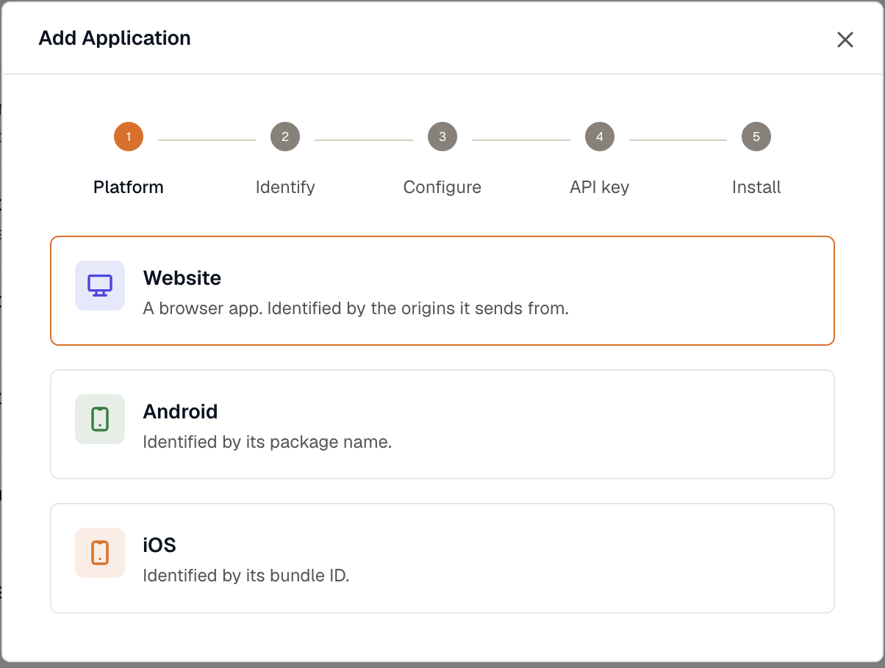

KloudMate has a RUM SDK for the browser, for native Android and iOS, and for React Native. They all send to the same collector and appear in the same [RUM interface](../rum-interface/), so one workspace can hold a website and its mobile apps side by side.

## Supported platforms

| Platform | SDK | Installed with | Setup |
| --- | --- | --- | --- |
| Web | `@kloudmate/rum-web` | A script tag, or npm | [Web](./web/) |
| Android | `com.kloudmate.rum:rum-core` | Gradle | [Android](./android/) |
| iOS | `KloudMateRum` | Swift Package Manager. Requires iOS 12 or later | [iOS](./ios/) |
| React Native, including Expo | `@kloudmate/rum-react-native` | npm, with autolinking | [React Native](./react-native/) |

The browser SDK works on current versions of Chrome, Edge, Firefox, Safari, and other Chromium-based browsers.

## Add an application

Open **RUM** and click **Add application**.

The last step generates a snippet with your key and the current SDK version already in it. Copy that snippet rather than the examples on these pages, which use placeholders.

### The name is permanent

Use only letters, digits, and `.`, `_`, or `-`. Any other character is rewritten during ingest, and the rewritten name no longer matches the one you configured, which shows up as panels with no data in them.

:::caution
There is no rename. An application is created the moment data arrives under a name, so you can't correct a name later. Mobile apps set `applicationName` in source and never go through this validation, so check the name yourself before you ship.
:::

Set **Version** here too, or the [Releases](../rum-interface/#releases) tab has nothing to compare.

### Sampling

**Telemetry sampling** is the share of sessions that send data at all. A session that isn't sampled registers no listeners and makes no requests, so this is what controls your ingest volume. **Replay sampling** then decides which of those sessions are also recorded.

The two multiply: 25% telemetry and 10% replay records one session in forty.

## The ingest key

RUM sends with a **Frontend** ingest key, which ships in client code where anyone can read it. Because of that, a frontend key carries a list of **allowed hosts**, and data sent from any other origin is rejected. If an application is installed correctly and still reports nothing, check that list first.

Keys live under **Settings → Ingest Keys**, where you can add one, edit its allowed hosts, or delete a key that has leaked. A key is shown once when it's created and can't be retrieved later, so rotating one means creating a replacement, swapping it into your app, and then deleting the old key. See [API Keys](../../platform/settings/api-keys/).

## Next

- Install and configure the SDK: [Web](./web/), [Android](./android/), [iOS](./ios/), or [React Native](./react-native/).
- Record what a visitor accomplished, not only how the app behaved: [Send custom events](./custom-events/).
- Look up an option or an attribute: [SDK reference](./sdk-reference/).

***

## Related Resources

- [What Is Real User Monitoring (RUM)?](../)
- [RUM Interface](../rum-interface/)
- [Session Detail](../session-detail/)
