The RUM interface is where you read what your instrumented apps sent. The tabs run in roughly the order the questions come up: whether anything is wrong, which pages and releases it is wrong on, and what a single visitor actually experienced.

To send data in the first place, see the [Instrumentation Guide](../instrumentation-guide/).

## Pick an application first

Opening **RUM** lands on the applications index, which lists every web, Android, and iOS application reporting to the workspace. Choose one to open its tabs. Each application is a `serviceName`, set as `applicationName` when the SDK initializes.

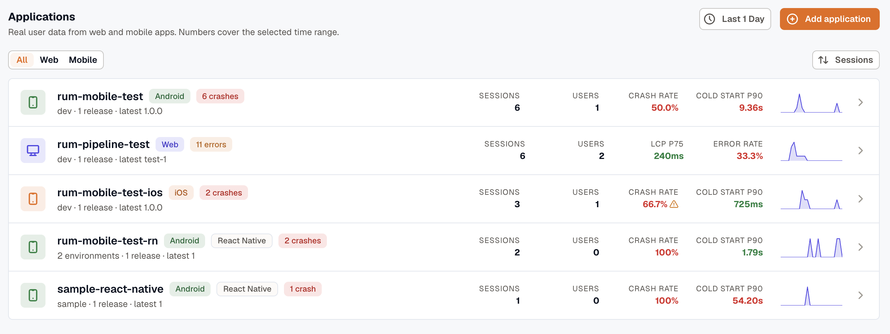

Each row carries the platform, the framework where it is not plain native, the environment and latest release, and the numbers that matter for that platform: sessions and users everywhere, then **LCP P75** and **Error Rate** on web, **Crash Rate** and **Cold Start P90** on mobile. Filter to **All**, **Web**, or **Mobile**, and sort by any of the columns. **Add application** starts the setup flow described in the [Instrumentation Guide](../instrumentation-guide/).

After you open one, the bar at the top keeps the application in view with its headline numbers, and the menu on it switches to another without leaving the tab you are on.

The tab set is the same on every platform, but the contents follow the application. A browser app has Core Web Vitals and no crash rate; a native app has crashes, app hangs, and app-start timings, and **Pages** is titled **Screens**.

| Tab | Answers |
| --- | --- |
| [Overview](#overview) | Is anything wrong right now |
| [Sessions](#sessions) | What did one visitor experience |
| [Pages](#pages) | Which pages are slow or failing |
| [Performance](#performance) | What is the app waiting on |
| [Errors](#errors) | What is breaking, and how often |
| [Releases](#releases) | Did the last release make things worse |
| [Journeys](#journeys) | Where do people go, and where do they give up |
| [Events](#events) | What are the custom events doing |

## Overview

Start on **Overview** to find out whether anything needs attention right now. It runs top to bottom from the findings worth acting on, through the headline numbers and what is happening over time, to where it is happening and to whom.

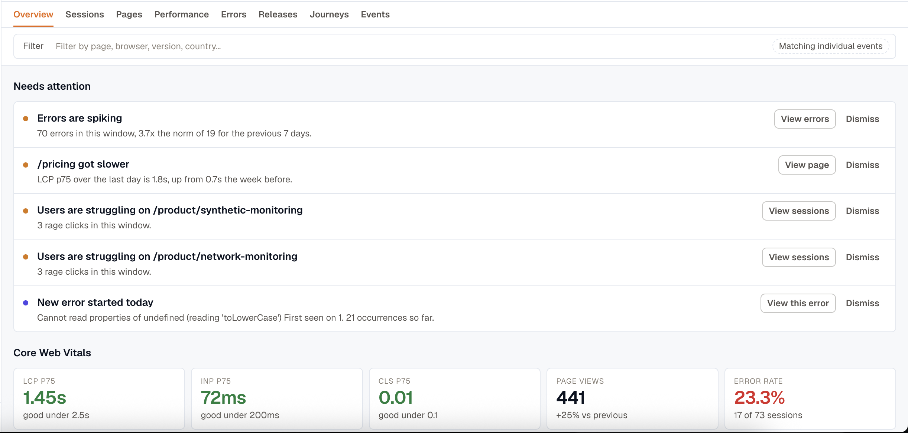

- **Needs attention** puts the findings worth acting on at the top, before any chart. Each one states the evidence, such as `70 errors in this window, 3.7x the norm of 19 for the previous 7 days`, and carries the action that follows from it: **View errors**, **View page**, **View sessions**. **Dismiss** removes a finding you have dealt with.
- **Core Web Vitals** shows **LCP P75**, **INP P75**, and **CLS P75** with the boundary they are judged against, plus **Page views** against the previous period and **Error rate** with the sessions behind it. Web applications only.
- **Release health** shows the crash-free rate. Applications that can crash only.
- **Volume and failures** plots sessions, page views, and errors over the range.
- **Worst pages by impact** ranks the pages costing the most, and links through to **Pages**. On mobile this reads **Worst screens by impact**.
- **Recent errors** lists what is failing in the window on screen, and links through to **Errors**.
- **Audience** breaks sessions down by browser or device, browser or OS version, **Screen resolution**, and country. Counts are distinct sessions, so one long session firing a thousand spans stays one visit.

  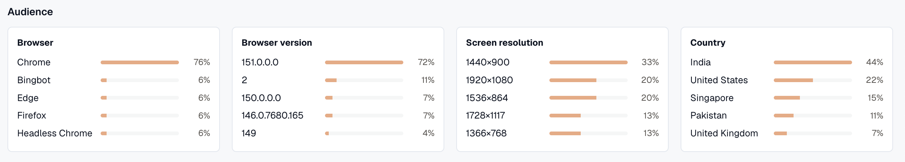

- **Delivery** summarizes the last few versions, and links through to **Releases**.

### Core Web Vitals thresholds

The vitals panels are colored to Google's own boundaries, so a red panel means the same thing here as it does in Lighthouse or Search Console.

| Metric | Good | Needs improvement | Poor |
| --- | --- | --- | --- |
| LCP (Largest Contentful Paint) | ≤ 2.5s | 2.5s to 4.0s | > 4.0s |
| INP (Interaction to Next Paint) | ≤ 200ms | 200ms to 500ms | > 500ms |
| CLS (Cumulative Layout Shift) | ≤ 0.1 | 0.1 to 0.25 | > 0.25 |

INP replaced First Input Delay as a Core Web Vital in March 2024, and the RUM views report it instead.

## Sessions

**Sessions** lists individual visits, most recent first.

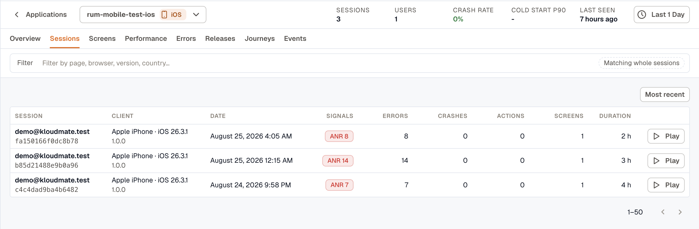

Each row carries:

- **Session**: the visitor's email or ID, with the session ID beneath it. Rows with neither read **Anonymous**.
- **Client**: country, browser, and OS on web; handset, OS version, and build on mobile.
- **Date**, in the workspace timezone.
- **Signals**: badges for the crashes, ANRs, rage clicks, error clicks, and dead clicks in that session, worst first, each carrying its count. A session with nothing to report shows nothing rather than a row of zeros. See [Frustration signals](../session-detail/#frustration-signals).
- **Errors**, **Crashes**, **Actions**, **Pages** (**Screens** on mobile), and **Duration**.
- **Play**, which opens the session on its replay. The button is disabled with **No replay was recorded for this session** when there is no recording, which is the common case.

Sort the list from the control above it, and page through with the arrows below. Click any row to open the session. See [Session Detail](../session-detail/) for what is inside.

## Pages

**Pages** ranks the individual pages of a web app, or the screens of a mobile app, on the measures that decide whether they feel fast.

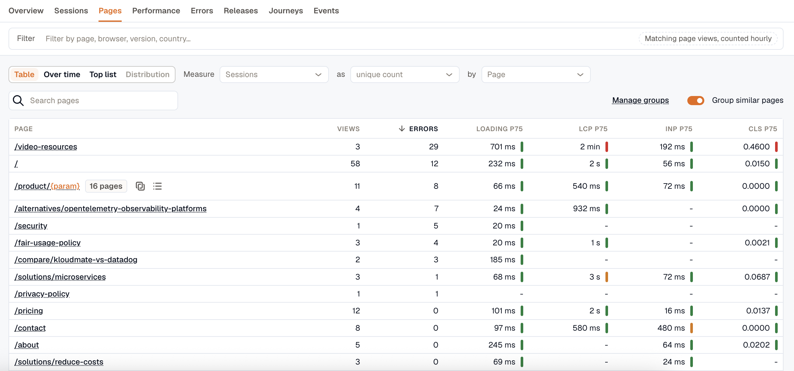

Each row gives the page's **Views**, **Errors**, **Loading P75**, **LCP P75**, **INP P75**, and **CLS P75**, with a colored bar beside each measure putting it in the good, needs-improvement, or poor band. Sort by a column to bring the worst to the top, then open a page for its own trend and its errors. A dash means the measure was never recorded for that page.

Above the table:

- **Group similar pages** collapses parameterized URLs, so `/orders/1041` and `/orders/1042` are read as one page rather than as thousands. A grouped row reads `/product/{param}` and carries the number of pages behind it, which you can expand or copy. **Manage groups** turns a local tweak into a workspace rule, and **Reset grouping** puts it back. Screens are class names rather than paths, so this is web only.
- **Search pages** filters the table by name.
- The same **Table**, **Over time**, **Top list**, and **Distribution** strip as [Events](#events) charts any measure. Pages keeps its own table, with every measure per page, so the measure controls reach the charts rather than the table.

Page views that arrived without a page name are collected in an **Unattributed** row below the table, with a link to the sessions behind it.

## Performance

**Performance** covers what the application waits on, and every panel on it is a way into the sessions behind the number.

On web it opens with **Core Web Vitals**, the same measures Overview reports, at Google's 75th percentile. **TTFB P75** joins them here and names the sample count behind it.

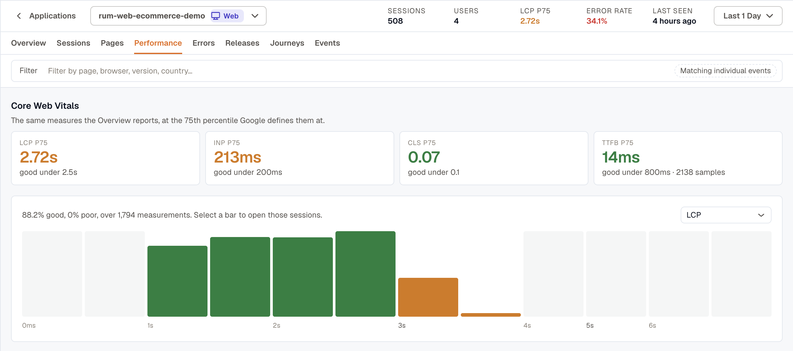

Under the cards, the distribution splits one measure into buckets banded by Google's boundaries, with the share that came out good and poor above it. A p75 on its own cannot tell a tail problem from an everyone problem, and this can. Pick the measure from the menu, and select a bar to open the sessions inside that bucket.

The rest of the tab:

- **Slowest pages by impact** ranks pages by how much load time each one adds in total, so a busy page that is slightly slow outranks a rare one that is much slower. That is a different question from the [Pages](#pages) tab, which ranks by value.
- **Who is slow** splits one measure by browser, device, OS, or country, against the application's own percentile.
- **Long tasks** measures blocking time from the 50 ms threshold rather than summing raw durations, so a page full of 55 ms hitches does not outrank one that froze.

**Network** covers the application's own `fetch` and XHR calls.

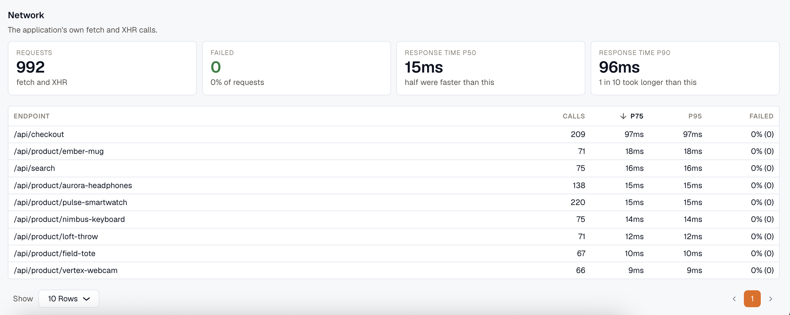

**Requests** and **Failed** state the volume and the failure rate, and **Response time P50** and **P90** the typical case and the slow tail. The endpoints table puts latency and failure rate together on one row: **Calls**, **P75**, **P95**, and **Failed** per endpoint, sorted by whichever column you pick. Endpoints are grouped without their query string, so one route is one row.

Sites that send browser resource timing also get a **Resources** section for images, scripts, fonts, and stylesheets. Panels an application sends nothing for are left out rather than drawn empty.

On Android and iOS the tab reads **App start** (cold start p50, p90, and p99, with TTFD), **Screen loads**, **Who is slow**, **Rendering** for slow and frozen frames, and the same **Network** section, fed by the OkHttp interceptor or `NSURLProtocol`.

:::note
This tab was called **Resources** on web and **Performance** on mobile. The two merged, and `/rum/resources` now redirects here, so existing bookmarks keep working.
:::

## Errors

**Errors** lists every error, crash, and app hang the SDKs reported, with a facet rail for narrowing and an error-volume chart above the list.

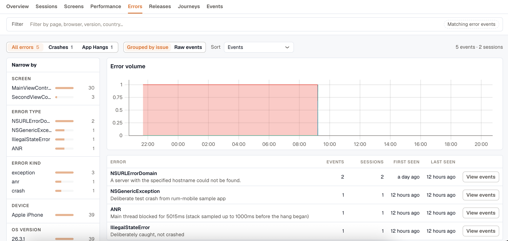

Toggles above the list control what it shows:

- **All errors**, **Crashes**, and **App Hangs** split by kind, each carrying its count. Android calls the third one **ANRs**. Applications that cannot crash do not show this control.
- **Grouped by issue** collapses identical errors into one row with its **Events**, **Sessions**, **First seen**, and **Last seen**, and a **View events** button. Switch to **Raw events** when the question is about one specific failure rather than a pattern.

**Narrow by** down the left filters on the dimensions that apply to the platform: page or screen, error type, error kind, browser or device, and OS version, each with its own count. **Sort** reorders the list by events, sessions, last seen, or first seen.

Opening an error shows its stack, its attributes, and the sessions it happened in, so the error and the session that produced it are one click apart.

## Releases

**Releases** answers what the version that just shipped changed. It opens on the current release against the one it replaced, as a sentence rather than two dropdowns, and **Compare** swaps in any other pair.

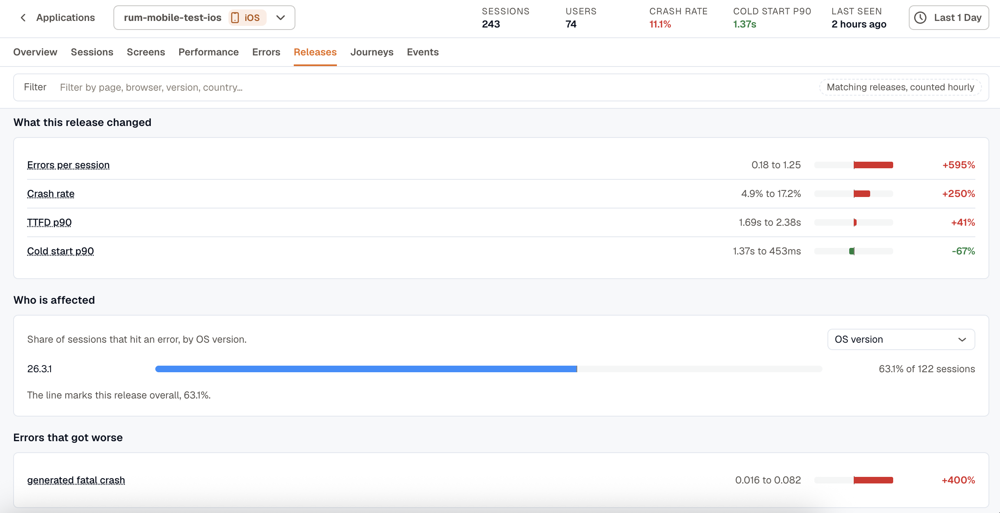

- **What this release changed** states each measure as before, after, and the change: `0.18 to 1.25` on errors per session, `+595%`. The bars diverge from a center line on one shared percent scale, because drawing the values themselves would put 0.31 errors, 0.07 CLS, and 2.97s on three incomparable scales.
- **Who is affected** gives the share of sessions that hit an error, broken down by browser, OS version, device, or country, with a line marking the release overall. It reports how likely a session on that browser is to fail, not how many people use it.
- **Errors that got worse** ranks regressions by per-session rate rather than by count, since a release part way through its rollout has lower counts for everything.
- **New in \<version\>** catches signatures that did not exist before, which is the case **Errors that got worse** cannot see.
- **Adoption** and **Sessions by version** show how far the rollout has got.
- **Version history** gives one row per release, led by a verdict.

Every delta, version, and error row is a link into the rows behind it, scoped to that version and carrying the window on screen.

:::caution
Releases needs the SDK to send a `version`. Without it the tab reads **Version is not configured in the SDK** and has nothing to compare. See the setup snippet for your platform in the [Instrumentation Guide](../instrumentation-guide/).
:::

Release data is counted hourly and kept for 180 days rather than read from raw spans, so a release stays comparable long after its sessions have aged out. That matters because you ask "is 4.2 worse than 4.1" weeks after 4.1 stopped shipping. A release too new to have enough sessions reads **Too few sessions to compare yet**.

Releases replaced the Deployments tab, and `/rum/deployments` redirects here.

## Journeys

**Journeys** covers where people go through the app and where they stop. Both views work on one application at a time, so set an **Application** filter in the filter bar first. A path across two sites is two unrelated graphs drawn on top of each other.

### Pathways

Pathways draws the routes visitors actually took, as a left-to-right graph. Each node names a page with its session count and its exit rate, and each edge carries the number of sessions that took it.

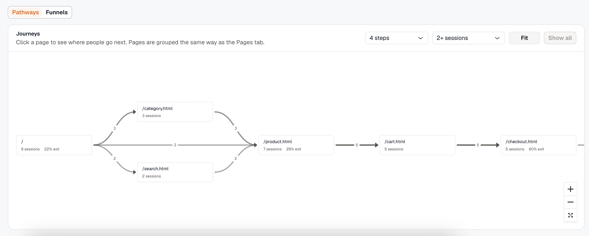

Click a page to start the graph from there and see where people go next. **Show all** returns to every starting point. The two menus at the top right set how far forward the graph follows, in steps, and how many sessions a path needs before it is drawn. **Fit** re-centers the view.

Pages are grouped the same way as the [Pages](#pages) tab, so a parameterized URL collapses here too.

Clicking a node also opens a panel with its **Sessions**, the share who **Left here**, and the share who **Hit an error** on it. A high **Left here** on a page in the middle of a path is where people are giving up.

### Funnels

Funnels measure conversion across up to five steps. A step is either a **route**, such as `/cart`, or an **Event**, such as `checkout_completed`, and either can match a prefix instead of an exact value. **Add step** extends the funnel.

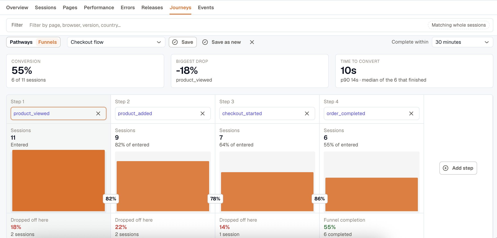

- **Conversion**, **Biggest drop**, and **Time to convert** sit above the chart. Conversion names the sessions behind it, such as `6 of 11 sessions`. Time to convert appears once the evaluation returns timestamps, and reports the median with p90 beside it.
- Each step shows its sessions, its share **of entered**, and how many **Dropped off here**. The last column reports **Funnel completion** instead.
- **Complete within** sets how long a session has to get from the first step to the last. Steps further apart than this do not count as a conversion. The default is 30 minutes.
- **Compare to previous period** puts the same funnel over the preceding window and reports the change in percentage points.

Click a step in the chart to open the drop-off table beneath it: the sessions that stalled there, with the errors they hit, and the **Play** button on every row. A stalled session is one click from its replay.

Pick a saved funnel from the menu at the top left, and keep the current one with **Save** or **Save as new**. A saved funnel tracks its conversion over time.

:::caution
Funnels read raw RUM data, which is kept for a limited time and varies by workspace. A range longer than that retention covers fewer sessions than the dates suggest, and the tab says so when the selected range is long enough for it to matter.
:::

## Events

**Events** covers everything sent through [`addEvent()`](../instrumentation-guide/custom-events/). It splits into separate views, because the same events answer different kinds of question:

- **Analyze** is the default: pick a measure, how to aggregate it, and what to group it by, then render the result as a **Table**, **Over time**, a **Top list**, or a **Distribution**. Selecting a row filters the page to it.

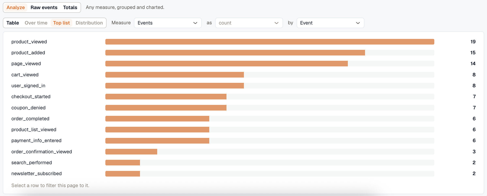

- **Raw events** lists individual events with their payloads. Use it for "which category is added most", "show me a sample", and "what did this session do".
- **Totals** reads the hourly rollup, which is kept for 400 days. It is the only view that can answer "is signup up on last quarter", since the other two run on raw retention. The rollup carries no payload, because customer-defined keys cannot be rolled up.

Custom events are counted per session and per user, and can be used as [funnel](#funnels) steps. An event name over the workspace's daily limit is collected under **Over the daily name limit**, which usually means a name was interpolated. See [Keep the event name constant](../instrumentation-guide/custom-events/#keep-the-event-name-constant).

## Filter the data

The **Filter** bar above every tab narrows the data by page, browser, version, country, and more. Combine filters to cut it down further, and set the range from the time picker at the top right.

The chip at the right of the bar names what a filter is matching on that tab, because it differs: **Matching whole sessions** on Sessions and Journeys, **Matching error events** on Errors, **Matching individual events** on Overview and Performance, **Matching page views, counted hourly** on Pages, **Matching releases, counted hourly** on Releases. It is the difference between "sessions that visited `/checkout`" and "errors that happened on `/checkout`".

Not every filter applies to every tab. A route filter does nothing on Journeys, for instance, because journeys match whole sessions and a session that opened one page also opened the others on its path. Arriving from another tab with such a filter set is normal, so the bar keeps showing it, struck through and carrying the reason it did nothing, rather than dropping it silently. A filter shown that way is withheld from the tab's queries, so what you see is what the panels actually used.

:::note
A longer range slows the query down, and the raw RUM data behind Sessions, Journeys, and Raw events is kept for a limited time that varies by workspace.
:::

***

### Related Resources

- [What Is Real User Monitoring (RUM)?](../)
- [Session Detail](../session-detail/)
- [Instrumentation Guide](../instrumentation-guide/)
