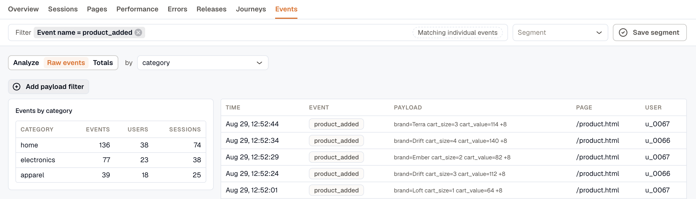
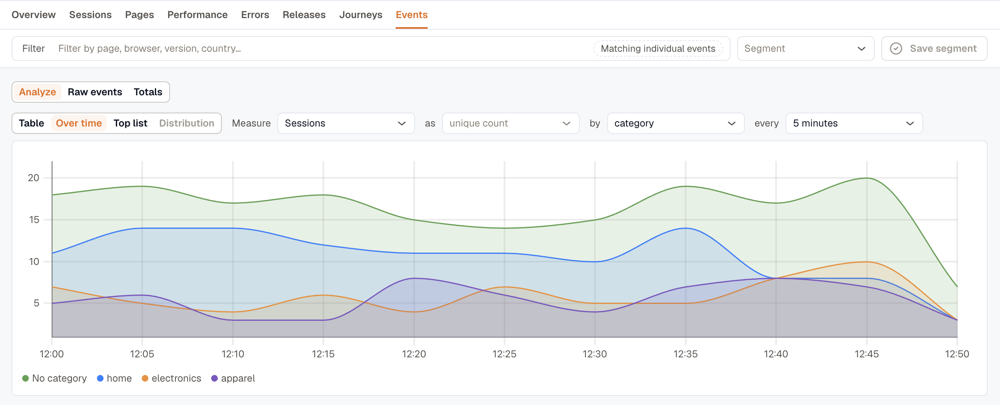
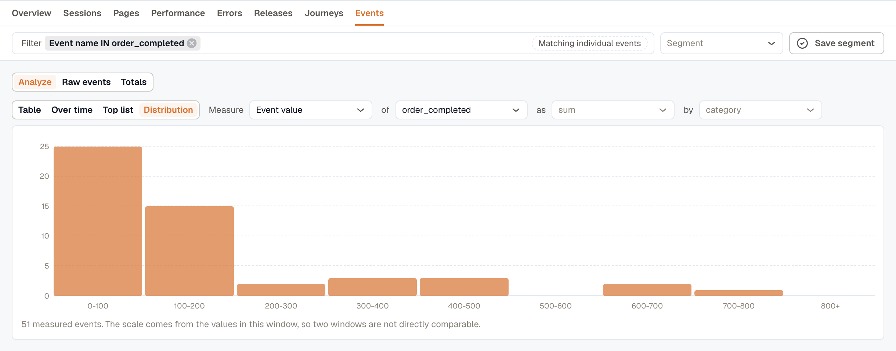

The RUM interface is where you read what your instrumented apps sent. The tabs run in roughly the order the questions come up: whether anything is wrong, which pages and releases it is wrong on, and what a single visitor actually experienced.

To send data in the first place, see the [Instrumentation Guide](../instrumentation-guide/).

## Pick an application first

Opening **RUM** lands on the applications index, which lists every web, Android, and iOS application reporting to the workspace. Choose one to open its tabs. Each application is a `serviceName`, set as `applicationName` when the SDK initializes.

Each row shows the numbers that matter for its platform: **LCP P75** and **Error Rate** on web, **Crash Rate** and **Cold Start P90** on mobile. **Add application** starts the setup flow in the [Instrumentation Guide](../instrumentation-guide/).

The tab set is the same on every platform, but the contents follow the application. A browser app has Core Web Vitals and no crash rate; a native app has crashes, app hangs, and app-start timings, and **Pages** is titled **Screens**.

| Tab | Answers |
| --- | --- |
| [Overview](#overview) | Is anything wrong right now |
| [Sessions](#sessions) | What did one visitor experience |
| [Pages](#pages) | Which pages are slow or failing |
| [Performance](#performance) | What is the app waiting on |
| [Errors](#errors) | What is breaking, and how often |
| [Releases](#releases) | Did the last release make things worse |
| [Journeys](#journeys) | Where do people go, and where do they give up |
| [Events](#events) | What are the custom events doing |

## Overview

Start on **Overview** to find out whether anything needs attention right now. It runs top to bottom from the findings worth acting on, through the headline numbers and what is happening over time, to where it is happening and to whom.

- **Needs attention** leads with the findings worth acting on, each stating its evidence, such as `70 errors in this window, 3.7x the norm of 19 for the previous 7 days`, and the action that follows from it.
- **Core Web Vitals** gives LCP, INP, and CLS at p75 with the boundary each is judged against, plus page views and error rate. Web applications only.
- **Release health** gives the crash-free rate, on applications that can crash.
- **Volume and failures** plots sessions, page views, and errors over the range.
- **Worst pages by impact**, **Recent errors**, and **Delivery** each link through to the tab that owns them.
- **Audience** breaks sessions down by browser or device, version, **Screen resolution**, and country. Counts are distinct sessions, so one long session firing a thousand spans stays one visit.

### Core Web Vitals thresholds

The vitals panels are colored to Google's own boundaries, so a red panel means the same thing here as it does in Lighthouse or Search Console.

| Metric | Good | Needs improvement | Poor |
| --- | --- | --- | --- |
| LCP (Largest Contentful Paint) | ≤ 2.5s | 2.5s to 4.0s | > 4.0s |
| INP (Interaction to Next Paint) | ≤ 200ms | 200ms to 500ms | > 500ms |
| CLS (Cumulative Layout Shift) | ≤ 0.1 | 0.1 to 0.25 | > 0.25 |

INP replaced First Input Delay as a Core Web Vital in March 2024, and the RUM views report it instead.

## Sessions

**Sessions** lists individual visits, most recent first.

Two columns are worth knowing about. **Signals** badges the crashes, ANRs, and frustration clicks in a session, worst first and with counts, so a session worth opening says so from the list. See [Frustration signals](../session-detail/#frustration-signals). **Play** is disabled where there is no recording, which is the common case.

Click any row to open the session. See [Session Detail](../session-detail/) for what is inside.

## Pages

**Pages** ranks the individual pages of a web app, or the screens of a mobile app, on the measures that decide whether they feel fast.

Each row gives a page's views, errors, and its load time, LCP, INP, and CLS at p75, banded good, needs-improvement, or poor. Sort by a column to bring the worst to the top, then open a page for its own trend and its errors.

**Group similar pages** collapses parameterized URLs, so `/orders/1041` and `/orders/1042` read as one `/product/{param}` row rather than as thousands. **Manage groups** turns a local tweak into a workspace rule. Screens are class names rather than paths, so this is web only.

Page views that arrived without a page name collect in an **Unattributed** row below the table.

## Performance

**Performance** covers what the application waits on, and every panel on it is a way into the sessions behind the number.

On web it opens with **Core Web Vitals**, the same measures Overview reports, at Google's 75th percentile. **TTFB P75** joins them here and names the sample count behind it.

The distribution below the cards splits one measure into buckets banded by Google's boundaries. A p75 on its own cannot tell a tail problem from an everyone problem, and this can; selecting a bar opens the sessions inside that bucket.

- **Slowest pages by impact** ranks pages by how much load time each adds in total, so a busy page that is slightly slow outranks a rare one that is much slower. That is a different question from [Pages](#pages), which ranks by value.
- **Who is slow** splits a measure by browser, device, OS, or country against the application's own percentile.
- **Long tasks** measures blocking time from the 50 ms threshold rather than summing raw durations, so a page full of 55 ms hitches does not outrank one that froze.

**Network** covers the application's own `fetch` and XHR calls.

The endpoints table puts latency and failure rate on one row, grouped without the query string so one route is one row. Sites that send browser resource timing also get a **Resources** section. Panels an application sends nothing for are left out rather than drawn empty.

On Android and iOS the tab reads **App start**, **Screen loads**, **Who is slow**, **Rendering**, and the same **Network** section. Cold start and **TTFD** are separate measures there: cold start is the launch, time to fully drawn runs until the first screen is usable, and it is far longer.

:::note
This tab was called **Resources** on web and **Performance** on mobile. The two merged, and `/rum/resources` now redirects here, so existing bookmarks keep working.
:::

## Errors

**Errors** lists every error, crash, and app hang the SDKs reported, with a facet rail for narrowing and an error-volume chart above the list.

**All errors**, **Crashes**, and **App Hangs** split the list by kind, with **ANRs** in place of App Hangs on Android. **Grouped by issue** collapses identical errors into one row with its counts and first and last seen; switch to **Raw events** when the question is about one specific failure rather than a pattern.

Opening an error shows its stack, its attributes, and the sessions it happened in, so the error and the session that produced it are one click apart.

## Releases

**Releases** answers what the version that just shipped changed. It opens on the current release against the one it replaced, and **Compare** swaps in any other pair.

- **What this release changed** states each measure as before, after, and the change: `0.18 to 1.25` errors per session, `+595%`.
- **Who is affected** gives the share of sessions that hit an error by browser, OS version, device, or country. It reports how likely a session on that browser is to fail, not how many people use it.
- **Errors that got worse** ranks regressions by per-session rate rather than by count, since a release part way through its rollout has lower counts for everything. **New in \<version\>** catches the signatures that did not exist before.
- **Adoption**, **Sessions by version**, and **Version history** cover the rollout itself.

Every number on the tab links into the rows behind it, scoped to that version.

:::caution
Releases needs the SDK to send a `version`. Without it the tab reads **Version is not configured in the SDK** and has nothing to compare. See the setup snippet for your platform in the [Instrumentation Guide](../instrumentation-guide/).
:::

Release data is counted hourly and kept for 180 days rather than read from raw spans, so a release stays comparable long after its sessions have aged out. That matters because you ask "is 4.2 worse than 4.1" weeks after 4.1 stopped shipping. A release too new to have enough sessions reads **Too few sessions to compare yet**.

Releases replaced the Deployments tab, and `/rum/deployments` redirects here.

## Journeys

**Journeys** covers where people go through the app and where they stop. Both views work on one application at a time, so set an **Application** filter in the filter bar first. A path across two sites is two unrelated graphs drawn on top of each other.

### Pathways

Pathways draws the routes visitors actually took, as a left-to-right graph. Each node names a page with its session count and its exit rate, and each edge carries the number of sessions that took it.

Click a page to start the graph from there, and set how many steps forward it follows and how many sessions a path needs before it is drawn. Pages are grouped the same way as the [Pages](#pages) tab.

Clicking a node opens its **Sessions**, the share who **Left here**, and the share who **Hit an error**. A high **Left here** mid-path is where people are giving up.

### Funnels

Funnels measure conversion across up to five steps. A step is either a **route**, such as `/cart`, or an **Event**, such as `checkout_completed`, and either can match a prefix.

**Conversion**, **Biggest drop**, and **Time to convert** sit above the chart, and each step gives its sessions and how many dropped off there.

**Complete within** sets how long a session has to get from the first step to the last; steps further apart than that do not count as a conversion. **Compare to previous period** reports the change in percentage points against the preceding window.

Clicking a step opens the sessions that stalled there, with the errors they hit and a **Play** button on every row. Save a funnel to track its conversion over time.

:::caution
Funnels read raw RUM data, which is kept for a limited time and varies by workspace. A range longer than that retention covers fewer sessions than the dates suggest, and the tab says so when the selected range is long enough for it to matter.
:::

## Events

**Events** covers everything sent through [`addEvent()`](../instrumentation-guide/custom-events/). It splits into separate views, because the same events answer different kinds of question:

- **Analyze** is the default: pick a measure, an aggregation, and something to group by, then render it as a table, over time, a top list, or a distribution.
- **Raw events** lists individual events with their payloads. Use it for "which category is added most" or "what did this session do".
- **Totals** reads the hourly rollup, kept for 400 days. It is the only view that can answer "is signup up on last quarter", since the other two run on raw retention. The rollup carries no payload.

Custom events are counted per session and per user, and can be used as [funnel](#funnels) steps. An event name over the workspace's daily limit is collected under **Over the daily name limit**, which usually means a name was interpolated. See [Keep the event name constant](../instrumentation-guide/custom-events/#keep-the-event-name-constant).

### Group by a payload attribute

You can group by any attribute your application sends in the event payload, in both Analyze and Raw events. If you send an attribute as a number, it is grouped as a number.

For example, to chart revenue by category over time, select **Event value** as the measure, **sum** as the aggregation, and group by `category`.

Over time charts the 50 largest groups. If you group by an attribute with thousands of distinct values, such as a user ID, most of them won't appear on the chart.

A payload key only exists in the time ranges where your application actually sent it. If you group by a key that isn't present in the selected range, the grouping falls back to event name.

### A group with no value

Events that were sent without the attribute are collected into a single group. When you group by `category`, that group appears as **No category**, and it's often the largest group on the tab.

This group doesn't tell you anything about your categories. It tells you how many events were sent without the attribute at all, so it's really a measure of missing instrumentation.

**Exclude** removes those events from every panel on the tab, which lets you compare the real categories against each other.

Numeric attributes behave differently. A missing number comes back as `0`, so you can't distinguish it from a genuine zero, and there's no separate group to exclude.

### What a distribution needs

**Distribution** works on **Event value** only, one event at a time. The other measures are counts, and a count has no spread. Only events that carry a [`value`](../instrumentation-guide/custom-events/#value-is-reserved) can be charted this way.

:::caution
Event value has no fixed scale, so the buckets are calculated from the values in view. Charts from two different ranges are not comparable.
:::

## Filter the data

The **Filter** bar lets you narrow down the data across the different tabs using things like page, browser, version, country, and more.

When you select multiple values for the same field, the filter matches **any** of those values. For example, selecting Chrome and Firefox includes data from either browser.

The meaning of a filter depends on the tab you're using, and the filter bar tells you what it is matching:

- **Sessions and Journeys:** **Matching whole sessions**
- **Errors:** **Matching error events**
- **Pages:** **Matching page views, counted hourly**

This distinction matters. A page filter on Sessions finds sessions that visited `/checkout`, while the same filter on Errors finds errors that occurred on `/checkout`.

Not every filter is applicable to every tab. For example, a route filter doesn't apply to Journeys because Journeys match entire sessions. If a session visited one page in a journey, the other pages in that journey are already part of the session.

When a filter can't be applied to the current tab, it is shown as struck through with an explanation. It is also excluded from the query rather than being silently ignored.

### Filter on a payload attribute

You can filter events using any attribute included in the event payload. Numeric attributes support comparison operators such as `>`, `>=`, `<`, and `<=`. For example, `cart_size > 2` matches events where `cart_size` is greater than 2.

:::note
Events that were sent without the attribute are excluded from `>`, `>=`, `<`, `<=`, `!=`, **Not in**, and **Not contains**. A missing key isn't treated as zero, so `cart_size < 5` returns only the events that actually carry `cart_size`.

Matching an attribute against an empty value does the opposite. It selects exactly the events that are missing the attribute, which is useful for finding gaps in your instrumentation.
:::

Payload attribute filters are available on some tabs only:

- **Events** and **Journeys** support payload filters. In a funnel, for example, `cart_value > 100` selects sessions that emitted at least one matching event. Earlier funnel steps are still included for those sessions.
- **Sessions** supports text attributes only. Numeric attributes such as `cart_size` cannot be used as session filters.
- **Errors**, **Pages**, and **Releases** don't support payload filters because errors, page views, and releases don't contain event payload attributes.

### Save a filter set as a segment

If you use the same set of filters regularly, you can save them as a **segment** and apply them later from any tab. A segment belongs to a single application.

You can update a segment while it's applied, or save the current filters as a new segment. Only the person who created a segment can delete it.

Applying a segment replaces the filters currently selected, while keeping the selected application unchanged.

:::note
A longer range slows the query down, and the raw RUM data behind Sessions, Journeys, and Raw events is kept for a limited time that varies by workspace.
:::

***

### Related Resources

- [What Is Real User Monitoring (RUM)?](../)
- [Session Detail](../session-detail/)
- [Instrumentation Guide](../instrumentation-guide/)
