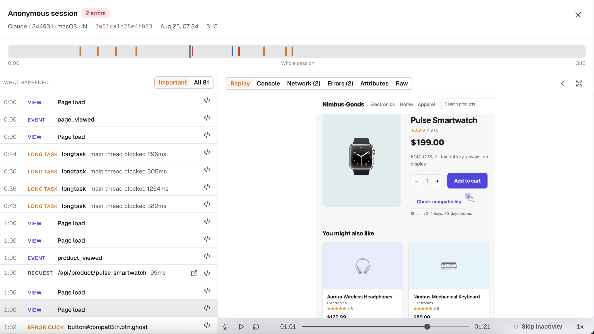
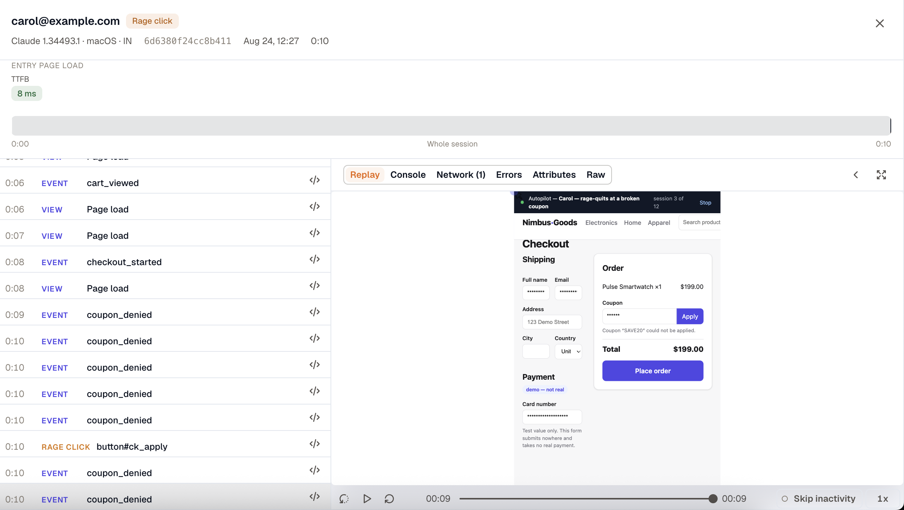
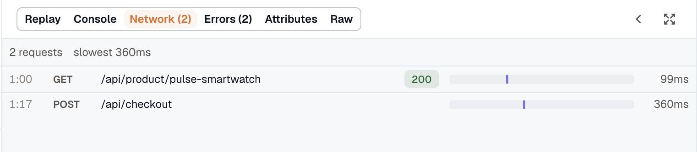
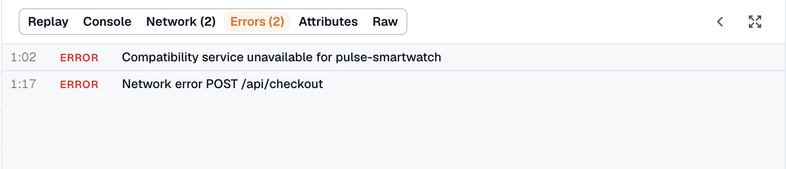
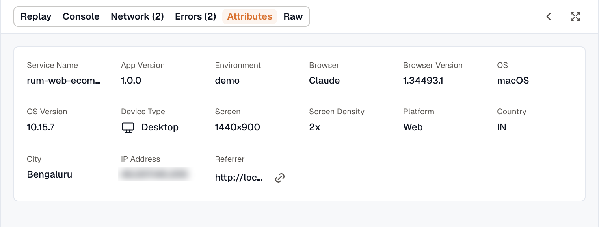

Opening a session shows one timeline with the replay and the evidence beside it. Everything on the screen runs on the same clock, so clicking an error in the list moves the replay to the moment it happened, and playing the replay moves the list along with it.

## Open a session

Click any row on the **Sessions** tab. The tab you land on is part of the URL, so a shared session link reopens where it was shared from. Sessions also open from outside RUM: a drop-off table in Journeys, an affected session on an issue, a browser span in Traces.

## The session header

Who this was, what they were on, and badges for the crashes, app hangs, errors, and rage clicks in the session. A session with no identity reads **Anonymous session**; see [Identify the user](../instrumentation-guide/web/#identify-the-user) to fill that in.

Under it, **Entry page load** gives the web vitals for the page the visitor arrived on: **TTFB**, **FCP**, **LCP**, **INP**, and **CLS**, colored good, needs-improvement, or poor. Mobile sessions get **Start type** and **Time to first frame** instead.

:::note
These are this session's own measurements, not workspace percentiles. The p75 figures on **Overview** and **Pages** answer a different question, and the two will rarely match.
:::

## The timeline

The bar below the header runs from 0:00 to the end of the recorded activity, and everything else on the screen moves with it. Click anywhere on it to move the playhead.

**Segments** are the views the visitor was on, in order. Clicking one scopes **What happened** to that view, and clicking it again clears the scope.

**Markers** flag the moments worth finding: errors, crashes, app hangs, frustration clicks, and long tasks. Plain clicks and successful requests are not marked, since a mark for every span would fill the track.

## What happened

The list on the left walks the session in order. Each row carries the time it happened, what kind of event it was, and enough of the detail to recognize it. Clicking a row seeks the replay; playing the replay highlights the row it has reached.

**Important**, the default, keeps what explains a session: failures, frustration clicks, long tasks over 200 ms, views, requests, and [custom events](../instrumentation-guide/custom-events/). It drops plain clicks, which are most of a real session and bury the handful of events that matter. **All** shows every span the SDK sent.

Rows carry an action where there is one to take: an error opens its issue, a request opens its backend trace, and any row expands its raw attributes. For the backend trace to reach past the browser span, see [Correlate RUM traces with OpenTelemetry backends](../correlate-rum-traces-with-opentelemetry-backends/).

## Frustration signals

Rage, dead, and error clicks are events in their own right. They appear as badges on the sessions list, as markers on the timeline, and as rows in **What happened**, so a session opened from a badge can point at the click behind it.

The example above is the shape these usually take: a coupon that will not apply, the same event firing over and over, and a rage click on the button that kept refusing.

| Signal | What it means |
| --- | --- |
| **Rage click** | Three or more clicks on the same element inside one second. The row reports the real size of the burst, so ten angry clicks read as ten. |
| **Dead click** | A click that produced no DOM change and no navigation within 500 ms. Nothing visibly happened. |
| **Error click** | A click followed by a JavaScript error within one second. |

A frustration row is titled with the element that was clicked, so it names the button or link that misbehaved.

A single click gets one verdict. When more than one applies, rage outranks error, which outranks dead, so a burst on a button that also did nothing reads as rage.

:::note
The browser SDK decides these at the moment of the click, using what the page did next. They are not inferred from the data after the fact, so a session recorded before the SDK shipped this cannot have them backfilled. Detection is on by default and needs no configuration.
:::

## The evidence tabs

The right-hand pane switches between six views of the same session: **Replay**, **Console**, **Network**, **Errors**, **Attributes**, and **Raw**. A tab carries a count where it has one, such as `Network (210)` or `Errors (14)`, so a pane worth opening says so before it is opened.

### Replay

The replay plays the session's recording at the position the timeline is holding, on web and on mobile.

Most sessions do not carry a recording. Those read **No replay for this session**, and their **Play** button in the sessions list is disabled with the same explanation. Raising `sessionRecorder.sampleRate` records a larger share. See [Record sessions for replay](../instrumentation-guide/web/#record-sessions-for-replay).

Playback runs at 1x through 8x, and **Skip inactivity** jumps the quiet stretches, which is most of a long session.

Seeking a long session takes about a second: recordings load in parallel, and a large one loads only the segment around the playhead. How well that works depends on the SDK version. See [Keep the SDK current](../instrumentation-guide/web/#keep-the-sdk-current).

### Console

The browser console for this session, capturing `console.error` and `console.warn` by default. To capture more levels, or none, set the `events.console` option. See [Choose what the SDK captures](../instrumentation-guide/web/#choose-what-the-sdk-captures).

### Network

Every `fetch` and `XMLHttpRequest` the session made, drawn as a waterfall, with a summary line giving the request count, how many failed, and the slowest.

The bar is what makes this a waterfall rather than a list in time order: it places each request against the whole session, so three calls stacked in the same second look like the slow page they are. Same-origin calls show the path alone and third-party calls show host and path, with the full URL on hover. Failed requests are red across the row.

### Errors

The errors, crashes, and app hangs from this session, each with its type and message. A clean session reads **Nothing failed in this session**.

### Attributes

The environment the session ran in: service, version, browser, OS, device, location, and referrer.

**Screen** is the device's screen resolution and **Screen Density** the scale factor. Both are reported for web and mobile, and the same measurement drives the **Screen resolution** breakdown on [Overview](../rum-interface/#overview).

### Raw

Every span the session produced, with its full JSON. The place to check an attribute the curated views do not show.

***

### Related Resources

- [RUM Interface](../rum-interface/)
- [Instrumentation Guide](../instrumentation-guide/)
- [Correlate RUM traces with OpenTelemetry backends](../correlate-rum-traces-with-opentelemetry-backends/)
