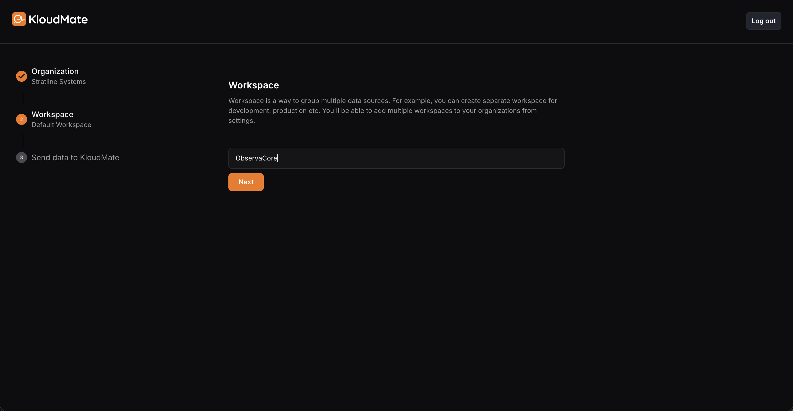
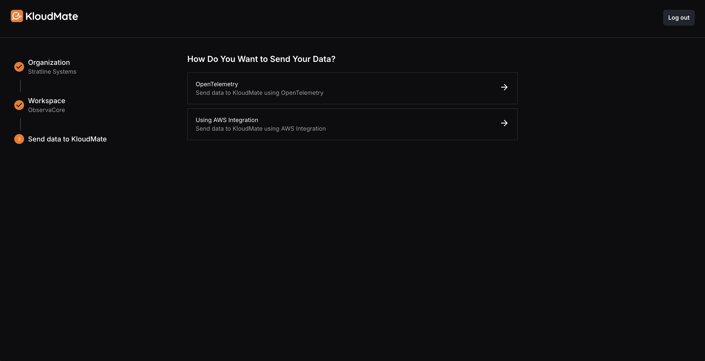
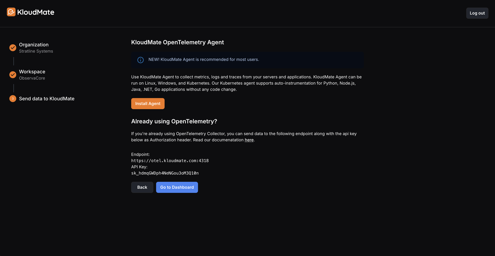
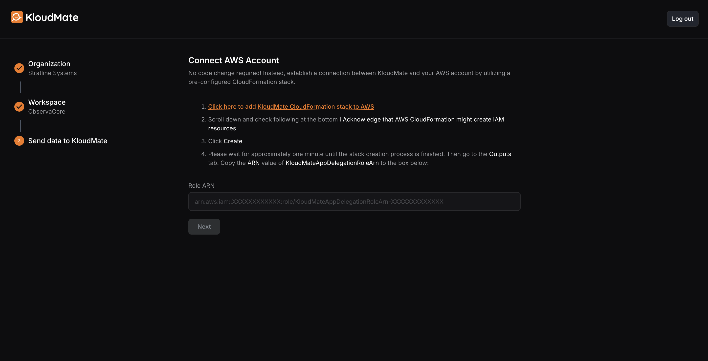
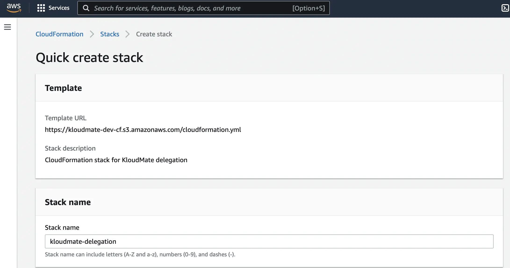
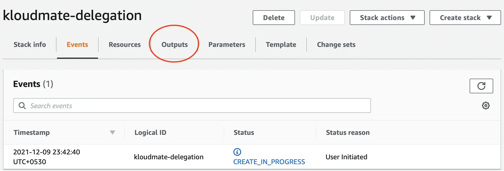
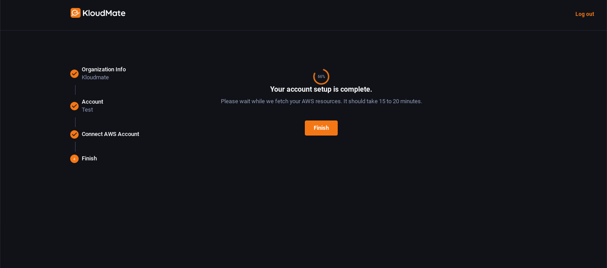

## Signing Up With KloudMate

- [Click here](https://app.kloudmate.com/signup) to go to the KloudMate signup page.
- Fill in the signup form with your details (work email preferred).

- Check your email for a verification code from noreply\@kloudmate.com (Don't forget the spam folder!).
- Enter the verification code on the KloudMate window and click '**Next**'.
- Enter your organization name and workspace name. Click '**Next**'.

- Select the method you prefer in the **Send Data to KloudMate** window.

### Using OpenTelemetry

- Select **OpenTelemetry** if you want to generate, collect, and export metrics, logs, and traces to KloudMate using the OpenTelemetry SDKs or Collector.
- The **Endpoint** and **Workspace** API Key required to send data to KloudMate are already available on this page. Use these details while configuring your OpenTelemetry instrumentation or Collector.
- If you prefer a simpler setup, you can install the **KloudMate Agent** by clicking **Install Agent** above. The agent is OpenTelemetry-based and comes preconfigured to send telemetry data to KloudMate.

- For detailed steps on installing and configuring agents, refer to the [KloudMate Agents](./km-agent/index.mdx) documentation.
- For a complete guide on sending data directly using OpenTelemetry, click [Using OpenTelemetry Collector](./opentelemetry/index.mdx).

### Using AWS Integration

- Select **Using AWS Integration ** f you want to connect your AWS account with KloudMate
- After selecting AWS integration, enter the name of your AWS account.
- On the next screen, click on the hyperlink in step 1 of the onscreen instructions. You will need to sign in to your AWS account as an Administrator if you are not logged in already.

- Upon clicking on the hyperlink, you will be automatically redirected to your AWS account, and a stack will be created.
- Follow the onscreen instructions (detailed below) and click on '**Create Stack**'.

- It may take upto 2 minutes for your ARN Role to be created.
- Once done, copy the **ARN Value **from the '**Outputs**' tab.

- Paste the copied ARN Value in the **Role ARN field **available on the** Using AWS Integration ** indow of the KloudMate signup page, and click '**Next**'**.**
- And we're done!

Your AWS Account is now integrated with KloudMate.

***

## **Related Resources**

- [Get Started](./get-started.mdx)
- [Get Help](./get-help.mdx)

