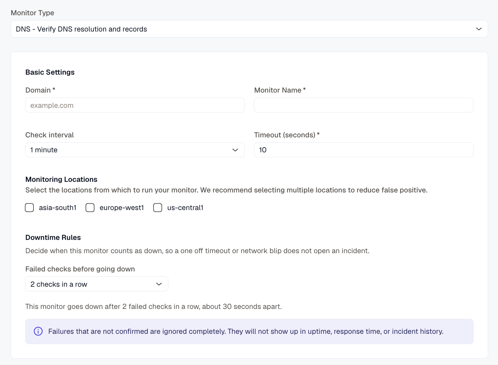

---

title: "DNS Monitor"
description: "Verify DNS resolution and records with a synthetic monitor."
sidebar:
  label: "DNS Monitor"
---
The DNS Monitor helps ensure your domain’s DNS resolution is functioning correctly by verifying DNS records and response times from configured servers.

## Creating a New DNS Monitor

1. Navigate to **Synthetic monitoring > Monitors**.
2. Click **Add new**.
3. From the monitor type dropdown, select **DNS - Verify DNS resolution and records**.

## Basic Settings

- **Domain**
  Enter the domain name you wish to monitor.
- **Monitor Name**
  Provide a descriptive name to identify the DNS monitor.
- **Check Interval**
  Set how often the DNS queries should be performed to check the domain’s DNS resolution.
- **Timeout**
  Define the maximum amount of time the monitor waits for a DNS response before marking it as failed.
- **Monitoring Locations**
  Choose one or multiple locations from which the DNS queries will be executed. This helps test DNS resolution from diverse geographic points.

## Notification Settings

Select the notification channels to receive alerts when the monitor detects failures in DNS resolution or record validation.

## DNS Configuration

- **Record Types**
  Specify the DNS record types to query, such as A, AAAA, CNAME, MX, TXT, etc. Each type represents different information about the domain.
- **Nameservers (Optional)**
  Optionally specify the nameservers hosting your domain’s DNS records for targeted checks.
- **Enable TCP**
  Enable DNS queries over TCP instead of UDP. TCP-based queries can detect certain DNS issues that UDP-only queries may miss, enhancing reliability checks.

## Assertions

Assertions define what aspects of DNS responses the monitor validates:

- **Record Count**
  Checks the number of DNS records returned by the query to ensure completeness.
- **Record Value**
  Verifies the actual data contained within the DNS records matches expected values.
- **Query Time (ms)**
  Measures the response time of the DNS server to a query, ensuring timely resolution.
- **Response Code**
  Monitors the DNS response code returned by the server to detect errors or anomalies.

## Metrics

Metrics available to be monitored in Dashboard section

| **Metric Name**                                         | **Type**      | **Description**                                            | **Labels**                                                                               |
| ----------------------------------------------------------- | ----------------- | ------------------------------------------------------------------- | ---------------------------------------------------------------------------------------- |
| kloudmate\_synthetic\_check\_dns\_resolve\_time   | Gauge   | Time taken to resolve the DNS query                       | check\_id, check\_name, check\_type, target, workspace\_id, location                |
| kloudmate\_synthetic\_check\_dns\_query\_time     | Gauge   | Time taken for a specific DNS query                       | check\_id, check\_name, check\_type, target, workspace\_id, location, record\_type  |
| kloudmate\_synthetic\_check\_dns\_record\_count   | Gauge   | The number of records returned for a specific DNS query   | check\_id, check\_name, check\_type, target, workspace\_id, location, record\_type  |

| kloudmate\_synthetic\_check\_request\_duration   | Gauge   | The total time taken for the primary operation of the check (e.g., HTTP request, DNS query, gRPC call).   | check\_id, check\_name, check\_type, target, workspace\_id, location |
| ---------------------------------------------------------- | ----------------- | ------------------------------------------------------------------------------------------------------------------- | -------------------------------------------------------------------- |

***

## Related Resources

[TCP Monitor - Test TCP Port Connectivity](../tcp-monitor/)

