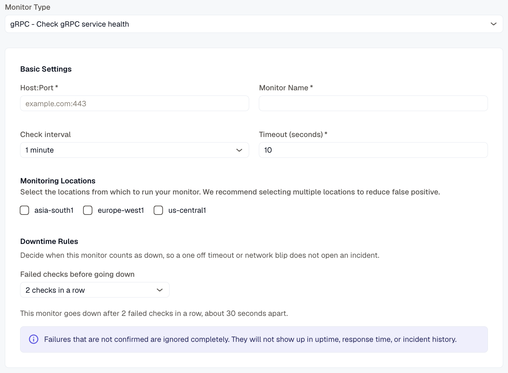

---

title: "gRPC Monitor"
description: "Check gRPC service health with a synthetic monitor."
sidebar:
  label: "gRPC Monitor"
---
The gRPC Monitor enables continuous health checks for gRPC services by invoking specified RPC methods and validating responses.

## Creating a New gRPC Monitor

1. Navigate to **Synthetic monitoring > Monitors**.
2. Click **Add new**.
3. Select **gRPC - Check gRPC service health** from the monitor type dropdown.

## Basic Settings

- **Host\:Port**
  Enter the gRPC server’s host and port in the format `hostname:port` to monitor.
- **Monitor Name**
  Provide a descriptive name for the gRPC monitor.
- **Check Interval**
  Define the frequency at which the monitor sends requests to the gRPC service.
- **Timeout**
  Set the maximum allowed time to receive a response before marking the check as failed.
- **Monitoring Locations**
  Select one or more geographic locations from which the health check requests will be performed.
- **Downtime Rules — Failed checks before going down**
  Set how many consecutive failed checks (about 30 seconds apart) are needed before the monitor counts as down, so a one-off timeout or network blip doesn't open an incident. Unconfirmed failures are ignored completely and never appear in uptime, response time, or incident history.

## Notification Settings

Select one or more notification channels to receive alerts if the gRPC service becomes unhealthy or unresponsive.

## gRPC Configuration

- **Service**
  Specify the fully qualified name of the gRPC service to call (e.g., `package.ServiceName`).
- **Method**
  Specify the RPC method within the chosen service (e.g., `MethodName`).
- **Payload (JSON)**
  Provide the request message in JSON format. Although gRPC uses binary Protobuf, the monitor converts this JSON payload automatically to Protobuf for the request.
- **Use Plaintext (no TLS)**
  Enable this option to disable SSL/TLS encryption, sending requests in plaintext.

## Assertions

Configure assertions to validate different aspects of the gRPC responses:

- **Status Code**
  Checks the gRPC-specific status code returned by the server (distinct from HTTP status codes).
- **Response Time (ms)**
  Measures the total time taken for the gRPC request and response cycle in milliseconds.
- **Response Body**
  Validates the entire response message returned by the gRPC server.
- **JSON Body (JSON Path)**
  Allows inspection of specific fields within the JSON-converted response using JSONPath expressions.
- **Header**
  Checks gRPC metadata sent as request/response headers.
- **Trailer**
  Validates gRPC trailers—metadata sent after the response body.

## Metrics

Metrics available to be monitored in Dashboard section

| **Metric Name**                                      | **Type**    | **Description**                                  | **Labels**                                                               |
| ------------------------------------------------------------- | -------------------- | --------------------------------------------------------- | ---------------------------------------------------------------------------------- |
| kloudmate\_synthetic\_check\_grpc\_response\_time   | Gauge      | Time taken for the gRPC call                    | check\_id, check\_name, check\_type, target, workspace\_id, location          |
| kloudmate\_synthetic\_check\_grpc\_status\_code     | Gauge      | The gRPC status code returned by the service.   | check\_id, check\_name, check\_type, target, workspace\_id, location, grpc\_method |

| kloudmate\_synthetic\_check\_request\_duration   | Gauge   | The total time taken for the primary operation of the check (e.g., HTTP request, DNS query, gRPC call).   | check\_id, check\_name, check\_type, target, workspace\_id, location |
| ---------------------------------------------------------- | ----------------- | ------------------------------------------------------------------------------------------------------------------- | -------------------------------------------------------------------- |

***

## Related Resources

[WebSocket Monitor - Monitor WebSocket Connections](../websocket-monitor/)

