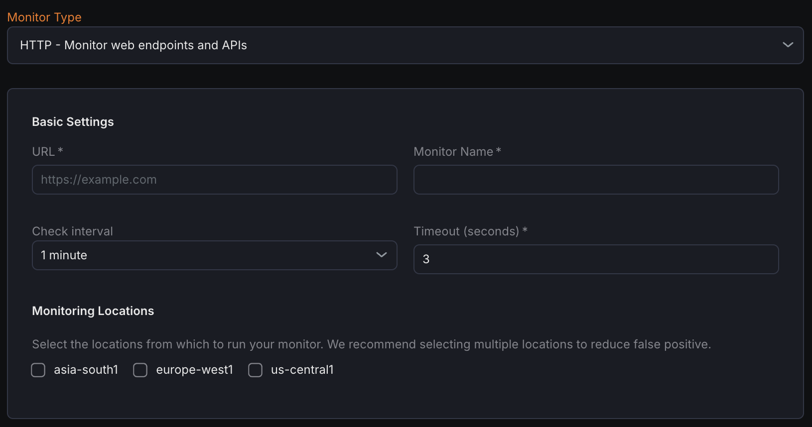

The HTTP Monitor allows you to keep track of the availability and performance of web endpoints and APIs by regularly sending HTTP requests and evaluating the responses based on configurable criteria.

## Creating a New HTTP Monitor

1. Navigate to **Synthetic monitoring > Monitors**.
2. Click on **Add new**.
3. From the monitor type dropdown, select **HTTP - Monitor web endpoints and APIs**.

## Basic Settings

- **URL**
  Specify the full URL of the endpoint or API you want to monitor.
- **Monitor Name**
  Assign a descriptive name to identify the monitor.
- **Check Interval**
  Define how frequently the monitor sends requests to the endpoint to check its status and response.
- **Timeout**
  Set the maximum amount of time the monitor will wait to receive a response from the endpoint before considering the check unsuccessful.

## **Notification Settings**

Configure where notifications should be sent if the monitor detects downtime or failures. Select one or more notification channels in this section to receive alerts promptly.

## **Advanced Settings**

Request Configuration

- **HTTP Method**
  Choose the type of HTTP request (GET, POST, PUT, PATCH, DELETE, etc.) the monitor will send.
- **Headers**
  Add custom HTTP headers to the request to simulate specific client behavior, send authentication tokens, or customize the request further.
- **Request Body**
  Provide the data payload for HTTP methods that support it (e.g., POST, PUT, PATCH, DELETE) as part of the request.
- **Enable Basic Authentication**
  Enable this option to include HTTP Basic Auth credentials with the request for endpoints that require authentication.
- **Follow Redirects**
  When enabled, the monitor automatically follows HTTP redirect responses (e.g., 301, 302, 307) to the final destination.

## **Assertions**

Assertions define the conditions the monitor validates against the HTTP responses. Multiple assertions can be configured to ensure comprehensive monitoring:

- **Status Code**
  Verifies the HTTP response status code matches the expected value (e.g., 200, 404).
- **Response Time**
  Measures how long the server takes to respond and ensures it is within acceptable limits.
- **Header**
  Checks if specific HTTP headers exist in the response and optionally if they match expected values.
- **Body**
  Validates the response payload content by searching for specific text strings or patterns.
- **JSON Body**
  Performs more detailed validation by inspecting parsed JSON elements within the response body.
- **Certificate Expiry (Days)**
  Checks the remaining validity period of the SSL/TLS certificate and alerts if it is about to expire within the specified number of days.

## Metrics

Metrics available to be monitored in Dashboard section.

| **Metric Name**                                                     |**Type**     |**Description**                                             |**Labels**                                                       |
| ----------------------------------------------------------------------------- | ----------------- | --------------------------------------------------------------------- | -------------------------------------------------------------------------- |
| kloudmate\_synthetic\_check\_http\_dns\_lookup\_time                | Gauge   | Time taken to resolve the DNS for HTTP checks               | check\_id, check\_name, check\_type, target, workspace\_id, location  |
| kloudmate\_synthetic\_check\_http\_content\_transfer\_time          | Gauge   | Time taken to transfer the content for HTTP checks          | check\_id, check\_name, check\_type, target, workspace\_id, location  |
| kloudmate\_synthetic\_check\_http\_response\_headers\_size\_bytes   | Gauge   | The size of the response headers in bytes for HTTP checks   | check\_id, check\_name, check\_type, target, workspace\_id, location       |

| kloudmate\_synthetic\_check\_request\_duration   | Gauge   | The total time taken for the primary operation of the check (e.g., HTTP request, DNS query, gRPC call).   | check\_id, check\_name, check\_type, target, workspace\_id, location  |
| ---------------------------------------------------------- | ----------------- | ------------------------------------------------------------------------------------------------------------------- | -------------------------------------------------------------------------- |

| kloudmate\_synthetic\_check\_connect\_time   | Gauge   | Time taken to establish a connection. Applicable to HTTP, TCP, UDP, WebSocket, and SSL checks.   | check\_id, check\_name, check\_type, target, workspace\_id, location |
| ------------------------------------------------------ | ----------------- | ---------------------------------------------------------------------------------------------------------- | -------------------------------------------------------------------- |

| kloudmate\_synthetic\_check\_time\_to\_first\_byte   | Gauge   | Time to the first byte. Applicable to HTTP, TCP, and UDP checks.              | check\_id, check\_name, check\_type, target, workspace\_id, location  |
| -------------------------------------------------------------- | ----------------- | --------------------------------------------------------------------------------------- | -------------------------------------------------------------------------- |
| kloudmate\_synthetic\_check\_response\_size\_bytes   | Gauge   | The size of the response in bytes. Applicable to HTTP, TCP, and UDP checks.   | check\_id, check\_name, check\_type, target, workspace\_id, location       |

***

## Related Resources

[SSL Certificate Validity Monitor - Check SSL Certificate Expiration and Validity](../ssl-certificate-validity-monitor-check-ssl-certificate-expiration-and-validity/)

