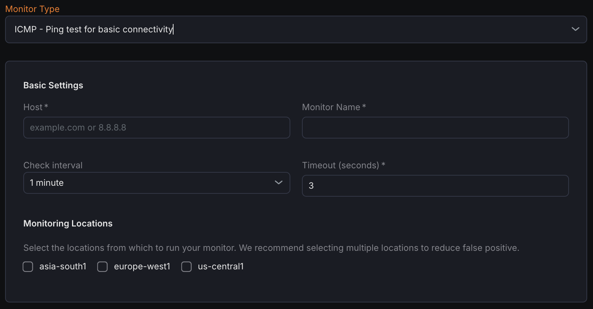

The ICMP Monitor performs ping tests to verify basic network connectivity to hosts by sending ICMP Echo Request packets and measuring responses.

## Creating a New ICMP Monitor

1. Navigate to **Synthetic monitoring > Monitors**.
2. Click **Add new**.
3. Select **ICMP - Ping test for basic connectivity** from the monitor type dropdown.

## Basic Settings

- **Host**
  Enter the hostname or IP address of the target site to ping. the hostname or IP address of the target site to ping.
- **Monitor Name**
  Provide a descriptive name for the ICMP monitor.
- **Check Interval**
  Define how frequently ping tests should be executed.
- **Timeout**
  Set the maximum time to wait for ping responses before marking the check as failed.
- **Monitoring Locations**
  Select one or more geographic locations from which ping tests will originate.

## Notification Settings

Configure notification channels to receive alerts when the ICMP monitor detects host unreachability.

## ICMP (Ping) Configuration

- **Ping Count**
  Specify the number of ICMP Echo Request packets to send in each test cycle.
- **Interval (ms)**
  Set the time interval between individual ping packets, measured in milliseconds.
- **Packet Size (bytes)**
  Define the size of the ICMP payload in each ping packet.
- **TTL (Time To Live)**
  Configure the maximum number of router hops a ping packet can traverse before being discarded.

## Assertions

Assertions validate ping test results and network performance metrics:

- **Avg RTT (ms)**
  Calculates the average Round Trip Time for ping packets from sender to target and back.
- **Packet Loss (%)**
  Measures the percentage of ping packets that received no reply.
- **Packets Received**
  Counts the number of successful ICMP Echo Reply responses.
- **Min RTT (ms)**
  Records the shortest Round Trip Time among all pings sent.
- **Max RTT (ms)**
  Records the longest Round Trip Time among all pings sent.

## Metrics

Metrics available to be monitored in Dashboard section

| **Metric Name**                                                |**Type**   |**Description**                                   |**Labels**                                                       |
| ------------------------------------------------------------------------ | -------------------- | ----------------------------------------------------------- | -------------------------------------------------------------------------- |
| kloudmate\_synthetic\_check\_network\_round\_trip\_time        | Gauge      | Round trip time for a packet (for ICMP)           | check\_id, check\_name, check\_type, target, workspace\_id, location  |
| kloudmate\_synthetic\_check\_network\_min\_rtt                 | Gauge      | Minimum round trip time for a packet (for ICMP)   | check\_id, check\_name, check\_type, target, workspace\_id, location  |
| kloudmate\_synthetic\_check\_network\_max\_rtt                 | Gauge      | Maximum round trip time for a packet (for ICMP)   | check\_id, check\_name, check\_type, target, workspace\_id, location  |
| kloudmate\_synthetic\_check\_network\_packets\_sent            | Gauge      | Number of packets sent (for ICMP)                 | check\_id, check\_name, check\_type, target, workspace\_id, location  |
| kloudmate\_synthetic\_check\_network\_packets\_received        | Gauge      | Number of packets received (for ICMP)             | check\_id, check\_name, check\_type, target, workspace\_id, location  |
| kloudmate\_synthetic\_check\_network\_packets\_lost            | Gauge      | Number of packets lost (for ICMP)                 | check\_id, check\_name, check\_type, target, workspace\_id, location  |
| kloudmate\_synthetic\_check\_network\_packets\_lost\_percent   | Gauge      | Percentage of packets lost (for ICMP).            | check\_id, check\_name, check\_type, target, workspace\_id, location       |

***

## Related Resources

[Push Monitor - Callback URL to Confirm Availability](../push-monitor-callback-url-to-confirm-availability/)

