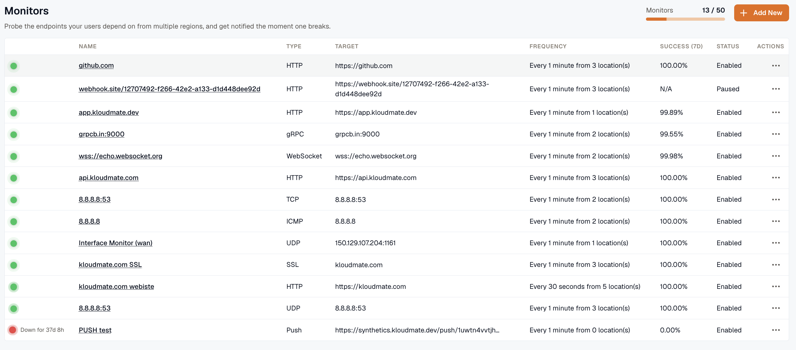
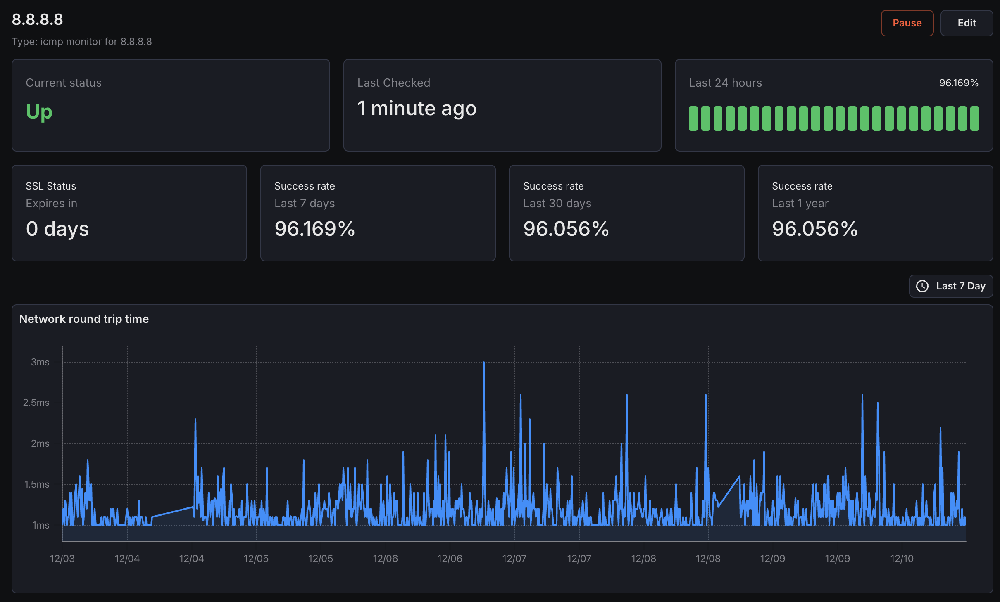
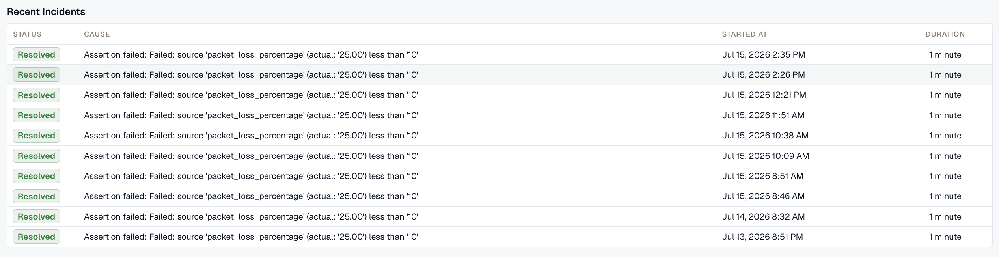
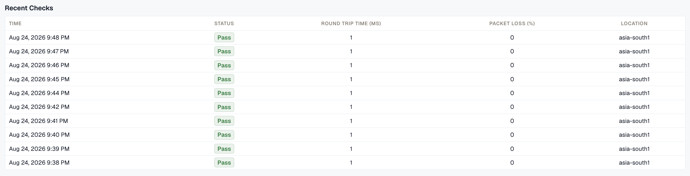

The Monitors page displays all monitors created within the current workspace, providing key status information at a glance for quick assessment of monitoring health.

### Monitors Overview

- **Name**: The user-defined name of each monitor, for easy identification.
- **Type**: Indicates the monitor type (e.g., HTTP, SSL, DNS, TCP, UDP, gRPC, WebSocket, ICMP, Push).
- **Target**: Shows the endpoint or host the monitor is targeting (e.g., URL, host\:port, domain).
- **Frequency**: Displays the check interval and number of monitoring locations used for each check.
- **Success (24h)**: Shows the success percentage of the monitor over the past 24 hours.
- **Status**: Indicates the current operational status of the monitor (e.g., Up, Down, Warning).

### Monitor Details Page

Clicking any monitor in the list opens its details page, with full performance and history information.

**Details Page Sections** - **Status**  
  Current real-time status of the monitor with visual indicators.
- **Success Rate**&#xA;Detailed success rate metrics over various time periods.
- **Recent Incidents**
  History of downtime incidents with timestamps and durations.

- **Recent Checks**  
  Log of the most recent check executions with results and timings.

## Core Uptime and Status Metrics

Metrics available to be monitored in Dashboard section. These metrics are applicable to all monitors.

| **Metric Name**                         | **Type**      | **Description** | **Labels**                                                             |
| ------------------------------------------------ | ----------------- | --------------------------------------------------------------------------------------------- | ---------------------------------------------------------------------- |
| kloudmate\_synthetic\_check\_success   | Gauge   | Indicates if a check was successful (1) or failed (0) based on the success quorum   | check\_id, check\_name, check\_type, target, workspace\_id   |
| kloudmate\_synthetic\_check\_status    | Gauge   | Indicates if a check was successful (1) or failed (0) for a specific location       | check\_id, check\_name, check\_type, target, workspace\_id, location   |

***

## Related Resources

[HTTP Monitor - Monitor Web Endpoints and APIs](http-monitor/)

